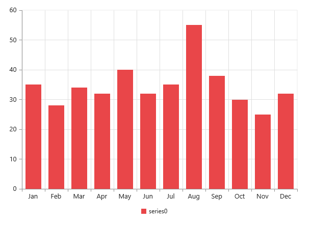

# Working with Data

Chart gets data either locally or remotely. To populate the Chart with data, you can use the DataSource in series properties.

## Local Data

EJ Chart provides you an option to bind the data to the Chart using the DataSource property of the series. 

In Controllers:

[MVC]

[CS]

  public ArrayList GetData()

        {

            ArrayList dataTable = new ArrayList();

            dataTable.Add(new dataVal (“CHEESE BURGER", 100, 15, 15));

            dataTable.Add(new dataVal ("PIZZA", 100, 15, 9));

            dataTable.Add(new dataVal ("CHICKEN NOODLE", 50, 4, 2));

            dataTable.Add(new dataVal (“YOGURT”, 75, 10, 2));

            dataTable.Add(new dataVal ("BEEF SANDWICH", 125, 22, 13)); 

            return dataTable;

        }

        class dataVal

        {

            private string foodname;

            public string foodName

            {

                get { return foodname; }

                set { foodname = value; }

            }

            private double calorie;

            public double calorie

            {

                get { return calorie; }

                set { calorie = value; }

            }

            private double protein;

            public double protein

            {

                get { return protein; }

                set { protein = value; }

            }

            private double fat;

            public double fat

            {

                get { return fat; }

                set { fat = value; }

            }

           public dataVal(string foodname, double calorie, double protein, double fat)

            {

                this.foodname = foodname;

                this.calorie = calorie;

                this.protein = protein;

                this.fat = fat;

            }

        }

        public ActionResult SimpleChart()

        {

            var DataSource = GetData();

            ViewBag.datasource = DataSource;

            return View();

        }


In View:


[MVC]

[CSHTML]

@(Html.EJ().Chart("chartcontainer")

        .Series(sr =>

            {

              sr.DataSource((System.Collections.IEnumerable)ViewBag.datasource)

                 .XName("foodName")

                 .YName("calorie")

                 .Type(SeriesType.Column).Add();

              sr.DataSource((System.Collections.IEnumerable)ViewBag.datasource)

                 .XName("foodName")

                 .YName("protein")

                 .Type(SeriesType.Column).Add();

            })

        )    



## Remote Data

You can bind the Essential Chart to remote data using DataManager and the Query in series that is used to retrieve the data by creating queries. Data manager supports the following types of data binding.

1. JSON
2. Web Services
3. oData

The following code example illustrates binding EJ Chart to oData service.   

[MVC]

 @(Html.EJ().Chart("container")                                                      

  .Series(ser =>

           {                           

           ser.DataSource(service =>     

                    service.URL("http://mvc.syncfusion.com/Services/Northwnd.svc/"));

            ser.XName("ShipCity");

            ser.YName("Freight");

            ser.Query("ej.Query().from('Orders').take(10)")

            .EnableAnimation(true).Add();

                      })        // ...                                    

        )


