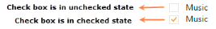
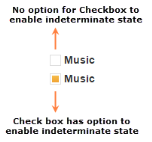
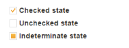
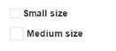
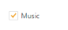
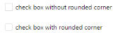

# Easy customization

## Checked state

Using Checked property, you can set the state of Checkbox. When checked property is true then tick mark is displayed and Checkbox is in checked state. When it is false, the tick mark is not displayed is in non tri-state and Checkbox is in unchecked state. When you want to use this Checked property, then checkbox should be in non Tri-state and EnableTriState property should be false.



@*Add the code in CSHTML page to configure and initialize the control*@

@* set the state for non Tri-state checkbox using Checked property*@

@Html.EJ().CheckBox("checkbox_unchecked").Checked(false)

<label for="checkbox_unchecked" class="clslab">Music</label>

 

@Html.EJ().CheckBox("checkbox_checked").Checked(true)

<label for="checkbox_checked" class="clslab">Music</label>



Execute the above code to render the following output.

Checkbox in binary states
{:.caption}

## Enable Tri-State

Sometimes, it is essential for you to represent the answer in partially true state. To represent the partially true types, an indeterminate state option is present. The state between checked and unchecked state is called indeterminate state. For example, a Checkbox presented to select files to send via [FTP](http://en.wikipedia.org/wiki/File_Transfer_Protocol) can use a [tree view](http://en.wikipedia.org/wiki/Tree_view) so that files can be selected one at a time, or by folder. When only some of the files in a folder are selected, then the checkbox for that folder could be in indeterminate state.

When you enable Tri-state, then the Checkbox includes the indeterminate state. The Checkbox has three states. EnableTriState property specifies to enable or disable the Tri-State option for Checkbox. 

The following steps explains you the details about rendering the Checkbox with Tri-state options.



@*Add the code in CSHTML page to configure and initialize the control*@

@* Enable or disable the Tri-state using EnableTriState property *@

@Html.EJ().CheckBox("checkbox_nonTriState").EnableTriState(false)

<label for="checkbox_nonTriState" class="clslab">Music</label>

 

@Html.EJ().CheckBox("checkbox_triState").EnableTriState(true)

<label for="checkbox_triState" class="clslab">Music</label>



Execute the above code to render the following output.

Checkbox with Non-Tri state and Tri-state
{:.caption}

## Check State

You require an option to set indeterminate state for Checkbox. By using CheckState property, you can set any state that is illustrated in following table. Before using this property, enable the Tri-state for Checkbox. EnableTriState propertyis set true.

_List of check states_

<table>
<tr>
<td>
Check</td><td>
Check box will be in checked state</td></tr>
<tr>
<td>
Uncheck</td><td>
Check box will be in un-checked state</td></tr>
<tr>
<td>
Indeterminate</td><td>
Check box will be in indeterminate state</td></tr>
</table>

The following steps explains you the details about rendering the Checkbox with specified checked state, when the checkbox is in tri-state.



@*Add the code in CSHTML page to configure and initialize the control*@

@*set the state of Tri-state checkbox using CheckState property*@

@Html.EJ().CheckBox("checkbox_check").EnableTriState(true).CheckState(CheckState.Check)

<label for="checkbox_check" class="clslab">Checked state</label>

 

@Html.EJ().CheckBox("checkbox_uncheck").EnableTriState(true).CheckState(CheckState.Uncheck)

<label for="checkbox_uncheck" class="clslab">Unchecked state</label>

 

@Html.EJ().CheckBox("checkbox_indeterminate").EnableTriState(true).CheckState(CheckState.Indeterminate)

<label for="checkbox_indeterminate" class="clslab">Indeterminate state</label>



Execute the above code to render the following output.

Checkbox in three different states
{:.caption}

## Checkbox Size

You can render Checkbox in different sizes. The following table contains some predefined size option for rendering a Checkbox in easiest way. Each size option has different height and width. Mainly it avoids the complexity in rendering Checkbox with complex CSS class. 

_List of checkbox size_

<table>
<tr>
<td>
Small</td><td>
Creates checkbox with inbuilt small size height, width specified.</td></tr>
<tr>
<td>
Medium</td><td>
Creates checkbox with inbuilt medium size height, width specified.</td></tr>
</table>

The following steps explains you the details about rendering the Checkbox with different size.



@*Add the code in CSHTML page to configure and initialize the control*@

@* set the size of checkbox using Size property *@

@Html.EJ().CheckBox("checkbox_small").Size(Size.Small)

<label for="checkbox_small" class="clslab">Small size</label>

 

@Html.EJ().CheckBox("checkbox_medium").Size(Size.Medium)

<label for="checkbox_medium" class="clslab">Medium size</label>



Execute the above code to render the following output.

Checkbox in different sizes
{:.caption}

## Text

It specifies the text content for Checkbox. In previous programs, separate label for each Checkbox is created. You can also set the text for checkbox using Text property. Therefore, it is not essential to add label tag for each checkbox in HTML code.

The following steps explains you the details about rendering the Checkbox with text content and without writing label tag



@*Add the code in CSHTML page to configure and initialize the control*@

@*set text for checkbox using Text property *@

@Html.EJ().CheckBox("checkbox_text").Text("Music") 



Execute the above code to render the following output.

Checkbox with text content
{:.caption}

## Rounded corner for checkbox

Specifies the corner of Checkbox in rounded shape. Checkbox doesn’t have rounded corner by default. To set rounded corner, you can enable ShowRoundedCorner property.

The following steps explains you the details about rendering the Checkbox with rounded corner.



@*Add the code in CSHTML page to configure and initialize the control*@

@*set the rounded corner for checkbox *@

@Html.EJ().CheckBox("checkbox_normalCorner").ShowRoundedCorner(false).Text("checkbox without rounded corner")

 

@Html.EJ().CheckBox("checkbox_roundedCorner").ShowRoundedCorner(true).Text("checkbox with rounded corner")



Execute the above code to render the following output.

Checkbox with non-rounded & rounded corner
{:.caption}

