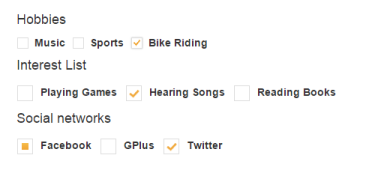
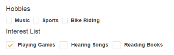
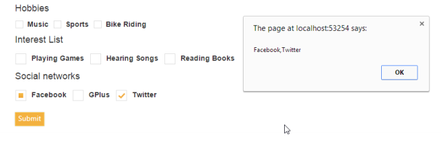
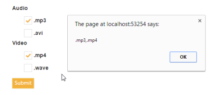

# Getting Started

This section explains briefly about how to create a Checkbox in your application with ASP.NET MVC.

## Create your first Checkbox in MVC

Essential ASP.NET MVC Checkbox provides support to multiple selections within your webpage, and allows you to select options from the list. Refer the following guidelines to create multiple or single selection List Receiving App using Checkbox that helps you to get the value of checked Checkbox using the button. The following screenshot illustrates the functionality of Checkbox with button action.

Checkboxes Control
{:.caption}

In the above screenshot, you can select hobbies, interest list and social networks receiving app using Checkbox. The Checkbox performs the action to render the checked values when button clicked.

### Create a Checkbox

ASP.NET MVC Checkbox widget has built-in features like multiple selections. You can easily create the Checkbox widget using simple HTML helper “@Html.EJ().CheckBox()” as follows.

1. You can create an MVC Project and add necessary assemblies, styles and scripts with the help of the given [MVC-Getting Started](http://help.syncfusion.com/aspnetmvc/checkbox/getting-started) Documentation.
2. Add the following code to the corresponding view page to render Checkbox.

   ~~~ html

	   

			

				

					<h4>Hobbies</h4>

					<table>

						<tr>

							<td class="chkrad">

								@Html.EJ().CheckBox("check1").Value("Music")

								<label for="check1" class="clslab">

									Music

								</label>

							</td>

							<td class="chkrad">

								@Html.EJ().CheckBox("Checkbox3").Value("Sports")

								<label for="Checkbox3" class="clslab">

									Sports

								</label>

							</td>

							<td class="chkrad">

								@Html.EJ().CheckBox("Checkbox4").Value("Bike Riding")

								<label for="Checkbox4" class="clslab">

									Bike Riding

								</label>

							</td>

						</tr>

					</table>

					<h4>Interest List</h4>

					<table>

						<tr>

							<td class="chkrad">

								@Html.EJ().CheckBox("Checkbox1").Value("Playing Games").Size(Size.Medium)

								<label for="Checkbox1" class="clslab">Playing Games</label>

							</td>

							<td class="chkrad">

								@Html.EJ().CheckBox("Checkbox5").Value("Hearing Songs").Size(Size.Medium)

								<label for="Checkbox5" class="clslab">Hearing Songs</label>

							</td>

							<td class="chkrad">

								@Html.EJ().CheckBox("Checkbox6").Value("Reading Books").Size(Size.Medium)

								<label for="Checkbox6" class="clslab">Reading Books</label>

							</td>

						</tr>

					</table>

				

			

		

   ~~~

3. Add the following styles to the corresponding view page to show the Checkbox in horizontal order.

   ~~~ css

		

   ~~~

4. Run the above code to render the following output.

Checkbox Creation
{:.caption}

### Create a Tri-State Checkbox

ASP.NET MVC Tri-State Checkbox widget renders by setting EnableTriState property to True. You can add the following code to create Tri-state Checkbox in the 
 element of the corresponding view page.



<h4>Social networks</h4>

                <table>

                    <tr>

                        <td class="chkrad">

                            @Html.EJ().CheckBox("Checkbox2").Value("Facebook").Size(Size.Medium).EnableTriState(true).CheckState(CheckState.Indeterminate) <label for="Checkbox2" class="clslab">Facebook</label>

                        </td>

                        <td class="chkrad">

                            @Html.EJ().CheckBox("Checkbox7").Value("GPlus").Size(Size.Medium).EnableTriState(true).CheckState(CheckState.Uncheck) <label for="Checkbox7" class="clslab">GPlus</label>

                        </td>

                        <td class="chkrad">

                            @Html.EJ().CheckBox("Checkbox8").Value("Twitter").Size(Size.Medium).EnableTriState(true).CheckState(CheckState.Check) <label for="Checkbox8" class="clslab">Twitter</label>

                        </td>

                    </tr>

                </table>



Run the above code to render the following output.

Tri-state Checkbox Creation
{:.caption}

### Receive Hobbies and Interest

You can receive the Hobbies and Interest values using Checkbox. You can create a button in your corresponding view page 
 element using @Html.EJ().Button() and add the script section to the view page. The following steps illustrate how to create and set action to the button.

 Add the following code for Button creation.





@Html.EJ().Button("buttonnormal").Text("Submit").Size(ButtonSize.Normal)



 Add the script into your view page.	





  

Execute the above code example to render the following output.

Receive hobbies and interest
{:.caption}

### Receive Media Player

You can get the Media Player file type application like video, audio and picture using Checkbox. You can refer the following steps to render Media Player file types.

1. Add the following code in 
 element of the corresponding view page.

   ~~~ html

			<table>

				<label for="check2" class="clslab">

					Audio

				</label>

				<tr>

					<td class="chkrad">

						@Html.EJ().CheckBox("Checkboxs3").Value(".mp3").Size(Size.Medium)

						<label for="Checkboxs3" class="clslab">

							.mp3

						</label>

					</td>

				</tr>

				<tr>

					<td class="chkrad">

						@Html.EJ().CheckBox("Checkboxs4").Value(".avi").Size(Size.Medium)

						<label for="Checkboxs4" class="clslab">

							.avi

						</label>

					</td>

				</tr>

			</table>

			<table>

				<label for="Checkboxs1" class="clslab">Video</label>

				<tr>

					<td class="chkrad">

						@Html.EJ().CheckBox("Checkboxs5").Value(".mp4").Size(Size.Medium)

						<label for="Checkboxs5" class="clslab">.mp4</label>

					</td>

				</tr>

				<tr>

					<td class="chkrad">

						@Html.EJ().CheckBox("Checkboxs6").Value(".wave").Size(Size.Medium)

						<label for="Checkboxs6" class="clslab">.wave</label>

					</td>

				</tr>

			</table>

   ~~~

Execute the above code to render the following output.	

Receive Media player
{:.caption}
