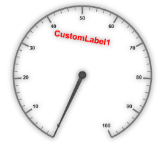
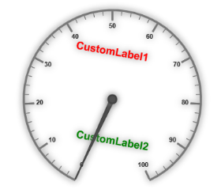
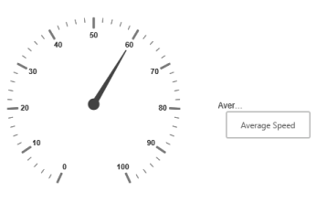

# Custom labels

Custom labels are the texts that you can use them in any location of the Gauge.

## Adding Custom Label Collection

Custom labels collection is directly added to the scale object. Refer the following code to add custom labels collection in a Gauge control.



//For circular gauge rendering

@(Html.EJ().CircularGauge("circulargauge")

.Scales(sc =>

{

sc.CustomLabels(cl =>

{

//custom label

cl.TextAngle(10)

.Color("Red")

.Value("CustomLabel1")

.Font(f =>f.Size("20px").FontFamily("Arial").FontStyle("bold"))

.Position(p =>p.X(180).Y(100)).Add();

}).Add();

})

)


### Basic Customization

* You can customize custom labels using the properties such as textAngle, color and font. textAngle attribute is used to display the custom labels in the specified angles and color attribute is used to display the custom labels in specified color. 
* You can use Value attribute to set the text value in the custom abels. To display the custom labels, set showCustomLabels as ‘true’. To set the location of the custom label in Circular Gauge, location property is used. By using x and y axis you can adjust the position of the custom labels.
* Font option is also available on  custom labels. The basic three properties of fonts such as size, family and style can be achieved by size, fontStyle and fontFamily attributes. 



// For Circular Gauge rendering

@(Html.EJ().CircularGauge("circulargauge")

.Scales(sc =>

{

sc.Size(2)

.ShadowOffset(10)

.ShowRanges(true)

.ShowScaleBar(true)

.Radius(150)

.ShowLabels(true)

.CustomLabels(cl =>

{

//For setting custom label text angle

cl.TextAngle(10)

//For setting custom label color

.Color("Red")

//For setting custom label color

.Value("CustomLabel1")

//For setting custom label font option

.Font(f =>f.Size("20px").FontFamily("Arial").FontStyle("bold"))

//For setting custom label position

.Position(p =>p.X(180).Y(100)).Add();

}).Add();

})

)



Execute the above code to render the following output.

Circular Gauge with customized custom label
{:.caption}

## Multiple Custom Labels

You can set multiple custom labels in a single Circular Gauge by adding an array of custom label objects. Refer the following code example for multiple custom label functionality.



// For Circular Gauge rendering

@(Html.EJ().CircularGauge("circulargauge")

.Scales(sc =>

{

sc.Size(2)

.ShadowOffset(10)

.ShowRanges(true)

.ShowScaleBar(true)

.Radius(150)

.ShowLabels(true)

.CustomLabels(cl =>

{

//custom label1

cl.TextAngle(10)

.Color("Red")

.Value("CustomLabel1")

.Font(f =>f.Size("20px").FontFamily("Arial").FontStyle("bold"))

.Position(p =>p.X(180).Y(100)).Add();

//custom label2

cl.TextAngle(10)

.Color("Green")

.Value("CustomLabel2")

.Font(f =>f.Size("20px").FontFamily("Arial").FontStyle("bold"))

.Position(p =>p.X(180).Y(250)).Add();

}).Add();

})

)



Execute the above code to render the following output.

Circular Gauge with multiple custom labels
{:.caption}

## Outer Custom Label

* Outer Custom Label is used to show custom labels outside the gauge control. The Outer Custom Label can be positioned with API called outerCustomLabelPosition. The value for this API is enumerable type and its possible values are,
1. Right
2. Left
3. Top
4. Bottom
* When a custom label is to be displayed as an Outer Custom Label, set the API customLabelType as Outer. Refer to the following code example to get the Outer Custom Label.



@(Html.EJ().CircularGauge("circularGaugeTooltip")

//Defines the outer label position.
.OuterCustomLabelPosition(OuterCustomLabelPosition.Right)

//Defines the tooltip object.
.Tooltip(ttp=>ttp

// Enables the label tooltip.
.ShowLabelTooltip(true)

// Enables the custom label tooltip.
.ShowCustomLabelTooltip(true))

// Customizes the scale options.
.Scales(SC =>{SC.Radius(130).ShowLabels(true)

// Customizes the custom label options.
.CustomLabels(cl => {cl.Value("AverageSpeed").Font(f =>f.Size("20px").FontFamily("Arial").FontStyle("bold")).Position(p =>p.X(360).Y(30)).Add();})

// Customizes the pointers options.
.Pointers(PO =>{PO.Value(60).Length(90).Add();}).Add();}))




public ActionResult Print()
{
	var DataSource = new ScheduleDataDataContext().DefaultSchedules.ToList();
	ViewBag.dataSource = DataSource;return View();
}


Execute the above code to render the following output.

Circular gauge with outer custom label.
{:.caption}
