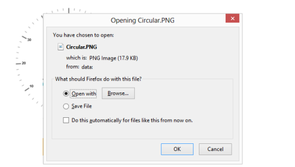

# Exporting

* Circular Gauge has an exporting feature that converts Gauge control into image format and then export in client side. The method API `exportImage` is used to export the Circular Gauge. 
* It has two arguments such as **file name** and **file format** to specify the file name and file formats. For exporting refer the following code example.



@(Html.EJ().CircularGauge("circulargauge"))

<input type="submit" value="Export Image" id="btnExportImage" />



Execute the above code to render the following output.

Circular Gauge control Export Functionality
{:.caption}

