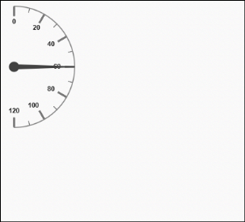

# Gauge Position

Semi-circular Gauge can be positioned within the canvas element which provides better appearance for the gauge in the canvas.

## Positioning

* Semi-circular Gauge can be positioned with the help of the attribute called gaugePosition. It is an enumerable value. You can position the gauge away from the corner with the help of the distanceFromCorner attribute. 
* The possible enum values for the gaugePosition are as follows:
1. Topleft
2. Topcenter
3. Topright
4. Middleleft
5. Center
6. Middleright
7. Bottomleft
8. Bottomcenter
9. Bottomright





@(Html.EJ().CircularGauge("SemiCircularGauge").BackgroundColor("transparent")

// To set dimension of the canvas.
.Width(500).Height(500).Radius(100).Value(60)

// To set gauge position.
.GaugePosition(GaugePosition.TopLeft)

// To set gauge distance from corner.
.DistanceFromCorner(25)

// To set frame settings.
.Frame(fr=>fr.FrameType(Frame.HalfCircle)

// To set frame start angle.
.HalfCircleFrameStartAngle(270)

// To set frame end angle.
.HalfCircleFrameEndAngle(90))

// To set basic scale settings.
.Scales(SC =>{SC.Radius(100)
				.Maximum(120)
				.MajorIntervalValue(20)
				.MinorIntervalValue(10)
				.ShowScaleBar(true)
				.Size(1)
				.Border(bor => bor.Width(0.5))
				.StartAngle(270)
				.SweepAngle(180).Add();}))



public partial class CircularGaugeController : Controller
{
     //        // GET: /ToolTip/        
	 public ActionResult Semicircular()
	 {           
		return View();
     }
}


  
Execute the above code to render the following output.

Semi-circular Gauge with Default topleft position
{:.caption}

