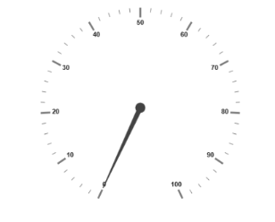
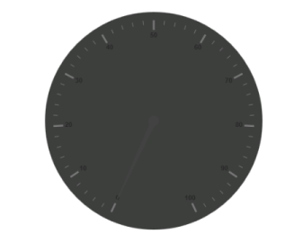
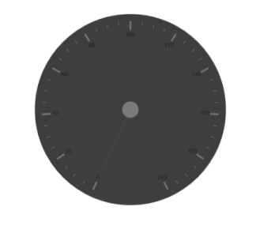
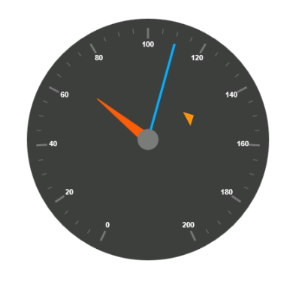

# Getting Started

* The ASP.NET MVC Circular Gauge provides support to display the Circular Gauge within your web page and allows you to customize it. This section encompasses the details on how to configure Circular Gauge. 
* You will learn how to provide data for a Circular Gauge and display that data in a suitable way. In addition, you will learn how to customize the default Circular Gauge appearance, according to your requirements. 
* As a result, you will get a Circular Gauge that shows you how the Automobile speedometer works with rpm (Rotation per Minute), kph (Kilometer per hour) and speed level indication (Safe, Caution and Danger). 

Analog Speedometer
{:.caption}

## Create a Circular Gauge

ASP.NET MVC Circular Gauge widget basically renders with animation and flexible APIs. You can easily create the Circular Gauge widget by using the following steps.

1. First create an MVC Project and add necessary Dll's and script with the help of the given [MVC-Getting Started](http://help.syncfusion.com/aspnetmvc/circulargauge/getting-started) Documentation.
2. Add the following code example to the corresponding view page to render CircularGauge.

   ~~~ cshtml

   @(Html.EJ().CircularGauge("circulargauge"))

   ~~~
   {:.prettyprint }

3. Add the following code example in the controller page.



public ActionResult Default()
{

	return View();

}



Run the above code example to get a default CircularGauge with default values.

Circular Gauge
{:.caption}

## Set Height and Width

Pointers have different height and width so you can set the height and width of the gauge according to your requirements.Set the basic values of the gauge such as height and width of the canvas element values that are to be rendered.



@(Html.EJ().CircularGauge("circulargauge")

.Height(500)

.Width(500)

)



Run the above code example and you will see the following output.

Circular Gauge with Height and Width
{:.caption}

## Set Background Color

The speedometer must have some dark color as background so that its value is clearly visible and you can vary the speed of the pointer by setting ReadOnly as False for user interaction.



@(Html.EJ().CircularGauge("circulargauge")

.Height(500)

.Width(500)

.BackgroundColor("#3D3F3D")

.ReadOnly(false)

)



Run the above code example and you will see the following output.

Circular Gauge with Dark Background
{:.caption}

## Provide Scale Values

* The pointer cap can be customized with the following options. Cap radius, cap border color, cap background color, pointer cap border width are some of the properties that are customizable.
* The speed limit in the gauge has maximum value of 200 kph. So you can set maximum value for the gauge as 200.
* Major Ticks have the interval value of 20 and minor ticks have the interval value of 5. Show ranges and show indicators are used to display the ranges and indicators in their respective positions.



@(Html.EJ().CircularGauge("circulargauge")

.Height(500)

.Width(500)

.BackgroundColor("#3D3F3D")

.ReadOnly(false)

.Scales(scale => {

scale.ShowRanges(true)

.ShowIndicators(true)

.PointerCap(cap=>

cap.Radius(15)

.BorderWidth(0)

.BackgroundColor("#797C79")

.BorderColor("#797C79"))        .Maximum(200)

.MajorIntervalValue(20)

.MinorIntervalValue(5).Add();

//Add the labels customization code here

//Add the pointers customization code here

//Add the ticks customization code here

//Add the ranges customization code here

//Add the indicators customization code here

//Add the Custom labels customization code here

}))



Run the above code example and you will see the following output.

Circular Gauge with Scale Values
{:.caption}

## Add Label Customization

To display the value around the scales, labels are used. By customizing the label color it displays as specified.



@(Html.EJ().CircularGauge("circulargauge")

.Height(500)

.Width(500)

.BackgroundColor("#3D3F3D")

.ReadOnly(false)

.Scales(scale => {scale

//Add the labels customization code here

.Labels(label => label.Color("#ffffff").Add())

.Add();

//Add the pointers customization code here

//Add the ticks customization code here

//Add the ranges customization code here

//Add the indicators customization code here

//Add the Custom labels customization code here

}))



Run the above code example and you will see the following output.

Circular Gauge with Label
{:.caption}

## Add Pointers

Here, you have three pointers that denote the kilometer value, rotation per minute value and torque value.The torque value pointer needs not be similar to the other two pointers. You can set torque pointer as marker pointer. And you can set other attributes for pointer such as background color, border color, length, width and distance from scale.



@(Html.EJ().CircularGauge("circulargauge")

.Height(500)

.Width(500)

.BackgroundColor("#3D3F3D")

.ReadOnly(false)

.Scales(scale => {scale

//Add the labels customization code here

//Add the pointers customization code here

.Pointers(pointer=>{

pointer.Value(140)

.DistanceFromScale(60)

.ShowBackNeedle(false)

.Length(20)

.Type(PointerType.Marker)

.MarkerType(MarkerType.Triangle)

.Width(10)

.BackgroundColor("#FF940A")

.Border(border => border.Color("#FF940A")).Add();

pointer.Value(110)

.ShowBackNeedle(false)

.Length(150)

.NeedleType(NeedleType.Rectangle)

.Width(2)

.BackgroundColor("#05AFFF")

.Border(border =>border.Color("#05AFFF")).Add();

pointer.Value(67)

.ShowBackNeedle(false)

.Length(100)

.Width(15)

.BackgroundColor("#FC5D07")

.Border(border => border.Color("#FC5D07")).Add();

})

.Add();

//Add the ticks customization code here

//Add the ranges customization code here

//Add the indicators customization code here

//Add the Custom labels customization code here

}))



Run the above code example and you will see the following output.

Circular Gauge with Pointers
{:.caption}

## Add Tick Details

* You can set Major ticks with their width and height equal to Minor ticks. 
* You can set Color according to your preference for better visibility in dark backgrounds.
* To display and customize the tick value add the following code example. 



@(Html.EJ().CircularGauge("circulargauge")

.Height(500)

.Width(500)

.BackgroundColor("#3D3F3D")

.ReadOnly(false)

.Scales(scale => {

scale

//Add the labels customization code here

//Add the pointers customization code here

//Add the ticks customization code here

.Ticks(tic => {

tic.Type(CircularTickTypes.Major)

.DistanceFromScale(70)

.Height(20)

.Width(3)

.Color("#ffffff").Add();

tic.Type (CircularTickTypes.Minor)

.DistanceFromScale(70)

.Height(12)

.Width(1)

.Color("#ffffff").Add();

})

.Add();

//Add the ranges customization code here

//Add the indicators customization code here

//Add the Custom labels customization code here

}))



Run the above code example and you will see the following output.

Circular Gauge with Ticks
{:.caption}

## Add Range Values

* Ranges denote the property of the scale value in the speedometer. The color values of the ranges denote speed variation. Set ShowRanges as True for showing the ranges in the Circular Gauge.
* For Low speed, you can mention it as safe zone; for moderate speed, you can call it as caution zone and for high speed, you can mark it as high speed.
* You can customize the range with properties such as start value, end value, start width, end width,  background color , border color, etc.,



@(Html.EJ().CircularGauge("circulargauge")

.Height(500)

.Width(500)

.BackgroundColor("#3D3F3D")

.ReadOnly(false)

.Scales(scale => {

scale

//Add the labels customization code here

//Add the pointers customization code here

//Add the ticks customization code here

//Add the ranges customization code here

.Ranges(range => {

range.DistanceFromScale(30)

.StartValue(0)

.EndValue(70)

.BackgroundColor("#5DF243")

.Border(border => border.Color("#ffffff")).Add();

range.DistanceFromScale(30)

.StartValue(70)

.EndValue(140)

.BackgroundColor("#F6FF0A")

.Border(border => border.Color("#ffffff")).Add();

range.DistanceFromScale(30)

.StartValue(140)

.EndValue(200)

.BackgroundColor("#FF1807")

.Border(border => border.Color("#ffffff")).Add();

})

.Add();

//Add the indicators customization code here

//Add the Custom labels customization code here

}))



Run the above code example and you will see the following output.

Circular Gauge with Ranges
{:.caption}

## Add Indicator Details

* Indicators denote whether the pointers values are in their respective zones or not. Positioning the indicator on the respective range value gives you the required changes.
* By using Position property, you can set the location of the indicator. StateRanges defines how the indicator should behave when the pointer is in certain values. 



@(Html.EJ().CircularGauge("circulargauge")

.Height(500)

.Width(500)

.BackgroundColor("#3D3F3D")

.ReadOnly(false)

.Scales(scale => {

//Add the labels customization code here

//Add the pointers customization code here

//Add the ticks customization code here

//Add the ranges customization code here

//Add the indicators customization code here

.Indicators(ind =>

{

ind.Height(10)

.Width(10)

. Type(IndicatorType.Circle)

.Position(loc => loc.X(210).Y(300))

.StateRanges(state =>

{

state.EndValue(70)

.StartValue(0)

.BackgroundColor("#5DF243")

.BorderColor("#5DF243").Text("").TextColor("#ffffff")

.Add();

state.EndValue(200)

.StartValue(70)

.BackgroundColor("#145608")

.BorderColor("#145608").Text("").TextColor("#ffffff")

.Add();

}).Add();

ind.Height(10)

.Width(10)

. Type(IndicatorType.Circle)

.Position(loc => loc.X(255).Y(200))

.StateRanges(state =>

{

state.EndValue(140)

.StartValue(70)

.BackgroundColor("#F6FF0A")

.BorderColor("#F6FF0A").Text("").TextColor("#ffffff")

.Add();

state.EndValue(70)

.StartValue(0)

.BackgroundColor("#969B0C")

.BorderColor("#969B0C").Text("").TextColor("#ffffff")

.Add();

state.EndValue(200)

.StartValue(140)

.BackgroundColor("#969B0C")

.BorderColor("#969B0C").Text("").TextColor("#ffffff")

.Add();

}).Add();

ind.Height(10)

.Width(10)

. Type(IndicatorType.Circle)

.Position(loc => loc.X(300).Y(300))

.StateRanges(state =>

{

state.EndValue(140)

.StartValue(200)

.BackgroundColor("#890F06")

.BorderColor("#890F06").Text("").TextColor("#ffffff")

.Add();

state.EndValue(140)

.StartValue(0)

.BackgroundColor("#FF1807")

.BorderColor("#FF1807").Text("").TextColor("#ffffff")

.Add();

}).Add();

}).Add();

//Add the Custom labels customization code here }))



Run the above code example and you will see the following output.

Circular Gauge with Indicators
{:.caption}

## Add Custom Label Details

Custom labels are used to specify the texts that need to be displayed in the gauge. You can customize it through various properties.To display the three range description, custom texts are used here.



@(Html.EJ().CircularGauge("circulargauge")

.Height(500)

.Width(500)

.BackgroundColor("#3D3F3D")

.ReadOnly(false)

.Scales(scale => {

//Add the labels customization code here

//Add the pointers customization code here

//Add the ticks customization code here

//Add the ranges customization code here

//Add the indicators customization code here

//Add the Custom labels customization code here

.CustomLabels(label=>{

label.Value("Safe")

.Color("#5DF243")

.Position(loc=>loc.X(200).Y(280))

.Font(font => { font.FontFamily("Arial").Size("12px").FontStyle("Bold"); })

.Add();

label.Value("Caution")

.Color("#F6FF0A")

.Position(loc => loc.X(253).Y(212))

.Font(font => { font.FontFamily("Arial").Size("12px").FontStyle("Bold"); })

.Add();

label.Value("Danger")

.Color("#FF1807")

.Position(loc => loc.X(290).Y(280))

.Font(font => { font.FontFamily("Arial").Size("12px").FontStyle("Bold"); })

.Add();

}).Add();

}))


Run the above code example and you will see the following output.

Circular Gauge with Custom label
{:.caption}
