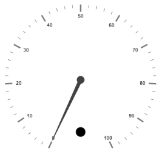
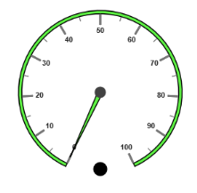
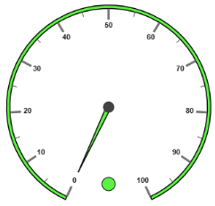
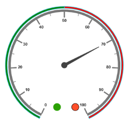

## Indicators

Indicators simply indicates the current status of the pointer. Indicators are in several formats such as in shape format, textual format and image format.

### Adding Indicator Collection 

Indicators collection is directly added to the scale object. Refer the following code to add indicator collection in a Gauge control.

[View]

//For circular gauge rendering

@(Html.EJ().CircularGauge("circulargauge")

.Scales(sc1 =>

{

sc1.ShowIndicators(true)

.Indicators(ind =>

{

ind.Height(10)

.Width(10)

.Type(IndicatorType.Circle)

.Position(pos =>pos.X(185).Y(300)).Add();

}).Add();

})

)

Execute the above code to render the following output.

{{ '' | markdownify }}
{:.image }

### Basic Customization

* You can enable indicators by setting showIndicators to ‘true’. The height and width property for the indicators are used to specify the area allocated to the indicator for the width and height respectively. You can use the position collection to position the indicators along x and y axis. 
* Indicators are of several types such as, circle, rectangle, rounded rectangle, text and image. By using the type property you can avail those shapes. For image type imageUrl property is used. 

[View]

// For Circular Gauge rendering

@(Html.EJ().CircularGauge("circulargauge")

.Scales(sc1 =>

{

sc1.ShowIndicators(true)

.MinorIntervalValue(5)

.BackgroundColor("#5DF243")

.Border(bo =>bo.Width(1.5).Color("Black"))

.ShowScaleBar(true).Radius(120).Size(5)

.Pointers(pc =>

{

pc.BackgroundColor("#5DF243")

.Border(bo =>bo.Width(1.5).Color("Black"))

.Length(110).Add();

})

.Indicators(ind =>

{

// For setting indicator height

ind.Height(10)

// For setting indicator width

.Width(10)

// For setting indicator type

.Type(IndicatorType.Circle)

// For setting indicator position

.Position(pos =>pos.X(185).Y(300)).Add();

}).Add();

})

)

Execute the above code to render the following output.

{{ '' | markdownify }}
{:.image }

### State Ranges

* State ranges are used to specify the indicator behavior in the specified region. Use startValue and endValue to set the range bound for the pointer. Whenever the pointer cross the specified region, the indicator attributes are applied for ranges. 
* The backgroundColor and borderColor sets the appearance behavior for the indicators. For text type indicators you can give value for text. And text can be changed whenever the pointer crosses its state range area. There are many basic font options available for the text in the state range such as size, fontStyle and fontFamily.

[View]

// For Circular Gauge rendering

@(Html.EJ().CircularGauge("circulargauge")

.Scales(sc1 =>

{

sc1.ShowIndicators(true)

.MinorIntervalValue(5)

.BackgroundColor("#5DF243")

.Border(bo =>bo.Width(1.5).Color("Black"))

.ShowScaleBar(true).Radius(150).Size(5)

.Pointers(po =>

{

po.BackgroundColor("#5DF243")

.Border(bo =>bo.Width(1.5).Color("Black"))

.Length(110).Add();

})

.Indicators(ind =>

{

// For setting indicator height

ind.Height(10)

// For setting indicator width

.Width(10)

// For setting indicator type

.Type(IndicatorType.Circle)

// For setting indicator position

.Position(pos =>pos.X(185).Y(300))

// For setting indicator state range collection

.StateRanges(st =>

{

// For setting state range End Value

st.EndValue(100)

// For setting state range start value

.StartValue(0)

// For setting indicator background color

.BackgroundColor("#5DF243")

// For setting indicator border color

.BorderColor("Black")

// For setting indicator text

.Text("")

// For setting indicator text color

.TextColor("#870505").Add();

}).Add();

}).Add();

})

)

Execute the above code to render the following output.

{{ '' | markdownify }}
{:.image }

### Multiple Indicators

You can use multiple indicators for a single Gauge. Each indicator have a list of state ranges. Refer the following code example for multiple Indicators. 

[View]

// For Circular Gauge rendering

@(Html.EJ().CircularGauge("circulargauge")

.Scales(sc1 =>

{

sc1.ShowIndicators(true)

.ShowRanges(true)

.MinorIntervalValue(5)

.ShowScaleBar(true).Radius(150).Size(5)

.Pointers(po =>

{

po.Length(110).Value(70).Add();

})

.Ranges(ran =>

{

ran.DistanceFromScale(-30).StartValue(0).EndValue(50).BackgroundColor("Green").Placement(RangePlacement.Far).Add();

ran.DistanceFromScale(-30).StartValue(50).EndValue(100).BackgroundColor("Red").Placement(RangePlacement.Far).Add();

})

.Indicators(ind =>

{

//Indicator1

ind.Height(10).Width(10)

.Type(IndicatorType.Circle)

.Position(pos =>pos.X(165).Y(300))

.StateRanges(st =>

{

st.EndValue(50)

.StartValue(0)

.BackgroundColor("#24F92F")

.BorderColor("Black").Add();

st.EndValue(50)

.StartValue(100)

.BackgroundColor("#322C04")

.BorderColor("Black").Add();

}).Add();

//Indicator2

ind.Height(10).Width(10)

.Type(IndicatorType.Circle)

.Position(pos =>pos.X(215).Y(300))

.StateRanges(st =>

{

st.EndValue(50)

.StartValue(0)

.BackgroundColor("#600000")

.BorderColor("Black").Add();

st.EndValue(100)

.StartValue(50)

.BackgroundColor("#FF4F2A")

.BorderColor("Black").Add();

}).Add();

}).Add();

})

)

Execute the above code to render the following output.

{{ '' | markdownify }}
{:.image }

