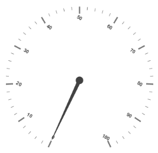
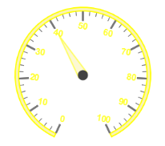
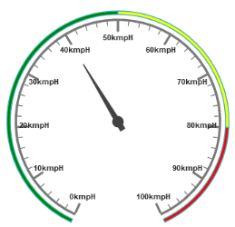
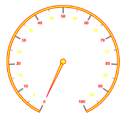

#  Labels

**Labels** are units that are used to display the values in the scales. You can customize `Labels` with the properties like `Angle`, `Color`, `Font`, `Opacity`, etc.

## Adding Label Collection 

**Label collection** is directly added to the scale object. Refer the following code example to add label collection in a **Gauge**.



//For circular gauge rendering

@(Html.EJ().CircularGauge("circulargauge")

.Scales(sc1 =>

{

sc1.Labels(lb =>

{

// For setting label angle

lb.Angle(30).Add();

}).Add();

}))


Execute the above code to render the following output.

Circular Gauge with  label collection
{:.caption}

## Label Customization

### Appearance

* The attribute `Angle` is used to display the labels in the specified angles and `Color` attribute is used to display the labels in specified color. You can adjust the opacity of the label with the property `Opacity` and the values of it lies between 0 and 1.
* You can adjust the labels based on the tick’s direction by setting `AutoAngle` as true. `IncludeFirstValue` is an special property especially used in some special scenarios such as in clock, where the value 0 needs to be replaced with that of 12. By enabling this property the first value of the label is not rendered.
* `Font` option is also available on the labels. The basic three properties of fonts such as `Size`, `Family` and `Style` can be achieved by size, fontStyle and fontFamily. Labels are two types such as major and minor.Major types labels are for major interval values and minor types labels are for minor interval values.



// For Circular Gauge rendering

@(Html.EJ().CircularGauge("circulargauge")

.Scales(sc1 =>

{

sc1.ShowScaleBar(true)

.BackgroundColor("#FAF4B5")

.Border(bo =>bo.Color("Yellow").Width(2))

.Radius(110)

.Size(10)

.Pointers(pointer =>

{

pointer.Border(bo =>bo.Width(2).Color("Yellow"))

.BackgroundColor("#FAF4B5")

.Value(40).Length(80)

.Width(16).Opacity(0.6).Add();

})

.Labels(lb =>

{

// For setting label angle

lb.Angle(30)

// For setting label opacity

.Opacity(0.8)

// For disable the include first value property

.IncludeFirstValue(false)

// For setting label color

.Color("Yellow")

// For setting label font

.Font(f =>f.Size("15px").FontFamily("Arial").FontStyle("bold")).Add();

}).Add();

})

)



Execute the above code to render the following output.

Circular Gauge with customized label
{:.caption}

### Unit text and Position

* `UnitText` is used to add some text along with the labels. For example, in speedometer, you need to mention the units in kph. You can also add the unit text in front of the labels. You can achieve this by using an enumerable property `UnitTextPosition`. With this you can position the unit text in front or back.
* Labels can be positioned with the help of two properties such as `DistanceFromScale` and `Placement`. **DistanceFromScale** property defines the distance between the scale and labels.  **Placement** property is used to locate the labels with respect to scale either inside the scale or outside the scale or along the scale. It is an enumerable data type.



// For Circular Gauge rendering

@(Html.EJ().CircularGauge("circulargauge")

.Scales(sc1 =>

{

sc1.ShowRanges(true)

.ShowScaleBar(true)

.Radius(150).Size(2)

.Pointers(pointer =>

{

pointer.Value(40).Length(100)

.ShowBackNeedle(true).Add();

})

.Labels(lb =>{

// For setting unit text

lb.UnitText("kmph")

// For setting unit text position

.UnitTextPosition(UnitTextPlacement.Back).Add();                                              })

.Ranges(ran =>

{

ran.DistanceFromScale(-30).StartValue(0).EndValue(50).BackgroundColor("Green").Placement(RangePlacement.Far).Add();

ran.DistanceFromScale(-30).StartValue(50).EndValue(80).BackgroundColor("Yellow").Placement(RangePlacement.Far).Add();

ran.DistanceFromScale(-30).StartValue(80).EndValue(100).BackgroundColor("Red").Placement(RangePlacement.Far).Add();

}).Add();

})

)



Execute the above code to render the following output.

Circular Gauge with unit text
{:.caption}

## Multiple Labels

You can achieve multiple labels such as minor and major `Type` in a **Gauge** sample scale. Refer the following code example for multiple labels variation.



// For Circular Gauge rendering

@(Html.EJ().CircularGauge("circulargauge")

.Scales(sc1 =>

{

sc1.ShowRanges(true)

.ShowScaleBar(true)

.Radius(150)

.Size(5)

.MinorIntervalValue(5)

.BackgroundColor("Yellow")

.Border(border =>border.Width(1.5).Color("Red"))

.PointerCap(cap => cap.BackgroundColor("Yellow").BorderColor("Red").BorderWidth(0.5).Radius(10))

.Labels(lb =>

{

// For setting label1

lb.Type(GaugeTypes.Minor).Color("Yellow").Add();

// For setting label2

lb.Type(GaugeTypes.Major).Color("Red").Add();

})

.Pointers(pointer =>

{

pointer.Length(110)

.BackgroundColor("Yellow")

.Border(bo =>bo.Width(1.5).Color("Red")).Add();

})

.Add();

})

)



Execute the above code to render the following output.

Circular Gauge with multiple labels
{:.caption}

