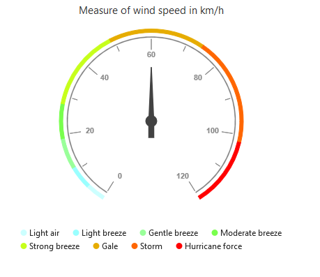
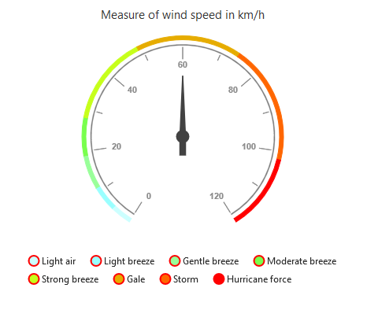
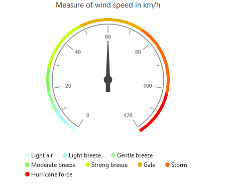
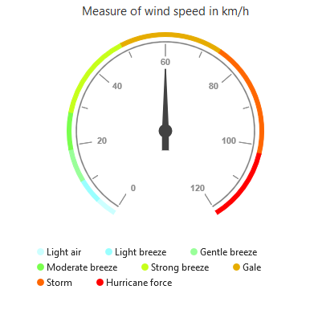

# Legend

The legend contains the list of the ranges that appear in the circular gauge  

## Legend Visibility

By default, the legend will not be displayed in the circular gauge. You can enable or disable it by using the `Visible` property of the legend.



@(Html.EJ().CircularGauge("circulargauge1")

      // ...
    
    //Visible CircularGauge legend
    .Legend(lg=>lg.Visible(true))
     //...
 )



[Click](http://mvc.syncfusion.com/demos/web/circulargauge/legend) here to view the online demo sample for  legend in the circular Gauge.

### Legend Text

The text displayed in the legend can be customized by using the `LegendText` property present in the ranges of the circular gauge. When the legendText is not specified in the ranges, then the legend item for that particular range will not displayed. By default the legendText value is null . 



 @(Html.EJ().CircularGauge("circulargauge1")
                .Scales(sc =>
                {
                    sc.Ranges(ran =>
                    {
                        ran.LegendText("Light air").Add();

                    })
        
                })
 )



## Position and Align the Legend

By using the `Position` property, you can position the legend at *left*, *right*, *top* or *bottom* of the CircularGauge. The legend is positioned at the **bottom** of the circular gauge, by default.



@(Html.EJ().CircularGauge("circulargauge1")

      // ...
    
    .Legend(lg=>lg.
        //...
        //Place the legend at top of the CircularGauge        
        Position(CircularLegendPosition.Top)
    )
     //...
 )



### Legend Alignment

You can align the legend to the *center*, *far* or *near* based on its position by using the `Alignment` property.



@(Html.EJ().CircularGauge("circulargauge1")

      // ...
    
    .Legend(lg=>lg.
        //...
        //The below two settings will place the legend at the top-right corner of the gauge.
        Position(CircularLegendPosition.Top)
        .Alignment(CircularLegendAlignment.Far)
    )
     


## Customization

### Legend shape

To change the legend item shape, you have to specify the desired shape in the `Shape` property of the legend. By default, the shape of the legend is **circle**.It also supports rectangle,diamond,triangle,slider,line,pentagon,trapezoid and wedge shapes.



@(Html.EJ().CircularGauge("circulargauge1")

      // ...
    
    .Legend(lg=>lg
        //...
        //Change legend shape
        .Shape(CircularLegendShape.Slider)
    )
     //...
 )



### Legend Item Size and Border

You can change the size of the legend items by using the `Width` and `Height` properties in the **itemStyle**. To change the legend item border, use `Border` property of the legend itemStyle.



@(Html.EJ().CircularGauge("circulargauge1")

      // ...
    
    .Legend(lg=>lg
        //...
        //Change legend items border, height and width
        .ItemStyle(itm=>itm.Width(13).Height(13).Border(br=>br.Width(2).Color("#FF0000")))
    )
     //...
 )



### Legend size

You can change the default legend size by using the `Size` property of the legend.  



@(Html.EJ().CircularGauge("circulargauge1")

      // ...
    
    .Legend(lg=>lg
        //...
        //Change legend size
        .Size(sz=>sz.Height("100").Width("350"))
    )
     //...
 )



### Legend Item Padding

You can control the spacing between the legend items by using the `ItemPadding` option of the legend.  The default value is 20. 


 @(Html.EJ().CircularGauge("circulargauge1")

      // ...
    
    .Legend(lg=>lg
        //...
        //Add space between each legend item
        .ItemPadding(30)
    )
     //...
 )
>



### Legend border

You can customize the legend border by using the `Border` option in the legend. 



@(Html.EJ().CircularGauge("circulargauge1")

      // ...
    
    .Legend(lg=>lg
        //...
        //Set border color and width to legend
        .Border(br=>br.Color("#FFC342").Width(2))
    )
     //...
 )



### Font of the legend text

The font of the legend item text can be customized by using the `Font`  property in legend.



@(Html.EJ().CircularGauge("circulargauge1")

      // ...
    
    .Legend(lg=>lg
        //...
        //Customize the legend item text
        .Font(fnt=>fnt.FontFamily("Segoe UI").FontStyle(CircularGaugeFontStyle.Normal)
            .FontWeight(CircularGaugeFontWeight.Bold).Size("15px"))
            )
     //...
 )



## Events

### Legend Item Render

LegendItemRender event triggers before rendering the legend items. This event is triggered for each legend item in Circular gauge. You can use this event to customize legend item shape or add custom text to legend item dynamically



@(Html.EJ().CircularGauge("circulargauge1")

      // ...
    
    .Legend(lg=>lg
       .Visible(true)
        //...       
    )
     //Subscribe the legenditem click event
     .LegendItemRender("onlegendRender")
 )
        
     function onlegendclicked(sender) {
        //Get legend item details before rendering
        var legendItem = sender.data;
      }


### Legend Item Click

You can get the legend item details such as *Rangeindex, bounds and shape* by subscribing the **LegendItemClick** event of the circular gauge. When the legend item is clicked, it triggers the event and returns the legend information 



@(Html.EJ().CircularGauge("circulargauge1")

      // ...
    
    .Legend(lg=>lg
       .Visible(true)
        //...       
    )
     //Subscribe the legenditem click event
     .LegendItemClick("onlegendclicked")
 )
        
     function onlegendclicked(sender) {
        //Get legend item details on legend item click.
        var legendItem = sender.data;
      }


