## Pointers

Pointer value points out the actual value set in the Circular Gauge. You can customize the pointers to improve the appearance of Gauge.

### Adding Pointer Collection

Pointer collection is directly added to the scale object. To add pointer collection in a Gauge control refer the following code example.  

[View]

// For Circular Gauge rendering

@(Html.EJ().CircularGauge("circulargauge")

.Scales(sc =>

{

sc.Pointers(PO =>

{

// For setting pointer value

PO.Value(30).Add();

}).Add();

})

)

Execute the above code to render the following output.

{{ '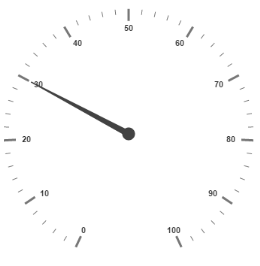' | markdownify }}
{:.image }

_Figure_ _20__(a): Circular Gauge with  pointer collection_

### Adding Pointer Value

Pointer value is the important element in the Circular Gauge that indicates the Gauge value. Real purpose of the Circular Gauge is based on the pointer value. You can set the pointer value either directly during rendering the control or it can be achieved by public method too.

[View]

// For Circular Gauge rendering

@(Html.EJ().CircularGauge("circulargauge")

.Scales(sc =>

{

sc.ShowScaleBar(true)

.MajorIntervalValue(10)

.MinorIntervalValue(2)

.Radius(150)

.Size(2)

.ShowRanges(true)

.Ranges(ran =>

{

ran.StartValue(20)

.EndValue(80)

.BackgroundColor(ConsoleColor.Green.ToString())

.Add();

})

.Pointers(PO =>

{

// For setting pointer value

PO.Value(30).Add();

}).Add();

})

)

Execute the above code to render the following output.

{{ '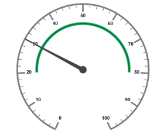' | markdownify }}
{:.image }

_Figure_ _21__(b): Circular Gauge with customized pointer value_

### Pointer Styles

Colors and Border

* The Pointers border is modified with the object called border as in scales. It has two border property called color and width which are used to customize the border color of the pointer and border width of the pointer. 
* You can set the background color to improve the look of the Circular Gauge and you can customize the background color of the scale using backgroundColor.

[View]

// For Circular Gauge rendering

@(Html.EJ().CircularGauge("circulargauge")

.Scales(sc1 =>

{

sc1.ShowScaleBar(true)

.Radius(110)

.Pointers(PO =>

{

// For setting pointer Value

PO.Value(45)

// For setting pointer length

.Length(80)

// For setting pointer width

.Width(16)

// For setting pointer background

.BackgroundColor(ConsoleColor.Yellow.ToString())

// For setting pointer border

.Border(bor =>bor.Color(ConsoleColor.Green.ToString()).Width(2))

// For setting pointer opacity

.Opacity(0.6).Add();

}).Add();

})

)

Execute the above code to render the following output.

{{ '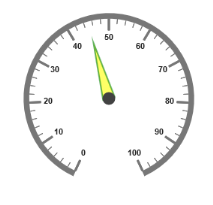' | markdownify }}
{:.image }

Appearance

* Based on the value, thepointer point out the label value. You can set the pointer length and width using length and width property respectively. 
* And you can also adjust the opacity of the pointer using the property opacity which holds the value between 0 and 1. You can add the gradient effects to the pointer using gradient object.

[View]

// For Circular Gauge rendering

@(Html.EJ().CircularGauge("circulargauge")

.Scales(sc1 =>

{

sc1.ShowScaleBar(true)

.Radius(110)

.BackgroundColor(ConsoleColor.Yellow.ToString())

.Border(bor =>bor.Color(ConsoleColor.Red.ToString()).Width(2))

.Pointers(PO =>

{

PO.Value(45)

// For setting pointer background

.BackgroundColor(ConsoleColor.Yellow.ToString())

// For setting pointer border

.Border(bor =>bor.Color(ConsoleColor.Red.ToString()).Width(2))

// For setting pointer length

.Length(80)

// For setting pointer width

.Width(16)

// For setting pointer opacity

.Opacity(0.6).Add();

}).Add();

})

)

Execute the above code to render the following output.

{{ '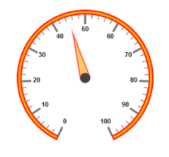' | markdownify }}
{:.image }

Position the pointer

* Pointer can be positioned with the help of two properties such as distanceFromScale and placement. distanceFromScale property defines the distance between the scale and pointer.  Placement property is used to locate the pointer with respect to scale either inside the scale or outside the scale or along the scale. 
* It is an enumerable data type. Both the property is applied only if pointer type is marker. For needle type marker, it renders with default position that is unchangeable.

[View]

// For Circular Gauge rendering

@(Html.EJ().CircularGauge("circulargauge")

.Scales(sc1 =>

{

sc1.ShowScaleBar(true)

.Size(10)

.Radius(110)

.BackgroundColor("#DCEBF9")

.Border(bor=>bor.Color(ConsoleColor.Blue.ToString()).Width(2))

.Pointers(PO =>

{

PO.Value(40)

.Length(20)

.Width(20)

.BackgroundColor("#DCEBF9")

.Border(bor=>bor.Color(ConsoleColor.Blue.ToString()).Width(2))

// For setting distance between scale and pointer

.DistanceFromScale(10)

// For setting pointer placement

.Placement(PointerPlacement.Near)

// For setting pointer type

.Type(PointerType.Marker)

// For setting marker type

.MarkerType(MarkerType.Triangle)

.Add();

}).Add();

})

)

Execute the above code to render the following output.

{{ '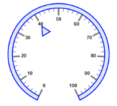' | markdownify }}
{:.image }

Types

* Circular gauge pointer has two types such as,
1. Needle
2. Marker
* Needle type pointers are the default pointers that cannot be positioned and that is located at the center of the gauge. There are four different shapes of needle pointers such as 
1. Rectangle
2. Triangle
3. Trapezoid 
4. Arrow
* For marker pointer, the available dimensions are 
1. Rectangle
2. Triangle

                    3.    Ellipse

                    4.    Diamond

                    5.    Pentagon

                    6.    Circle 

                    7.    Slider

                    8.    Pointer

                    9.    Wedge

                  10.    Trapezoid

                  11.    Rounded Rectangle

Pointer Image

In ASP.NET MVC Circular Gauge, it is possible to replace the pointer with some images. You can fix an image instead of rendering the pointer.

ImageUrl

To implement the pointer image we need to give the API called ImageUrl. It is a string datatype. Image type pointer is applicable for both marker and needle type pointers and it is possible to combine the normal marker pointer type with an image type. The three possibilities are

1. Needle Image
2. Marker Image
3. Marker pointer with Image

Needle Image 

In this type, needle pointer is completely replaced by image. You can implement it with the help of thr following example.

<table>
<tr>
<td>
[Razor]@(Html.EJ().CircularGauge("circulargauge1")// To set frame type as half circle .Frame(fr => fr.FrameType(Frame.HalfCircle))// To set scale options.Scales(scl =>      {          // set basic appearance          scl.ShowRanges(true).ShowLabels(false).StartAngle(180)             .SweepAngle(180).Radius(130).ShowScaleBar(false)             // To set pointer option             .Pointers(pon => {                                // To set pointer type as needle                              pon.Type(PointerType.Needle)                                 // To set needle type as image                                 .NeedleType(NeedleType.Image)                                 // To set image url for pointer image                                 .ImageUrl("nib.png")                                 // To set pointer value                                 .Value(60)                                 // To set pointer dimension                                 .Length(30).Width(100).Add(); })             // To set tick options             .Ticks(tic => { tic.Height(0).Width(0).Add(); })             // To set range options             .Ranges(rng => {                      rng.DistanceFromScale(-30).StartValue(0)                        .EndValue(70).Size(40).Add();                     rng.DistanceFromScale(30).StartValue(70)                        .EndValue(100).BackgroundColor("#fc0606")                        .Border(bor => or.Color("#fc0606")).Size(40).Add();              }).Add(); }))</td></tr>
<tr>
<td>
[Controller]public partial class CircularGaugeController : Controller    {        //        // GET: /ToolTip/        public ActionResult Semicircular()        {            return View();        }    }</td></tr>
</table>

{{ '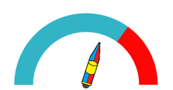' | markdownify }}
{:.image }

_Figure_ _25__: Semi-circular Gauge with needle pointer as image_

Marker Image 

In this type, the marker pointer is completely replaced by the image. You can implement it with the help of the following example.

<table>
<tr>
<td>
[Razor]@(Html.EJ().CircularGauge("circulargauge1")// To set frame type as half circle .Frame(fr => fr.FrameType(Frame.HalfCircle))// To set scale options.Scales(scl =>      {          // set basic appearance          scl.ShowRanges(true).ShowLabels(false).StartAngle(180)             .SweepAngle(180).Radius(130).ShowScaleBar(false)             // To set pointer option             .Pointers(pon => {                                // To set pointer type as marker                              pon.Type(PointerType.Marker)                                 // To set needle type as image                                 .MarkerType(MarkerType.Image)                                 // To set image url for pointer image                                 .ImageUrl("ball.png")                                 // To set pointer value                                 .Value(60)                                 // To set pointer dimension                                 .Length(30).Width(100).Add(); })             // To set tick options             .Ticks(tic => { tic.Height(0).Width(0).Add(); })             // To set range options             .Ranges(rng => {                      rng.DistanceFromScale(-30).StartValue(0)                        .EndValue(70).Size(40).Add();                     rng.DistanceFromScale(30).StartValue(70)                        .EndValue(100).BackgroundColor("#fc0606")                        .Border(bor => or.Color("#fc0606")).Size(40).Add();              }).Add(); }))</td></tr>
<tr>
<td>
[Controller]public partial class CircularGaugeController : Controller    {        //        // GET: /ToolTip/        public ActionResult Semicircular()        {            return View();        }    }</td></tr>
</table>

{{ '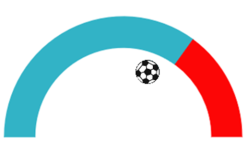' | markdownify }}
{:.image }

Marker pointer with Image 

In this type, marker pointer is drawn first and then the image is loaded. You can implement it with the help of following example.

<table>
<tr>
<td>
[Razor]@(Html.EJ().CircularGauge("circulargauge1")// To set frame type as half circle .Frame(fr => fr.FrameType(Frame.HalfCircle))// To set scale options.Scales(scl =>      {          // set basic appearance          scl.ShowRanges(true).ShowLabels(false).StartAngle(180)             .SweepAngle(180).Radius(130).ShowScaleBar(false)             // To set pointer option             .Pointers(pon => {                                // To set pointer type as marker                              pon.Type(PointerType.Marker)                                 // To set needle type as rectangle                                 .MarkerType(MarkerType.Rectangle)                                 // To set image url for pointer image                                 .ImageUrl("ball.png")                                 // To set pointer value                                 .Value(50)                                 // To set pointer dimension                                 .Length(30).Width(100)                                 .Border(bor => bor.Color("Black").Width(3))                                 .Add(); })             // To set tick options             .Ticks(tic => { tic.Height(0).Width(0).Add(); })             // To set range options             .Ranges(rng => {                      rng.DistanceFromScale(-30).StartValue(0)                        .EndValue(70).Size(40).Add();                     rng.DistanceFromScale(30).StartValue(70)                        .EndValue(100).BackgroundColor("#fc0606")                        .Border(bor => bor.Color("#fc0606")).Size(40).Add();              }).Add(); }))</td></tr>
<tr>
<td>
[Controller]public partial class CircularGaugeController : Controller    {        //        // GET: /ToolTip/        public ActionResult Semicircular()        {            return View();        }    }</td></tr>
</table>

{{ '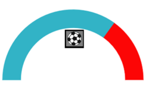' | markdownify }}
{:.image }

### Multiple Pointers

Circular Gauge can have multiple pointers on it. You can use any combination and any number of pointers in a Gauge. That is, a Gauge can contain any number of marker pointer and any number of needle pointers. Refer the following code example containing two pointers.

[View]

// For Circular Gauge rendering

@(Html.EJ().CircularGauge("circulargauge")

.Scales(sc1 =>

{

sc1.ShowScaleBar(true)

.Size(10)

.Radius(110)

.BackgroundColor("#DCEBF9")

.Border(bor =>bor.Color(ConsoleColor.Green.ToString()).Width(2))

.Pointers(PO =>

{

// For setting pointer1

PO.Value(40)

.Length(80)

.Width(16)

.Opacity(0.6)

.BackgroundColor("#DCEBF9")

.Border(bor =>bor.Color(ConsoleColor.Green.ToString()).Width(2)).Add();

// For setting pointer2

PO.Placement(PointerPlacement.Near)

.Type(PointerType.Marker)

.MarkerType(MarkerType.Triangle)

.Length(20)

.Width(20)

.Value(60)

.BackgroundColor("#DCEBF9")

.Border(bor =>bor.Color(ConsoleColor.Green.ToString()).Width(2)).Add();

}).Add();

})

)

Execute the above code to render the following output.

{{ '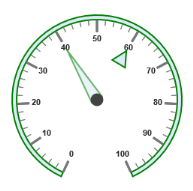' | markdownify }}
{:.image }

Figure 28: Circular Gauge with multiple pointers

### Pointer Value

* Gauge Pointer value is used to display the current value of the pointer in the Circular Gauge control.
* You can position the Circular Gauge pointer value with the gauge as center by using the API called distance. You can Disable/ Enable these pointers value by using the API showValue.

<table>
<tr>
<td>
[Razor]@(Html.EJ().CircularGauge("CoreCircularGauge")// Setting basic properties.Radius(100).Value(55).BackgroundColor("transparent")// Setting scale properties.Scales(SC =>{// enable rangesSC.ShowRanges(true)// Setting ticks option.Ticks(tic => { tic.Height(0).Width(0).Add(); })// Setting range properties.Ranges(ran =>{ran.Size(40).StartValue(0).EndValue(50).BackgroundColor("#1B4279").Border(bor => bor.Color("#1B4279")).Add();ran.Size(40).StartValue(50).EndValue(100).BackgroundColor("#91B8F3").Border(bor => bor.Color("#91B8F3")).Add();})// Setting pointer option.Pointers(PO =>{PO.PointerValueText(po=>// enable showValue propertypo.ShowValue(true)// setting distance property.Distance(10).Color("#8c8c8c")).Add();}).Add();}))</td></tr>
<tr>
<td>
[Controller]public partial class CircularGaugeController : Controller{//// GET: /ToolTip/public ActionResult Semicircular(){return View();}}</td></tr>
</table>

Run the above code to render the output as follows.

{{ '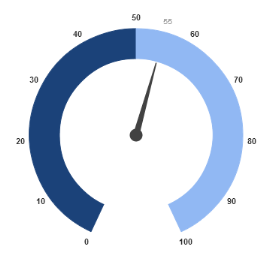' | markdownify }}
{:.image }

### Appearance

Appearance of the Circular Gaugepointer value text is adjusted by using four properties. Such as color, angle, autoAngle and opacity.

* Color property is used to set the color of the pointer value text.
* Angle property is used to set the angle in which the text is displayed.
* Auto Angle is used to display the text in certain angle based on pointer position angle.
* Opacity is used to customize the brightness of the text.

<table>
<tr>
<td>
[Razor]@(Html.EJ().CircularGauge("CoreCircularGauge")// Setting basic properties.Radius(100).Value(55).BackgroundColor("transparent")// Setting scale properties.Scales(SC =>{// enable rangesSC.ShowRanges(true)// Setting ticks option.Ticks(tic => { tic.Height(0).Width(0).Add(); })// Setting range properties.Ranges(ran =>{ran.Size(40).StartValue(0).EndValue(50).BackgroundColor("#1B4279").Border(bor => bor.Color("#1B4279")).Add();ran.Size(40).StartValue(50).EndValue(100).BackgroundColor("#91B8F3").Border(bor => bor.Color("#91B8F3")).Add();})// Setting pointer option.Pointers(PO =>{PO.PointerValueText(po=>po.ShowValue(true).Distance(10)// Setting opacity property.Opacity(1)// Setting color property.Color("Red")// Setting auto angle property.autoAngle(false)// Setting angle property.Angle(0)).Add();}).Add();}))</td></tr>
<tr>
<td>
[Controller]public partial class CircularGaugeController : Controller    {        //        // GET: /ToolTip/        public ActionResult Semicircular()        {            return View();        }}</td></tr>
</table>

Run the above code to render the output as follows.

{{ '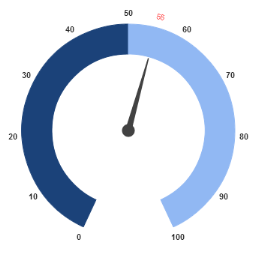' | markdownify }}
{:.image }

### Font Options

Similar to other collection, font option is also available in this pointer value text such as size, fontFamily and fontStyle.

<table>
<tr>
<td>
[Razor]@(Html.EJ().CircularGauge("CoreCircularGauge")// Setting basic properties.Radius(100).Value(55).BackgroundColor("transparent")// Setting scale properties.Scales(SC =>{// enable rangesSC.ShowRanges(true)// Setting ticks option.Ticks(tic => { tic.Height(0).Width(0).Add(); })// Setting range properties.Ranges(ran =>{ran.Size(40).StartValue(0).EndValue(50).BackgroundColor("#1B4279").Border(bor => bor.Color("#1B4279")).Add();ran.Size(40).StartValue(50).EndValue(100).BackgroundColor("#91B8F3").Border(bor => bor.Color("#91B8F3")).Add();})// Setting pointer option.Pointers(PO =>{PO.PointerValueText(po=>po.ShowValue(true).Distance(10).Opacity(1).Color("Red").autoAngle(false).Angle(0)// Setting font option.Font(fo=>fo.Size("15px").FontFamily("Arial").FontStyle("Normal"))).Add();}).Add();}))</td></tr>
<tr>
<td>
[Controller]public partial class CircularGaugeController : Controller{//// GET: /ToolTip/public ActionResult Semicircular(){return View(); }   }</td></tr>
</table>

Run the above code to render the output as follows.

{{ '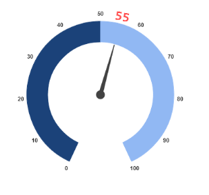' | markdownify }}
{:.image }

