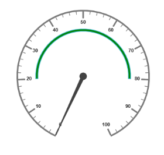
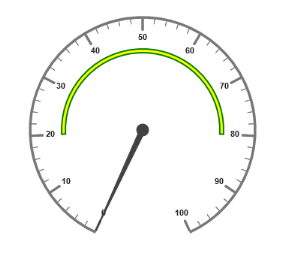
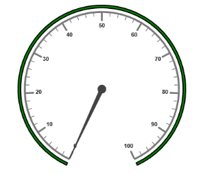
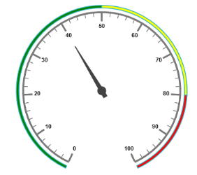
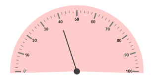

#  Ranges and Frames

Ranges are used to specify or group the scale values. By using ranges, you can describe the values in the pointers. 

## Add Range Collection

Range collection is directly added to the scale object. Refer the following code example to add range collection in a Gauge control. 



//For circular gauge rendering

@(Html.EJ().CircularGauge("circulargauge")

.Scales(sc1 =>

{

sc1.ShowRanges(true)

.Ranges(ran =>

{

ran.StartValue(20)

.EndValue(80)

.BackgroundColor("Green")

.Placement(RangePlacement.Far).Add();

}).Add();

})

)


### Range Customization

#### Appearance

* The API size is used to specify the width of the ranges.  The major attributes for ranges are startValue and endValue. startValue defines the start position of the ranges and endValue defines the end position of the ranges.
* StartWidth and endWidth are used to specify the range width at the starting and ending position of the ranges. You can add the gradient effects to the ranges by using gradient object.



// For Circular Gauge rendering

@(Html.EJ().CircularGauge("circulargauge")

.Scales(sc1 =>

{

sc1.ShowRanges(true)

.ShowScaleBar(true)

.Radius(150).Size(5)

.Ranges(ran =>

{

//For setting range start value

ran.StartValue(20)

//For setting range end value

.EndValue(80)

//For setting range background color

.BackgroundColor("Green")

//For setting range placement

.Placement(RangePlacement.Far).Add();

}).Add();

})

)



Execute the above code to render the following output.

Circular Gauge with customized ranges with startValues and endValues
{:.caption}

### Colors and Border

* By customizing the ranges, the appearance of the Gauge can be improved. The range border is modified with the object called border. It has two border property such as color and width. These are used to customize the border color of the ranges and border width of the ranges. 
* You can set the background color to improve the look and feel of the Circular Gauge. For customizing the background color of the ranges, backgroundColor is used.



// For Circular Gauge rendering

@(Html.EJ().CircularGauge("circulargauge")

.Scales(sc1 =>

{

sc1.ShowRanges(true)

.ShowScaleBar(true)

.Radius(150).Size(5)

.Ranges(ran =>

{

//For setting range start value

ran.StartValue(20)

//For setting range end value

.EndValue(80)

//For setting range background color

.BackgroundColor("Yellow")

//For setting range placement

.Placement(RangePlacement.Far)

//For setting range border

.Border(bo =>bo.Width(2).Color("Green")).Add();

}).Add();

})

)



Execute the above code to render the following output.

Circular Gauge with customized range colors and borders
{:.caption}

### Position the ranges

* You can position ranges using two properties such as distanceFromScale and placement. 
* distanceFromScale property defines the distance between the scale and range. 
* Placement property is used to locate the pointer with respect to scale either inside the scale or outside the scale or along the scale. It is an enumerable data type.



// For Circular Gauge rendering

@(Html.EJ().CircularGauge("circulargauge")

.Scales(sc1 =>

{

sc1.ShowRanges(true)

.ShowScaleBar(true)

.Radius(150).Size(2)

.Ranges(ran =>

{

//For setting range start value

ran.StartValue(0)

//For setting range end value

.EndValue(100)

//For setting range background color

.BackgroundColor("Green")

//For setting range placement

.Placement(RangePlacement.Far)

//For setting distance between scale and ranges

.DistanceFromScale(-30)

//For setting range border

.Border(bo =>bo.Width(2).Color("Black")).Add();

}).Add();

})

)



Execute the above code to render the following output.

Circular Gauge with customized ranges
{:.caption}

## Multiple Ranges

You can set multiple ranges by adding an array of ranges objects. Refer the following code example for multiple ranges functionality.



// For Circular Gauge rendering

@(Html.EJ().CircularGauge("circulargauge")

.Scales(sc1 =>

{

sc1.ShowRanges(true)

.ShowScaleBar(true)

.Radius(150).Size(2)

.Pointers(p =>

{

p.Value(40)

.ShowBackNeedle(true)

.Length(100).Add();

})

.Ranges(ran =>

{

//For setting range1

ran.StartValue(0)

.EndValue(50)

.BackgroundColor("Green")

.Placement(RangePlacement.Far)

.DistanceFromScale(-30).Add();

//For setting range2

ran.StartValue(50)

.EndValue(80)

.BackgroundColor("Yellow")

.Placement(RangePlacement.Far)

.DistanceFromScale(-30).Add();

//For setting range3

ran.StartValue(80)

.EndValue(100)

.BackgroundColor("Red")

.Placement(RangePlacement.Far)

.DistanceFromScale(-30).Add();

}).Add();

})

)



Execute the above code to render the following output.

Circular Gauge with multiple ranges
{:.caption}

## Frames

* Frame is the element that decides the appearance of the Circular Gauge. You can customize it using the object called frame.  It has the properties such as frameType, backGroundUrl, halfCircleFrameStartAngle and halfCircleFrameEndAngle.
* frameType is used to specify whether frame is a half circle frame or full circle frame. halfCircleFrameStartAngle and halfCircleFrameEndAngle are used to specify the angle for Gauge with frame type as half circle. backgroundUrl is used to set the background image for the frame.



// For Circular Gauge rendering

@(Html.EJ().CircularGauge("circulargauge")

.Frame(f =>

{

//For setting type

f.FrameType(Frame.HalfCircle)

//For setting half circle frame start angle

.HalfCircleFrameStartAngle(205)

//For setting half circle frame end angle

.HalfCircleFrameEndAngle(335).ToString();

})

.BackgroundColor("#FFCCCC")

.Scales(sc =>

{

sc.StartAngle(180)

.SweepAngle(180)

.PointerCap(pc =>pc.Radius(8))

.Pointers(po =>

{

po.NeedleType(NeedleType.Rectangle)

.Width(1).Length(120)

.Value(40).Add();

}).Add();

})

)



Execute the above code to render the following output.

Circular Gauge with multiple ranges
{:.caption}
