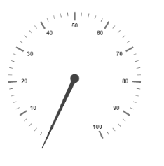
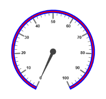
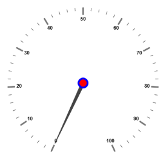
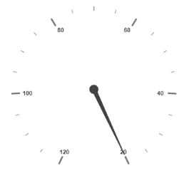
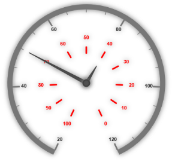

## Scales

Scales are the basic functional block of the Circular Gauge. By customizing the scales, the appearance of the Gauge can be improved. The functional blocks of Circular Gauge are 

* Pointers
* Labels
* CustomLabels
* Indicators
* Ticks
* Ranges
* Subgauges.
### Adding Scale Collection

Scale collection is directly added to the Gauge object. Refer the following code example to add scale collection in Gauge control.

[View]

//For circular gauge rendering

@(Html.EJ().CircularGauge("circulargauge")

.Scales(SC =>

{

SC.Radius(130).Add();

}))

Execute the above code to render the following output.

{  | markdownify }
{:.image }

### Scale Customization

Colors and Border

* The Scale border is modified with the object called border. It has two border property namely color and width which are used to customize the border color of the scale and border width of the scale. 
* Setting the background color improves the look and feel of the Circular Gauge. You can customize the background color of the scale using backgroundColor. 

[View]

//For circular gauge rendering

@(Html.EJ().CircularGauge("circulargauge")

.Scales(SC =>

{

SC.Radius(130)

.BackgroundColor("Red")

.ShowScaleBar(true)

.Border(b =>{

//For scale border width

b.Width(3)

//For scale border color

.Color("Blue");

})

.Pointers(po =>

{

po.Length(80).Add();

}).Add();

})

)

Execute the above code to render the following output.

{  | markdownify }
{:.image }

Pointer Cap

* Pointer cap is a circular shape element that is located at the center of the Circular Gauge. The pointer cap is one of the cynosure of the Circular Gauge. By customizing the pointer cap, Gauge style is improved. The pointer cap is modified with the object pointerCap. 
* It contains radius, borderColor, bordrWidth, interiorGradient and backgroundColor properties. The property radius is used to set the radius for the pointer cap. interiorGradient is used to provide the gradient effects to the pointer cap.

[View]

//For circular gauge rendering

@(Html.EJ().CircularGauge("circulargauge")

.Scales(SC =>

{

SC.PointerCap(pc =>

{

//For setting pointer cap radius

pc.Radius(10)

// For setting pointer cap border width

.BorderWidth(4)

// For setting pointer cap border color

.BorderColor("Blue")

// For setting pointer cap background

.BackgroundColor("Red");

}).Add();

}))

Execute the above code to render the following output.

{  | markdownify }
{:.image }

Appearance

* Circular Gauge contains two types of scale direction such as clockwise and counter clockwise. You can set them by enumerable property called direction. And you can set the minimum and maximum values for the scale with the properties minimum and maximum. The two properties minorIntervalValue and majorIntervalValue are the values used to set interval value for the ticks and labels. 
* The radius property is used to set the radius value for the circular scale and the size property is used to set the scale bar width. You can also adjust the Opacity of the scale with the property opacity. The value for opacity lies between 0 and 1. You can also give some shadow effects for the scale by using the property shadowOffset. The property startAngle is used to set starting position of the scale at certain angle and sweepAngle is used to shrink or expand the scale to certain angle. 

[View]

// For Circular Gauge rendering

@(Html.EJ().CircularGauge("circulargauge")

.Scales(sc =>

{

// For setting scale bar size

sc.Size(30)

// For setting scale minimum value

.Minimum(20)

// For setting scale maximum value

.Maximum(120)

// For setting scale major interval value

.MajorIntervalValue(20)

// For setting scale minor interval

.MinorIntervalValue(5)

// For setting scale background color

.BackgroundColor("Red")

// For setting scale bar opacity

.Opacity(0.5)

// For setting scale bar shadow offset

.ShadowOffset(20)

// For setting scale direction

.Direction(Directions.CounterClockwise).Add();

})

)

Execute the above code to render the following output.

{  | markdownify }
{:.image }

Enable/Disable properties

You can enable / disable properties in Circular Gauge using some properties in scale collection. The showIndicators property is used to enable/disable the indicators. ShowLabels, showTicks, showRanges, showPointers ans showScaleBar are used to enable/ disable labels, ticks, ranges, pointers and scale bar respectively. 

### Multiple Scales

You can set Multiple scales for a single Circular Gauge control by using an array of scale objects. Each scale object is independent of each other. The following code example refers to two scale objects in a Gauge.

[View]

// For Circular Gauge rendering

@(Html.EJ().CircularGauge("circulargauge")

.Scales(sc =>

{

// For setting  first scale

sc.ShowScaleBar(true)

.Size(10)

.Radius(150)

.Minimum(20)

.Maximum(120)

.MajorIntervalValue(20)

.MinorIntervalValue(5)

.Pointers(p => { p.Length(120).Value(50).Add(); })

.Direction(Directions.Clockwise)

.ShadowOffset(20).Add();

// For setting second scale

sc.Size(10)

.ShowScaleBar(false)

.Radius(80)

.MajorIntervalValue(10)

.Labels(lb =>lb.DistanceFromScale(-40).Color("Red").Add())

.Ticks(t =>t.Color("Red").Add())

.Pointers(p => { p.Length(50).Value(40).DistanceFromScale(-30).Add();                     })

.Direction(Directions.CounterClockwise)

.Opacity(0.5)

.ShadowOffset(5).Add();

})

)

Execute the above code to render the following output.

{  | markdownify }
{:.image }

