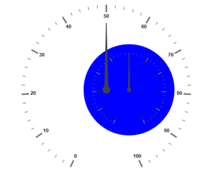
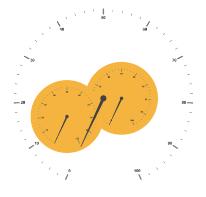

# Sub Gauges

A Circular Gauge containing another circular gauge is said to be Sub Gauges. Inorder to make  a sample like watch that has second gauge, minute gauge and hour gauge, sub gauges are used.

## Adding SubGauges

Sub gauge collection is directly added to the scale object. Refer the following code example to add custom sub gauge collection in a Gauge control



[View]

@(Html.EJ().CircularGauge("circulargauge")

.Value(50)

.Scales(sc =>

{

sc.Radius(190)

//For setting sub gauge

.SubGauges(sg =>

{

sg.ControlID("Subgauge1")

.Height(200)

.Width(200)

.Position(p =>p.X(100).Y(120)).Add();

}).Add();

})

)

@(Html.EJ().CircularGauge("Subgauge1")

.BackgroundColor("Blue")

.Value(50)

.Scales(sc=>{sc.Radius(150).Add();})

)


### Basic Customization

Basic attributes such as height and width property are used to set height and width of the sub gauge. You can easily position the gauge in another gauge using the position object and by giving the X and Y Coordinates value. controlID attribute is used to specify the sub gauge ID.



[View]

@(Html.EJ().CircularGauge("Subgauge1")

.BackgroundColor("Blue")

.Value(50)

.Radius(110)

.Scales(sc=>{sc.Radius(110).Add();})

)

@(Html.EJ().CircularGauge("circulargauge")

.Height(500)

.Width(500)

.Value(50)

.Scales(sc =>

{

sc.Radius(190)

.SubGauges(sg =>

{

//For setting sub gauge control ID

sg.ControlID("Subgauge1")

//For setting sub gauge Height

.Height(250)

//For setting sub gauge width

.Width(250)

//For setting sub gauge position

.Position(p =>p.X(150).Y(100)).Add();

}).Add();

})

)



Execute the above code to render the following output.

## Multiple SubGauges

You can set multiple sub gauges in a single Circular Gauge by adding an array of sub gauge objects. Refer the following code example for multiple sub gauges functionality.



[View]

@(Html.EJ().CircularGauge("Subgauge1")

.BackgroundColor("#f5b43f")

.Scales(sc => { sc.Radius(150).Add(); })

)

@(Html.EJ().CircularGauge("Subgauge2")

.BackgroundColor("#f5b43f")

.Scales(sc => { sc.Radius(150).Add(); })

)

@(Html.EJ().CircularGauge("circulargauge")

.Height(500)

.Width(500)

.Scales(sc =>

{

sc.Radius(250)

.SubGauges(sg =>

{

//Sub gauge1

sg.ControlID("Subgauge1")

.Height(200)

.Width(200)

.Position(p =>p.X(200).Y(150)).Add();

//Sub gauge2

sg.ControlID("Subgauge2")

.Height(200)

.Width(200)

.Position(p =>p.X(50).Y(200)).Add();

}).Add();

})

)



Execute the above code to render the following output.

