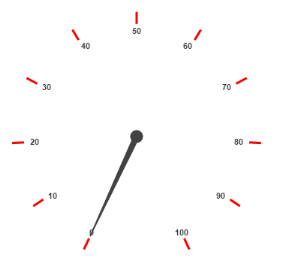
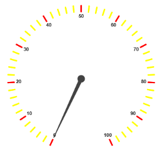

# Ticks

`Ticks` are used to mark some values on the scale. Based on the tick’s `Value` you can set the labels on the required position.

## Adding Tick Collection 

Tick collection is directly added to the scale object. Refer the following code example to add tick collection in a **Gauge** control.



//For circular gauge rendering

@(Html.EJ().CircularGauge("circulargauge")

.Scales(sc1 =>

{

sc1.Ticks(tick =>

{

// For setting tick

tick.Type(CircularTickTypes.Major).Color("Red").Add();

}).Add();

})

)

Execute the above code to render the following output.

Circular Gauge with tick collection
{:.caption}

## Tick Customization

* Height and width of the ticks can be applied by using the properties `Height` and `Width`. You can customize ticks with the properties such as angle, color, etc. `Angle` attribute is used to display the labels in the specified angles and `Color` attribute is used to display the labels in specified color. Ticks are two types such as major and minor.
* Major `Type` ticks are for major interval values and minor type ticks are for minor interval values.You can position ticks with the help of two properties such as `DistanceFromScale` and `Placement`. **DistanceFromScale** property defines the distance between the scale and ticks. **Placement** property is used to locate the ticks with respect to scale either inside the scale or outside the scale or along the scale. It is an enumerable data type.



// For Circular Gauge rendering

@(Html.EJ().CircularGauge("circulargauge")

.Scales(sc1 =>

{

sc1.Ticks(tick =>

{

// For setting tick1

tick.Type(CircularTickTypes.Major).Color("Red").Add();

// For setting tick2

tick.Type(CircularTickTypes.Minor)

// For setting tick color

.Color("Yellow")

// For setting tick height

.Height(8)

// For setting tick placement

.Placement(TickPlacement.Near)

// For setting tick distance from scale

.DistanceFromScale(5).Add();

}).Add();

})

)



Execute the above code to render the following output.

Circular Gauge with tick customization
{:.caption}

