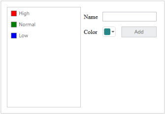
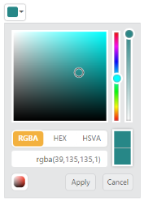
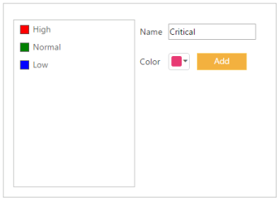
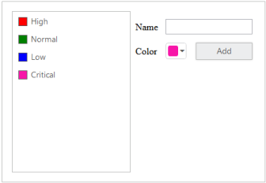

# Getting Started

This section explains briefly about how to create a ColorPicker in your application with, ASP.NET MVC.

## Create your first ColorPicker in ASP.NET MVC

The Essential ASP.NET MVCColorPicker control provides support for selecting the colors in different sources such as palettes, picker or custom palettes. You can also render the color value from control in three formats such as RGB, HSV and HEXCODE. 

In this example, you can learn how to customize ColorPicker control in a category Application. 

{  | markdownify }
{:.image }

In the following sections you can learn, How to:

* Create ColorPicker control
* Initialize the other widgets
* Add Value to ListBox Control

Create ColorPicker Control

Use the following steps to create the ColorPicker control.

1. You can create a MVC Project and add necessary Dll’s and Scripts with the help of the given [MVC-Getting Started](http://help.syncfusion.com/ug/js/Documents/gettingstartedwithmv.htm) Documentation.
2. Add the following code example to the corresponding view page for rendering the ColorPicker window.

[CSHTML]

@Html.EJ().ColorPicker("CategoryColor").Value("#278787")

3. Run this code to render the resultant output of the above steps.

{  | markdownify }
{:.image }

Initialize the other widgets

To add the priority value to the ListBox, the text value is obtained from the input element and color for each priority is received by ColorPicker control. To add each new priority value to ListBox control, click the Add button.

You can refer to the following link for more information on creation on ListBox

[http://help.syncfusion.com](http://help.syncfusion.com)

1. The following code example is used to create the Priority form using ListBox control and ColorPicker control.

[CSHTML]

&lt;div class="content-container-fluid"&gt;

        &lt;div class="row"&gt;

            &lt;div class="sample-area"&gt;

                &lt;div class="frame"&gt;

                    &lt;div id="control"&gt;

                        &lt;ul id="ColorValues"&gt;

                            &lt;li&gt;&lt;span class="color high"&gt;High</li>

                            &lt;li&gt;&lt;span class="color normal"&gt;Normal</li>

                            &lt;li&gt;&lt;span class="color low"&gt;Low</li>

                        &lt;/ul&gt;

                        @Html.EJ().ListBox("selectPriority").TargetID("ColorValues")

                    &lt;/div&gt;

                &lt;/div&gt;

            &lt;/div&gt;

            &lt;div id="Properties"&gt;

                &lt;table class="prop-grid"&gt;

                    &lt;tr class="row"&gt;

                        <td class="column">Name

                        &lt;/td&gt;

                        &lt;td class="column"&gt;

                            &lt;input type="text" id="categoryName" /&gt;

                        &lt;/td&gt;

                    &lt;/tr&gt;

                    &lt;tr class="row"&gt;

                        <td class="column">Color

                        &lt;/td&gt;

                        &lt;td class="column"&gt;

                            &lt;!--Colorpicker element--&gt;

                            @Html.EJ().ColorPicker("CategoryColor").Value("#278787")

                        &lt;/td&gt;

                        &lt;td class="column"&gt;

                            &lt;!--Add button for add the new category--&gt;                                @Html.EJ().Button("AddCategory").Text("Add").Width("82px").Height("28px").Type(ButtonType.Button).ClientSideEvents(events => events.Click("addCategoryValue"))

                        &lt;/td&gt;

                    &lt;/tr&gt;

                    &lt;tr class="row"&gt;

                    &lt;/tr&gt;

                &lt;/table&gt;

            &lt;/div&gt;

        &lt;/div&gt;

    &lt;/div&gt;

2. Add the following style section to align form fields. 

[CSS]

&lt;style&gt;

    .content-container-fluid > .row {

        width: 410px;

        border: 1px solid #bbbcbb;

        padding: 16px;

    }

    .color.high {

        background-color: red;

    }

    .color.normal {

        background-color: green;

    }

    .color.low {

        background-color: blue;

    }

    .sample-area {

        width: 205px;

    }

    .sample-area, #Properties {

        display: inline-block;

        float: left;

    }

    #Properties #categoryName {

        width: 140px;

        height: 20px;

    }

    #Properties .column {

        display: inline-block;

        width: 45px;

        margin: 10px 0 0;

    }

    #Properties .row {

        padding: 10px 0px 5px 0px;

    }

    .color {

        width: 13px;

        height: 13px;

        border: 1px solid;

        display: inline-block;

        margin-right: 6px;

        margin-bottom: -3px;

    }

&lt;/style&gt;

3. Initialize the element in &lt;script&gt; tag.

[JavaScript]

&lt;script&gt;

    var listBoxObj, colorObj;

    jQuery(function ($) {

        //initliaze the listbox with object creation

        listBoxObj = $("#selectPriority").data('ejListBox');

        //initliaze the colorpicker with object creation

        colorObj = $("#CategoryColor").data('ejColorPicker');        

    });

&lt;/script&gt;

4. Run the above code to render the following output.

{  | markdownify }
{:.image }

Add value to ListBox Control 

You can add the value to ListBox with selected color by performing the button click event. The following script section define the click event for the button element.

1. Initialize the click event to button element in &lt;script&gt; tag.

[JavaScript]

&lt;script&gt;

        jQuery(function ($) {

        //reuse the previous section script block            

         //The following function used to add the new value to the listbox control

        function addCategoryValue() {

            if ($("#categoryName").val() !== "") {

                //To get the selected color from the colorpicker by using getValue()

                listBoxObj.addItem("&lt;span class='color' style='background-color: " + colorObj.getValue() + "' &gt;&lt;/span&gt;" + $("#categoryName").val());

                $("#categoryName").val("");

            }

        }

&lt;/script&gt;

2. The following screenshot illustrates the resultant output after you click Add button.

{  | markdownify }
{:.image }

