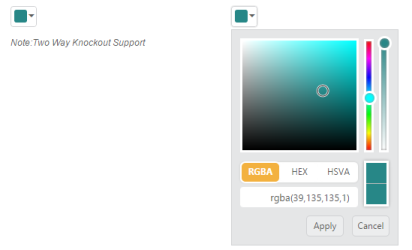

## Knockout Binding

Knockout support allows you to bind the HTML elements against any of the available data models.

Two types of knockout binding is supported,

* One-way binding
* Two-way binding

One-way binding refers to the process of applying observable values to all the available properties of the ColorPicker widget. The changes made in ColorPicker widget are not reflected and triggered in turn to the observable collection. This kind of binding is applied to all the properties of the ColorPicker widget.

Two-way binding supports both the processes. It applies the observable values to the ColorPicker widget properties and also the changes made in the ColorPicker widget are reflected back and triggered within the observable collections. 

For more information about Knockout binding, you can refer to the online documentation in the following link location,

[http://help.syncfusion.com/ug/js/documents/knockoutjs.htm](http://help.syncfusion.com/ug/js/documents/knockoutjs.htm)

1. The following example depicts how you can bind data to the ColorPicker widget through knockout support that enables and populates data to a ColorPicker widget based on the value set to the other ColorPicker widget.

[CSHTML]

@*Add the following script in view page for knockout support*@

&lt;script src="http://cdn.syncfusion.com/js/assets/external/knockout.min.js"&gt; &lt;/script&gt;

&lt;script src="http://cdn.syncfusion.com/13.1.0.21/js/web/ej.unobtrusive.min.js"&gt; &lt;/script&gt;

&lt;script src="http://cdn.syncfusion.com/13.1.0.21/js/ej.widget.ko.min.js"&gt; &lt;/script&gt;

&lt;div class="content-container-fluid"&gt;

    &lt;div class="row" style="width: 100%"&gt;

        &lt;div class="cols-sample-area" style="width: 100%"&gt;

            &lt;div class="frame" style="width: 420px"&gt;

                &lt;div id="control" style="float: left; width: 70%; margin-left: 10px"&gt;

                    &lt;input id="colorpick" data-bind="ejColorPicker: { value: value, modelType: palette }" /&gt;

                    &lt;h6&gt;Note:Two Way Knockout Support&lt;/h6&gt;

                &lt;/div&gt;

                &lt;div id="binding" style="float: left; width: 23%"&gt;

                    &lt;input id="colorpick1" data-bind="ejColorPicker: { value: value, modelType: picker }" /&gt;

                &lt;/div&gt;

            &lt;/div&gt;

        &lt;/div&gt;

    &lt;/div&gt;

&lt;/div&gt;

&lt;script&gt;

    window.viewModel = {

        value: ko.observable("#278787"),

        palette: ko.observable("palette"),

        picker: ko.observable("picker")

    };

    $(function () {

        ko.applyBindings(viewModel);

    });

&lt;/script&gt;

&lt;style&gt;

    .element {

        display: inline-block;

    }

    .frame {

        width: 600px;

        border: 0px;

    }

    #control {

        width: 600px;

    }

&lt;/style&gt;

The following screenshot displays the output of the above code example.

{  | markdownify }
{:.image }

