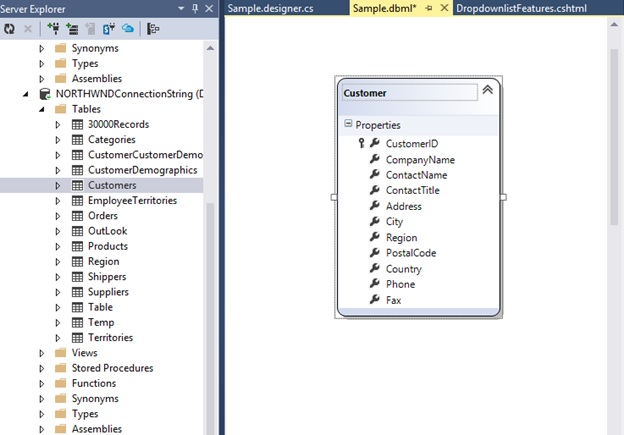

# Data Binding

The ComboBox loads the data either from local data sources or remote data services using the `DataSource` property. It supports the data type of `array` or **DataManager**.

The ComboBox also supports different kinds of data services such as OData, OData V4, and Web API, and data formats such as XML, JSON, and JSONP with the help of `DataManager` adaptors.

| Fields | Type | Description |
|------|------|-------------|
| text |  `string` | Specifies the display text of each list item. |
| value |  `string` | Specifies the hidden data value mapped to each list item that should contain a unique value. |
| groupBy |  `string` | Specifies the category under which the list item has to be grouped. |
| iconCss |  `string` | Specifies the icon class of each list item. |

> When binding complex data to the ComboBox, the fields should be mapped correctly. Otherwise, the selected item remains undefined.

## Binding local data

Local data can be represented in two ways as described below.

### 1. Array of simple data

The ComboBox has support to load array of primitive data such as strings and numbers. Here, both value and text field act the same.



    

        

            @{
                string[] datasource = new string[] { "Badminton", "Cricket", "Football", "Golf", "Tennis" };
                Html.EJ()
                    .ComboBox("ComboBox")
                    .Width("100%")
                    .Datasource(datasource)
                    .Placeholder("Select a game")
                    .Render();
            }
        

    


Output for array-data ComboBox control is as follows.

 

### 2. Array of JSON data

The ComboBox can generate its list items through an array of complex data. For this, the appropriate columns should be mapped to the **ComboBoxFields** property.

In the following example, `id` column and `text` column from complex data have been mapped to the `value` field and `text` field, respectively.



    

        

            @{
                Html.EJ()
                    .ComboBox("ComboBoxId")
                    .Width("100%")
                    .Datasource((IEnumerable<Flowers>)ViewBag.datasource)
                    .AllowCustom(true)
                    .ComboBoxFields(f=>f.Text("text").Value("id"))
                    .Placeholder("Select a flower")
                    .Render();
            }
        

    





public class Flowers
    {
        public string text { get; set; }
        public int id { get; set; }
        public static List<Flowers> GetFlowers()
        {
            List<Flowers> flower = new List<Flowers>();
            flower.Add(new Flowers { text = "Anemone Galilee", id=0 });
            flower.Add(new Flowers { text = "Allium drumstick", id=1 });
            flower.Add(new Flowers { text = "Artichoke thistle" id=2 });
            flower.Add(new Flowers { text = "Boronia" id=3 });
            flower.Add(new Flowers { text = "Bouvardia" id=4 });
            flower.Add(new Flowers { text = "Blue lace flower" id=5 });
            flower.Add(new Flowers { text = "Bird of paradise" id=6 });
            flower.Add(new Flowers { text = "Cone flower" id=7 });
            flower.Add(new Flowers { text = "Cosmos" id=8 });
            flower.Add(new Flowers { text = "Calla lily white" id=9 });
            flower.Add(new Flowers { text = "Common Yarrow" id=10 });
            return flower;
        }
        public ActionResult Default()
        {
            ViewBag.datasource = GetFlowers();
            return View();
        }
    }



Output for remote-data ComboBox control is as follows.

 

## Binding remote data

The ComboBox supports retrieval of data from remote data services with the help of **DataManager** component. The **Query** property is used to fetch data from the database and bind it to the ComboBox.

In the following sample, displayed first 6 contacts from the `customer` table of `Northwind` Data Service.



        

            @{
                Html.EJ()
                    .ComboBox("searchCustomer")
                    .Datasource(d => d.URL("//js.syncfusion.com/ejServices/wcf/NorthWind.svc/").Offline(false).CrossDomain(true))
                    .Query("ej.Query().from('Suppliers').select('SupplierID', 'ContactName')")
                    .ComboBoxFields(f => f.Text("ContactName").Value("SupplierID"))
                    .Width("100%")
                    .Placeholder("Search a customer")
                    .Render();
            }
        

    





public ActionResult Databindingremote()
        {
            return View();
        }



Output for remote-data ComboBox control is as follows.

 

## SQL Data Binding

Fetch the Data from SQL data source and initialize the control with DataSource property. Specify the column names in the Fields property. 

	
    
        @Html.EJ()ComboBox("selectEmployee").Datasource((IEnumerable<Object>)ViewBag.Data)ComboBoxFields(df => df.ID("Id").Text("Name").Value("Designation")).Width("150px")
		
	
    
    
        public ActionResult DropdownlistFeatures()
        {
            List<Employee> data = new List<Employee>();
            SqlConnection con = new SqlConnection(@"Data Source=(LocalDB)\MSSQLLocalDB;AttachDbFilename=|DataDirectory|\SampleDB.mdf;Integrated Security=True");
            using (con)
            {
                con.Open();
                SqlDataReader myReader = null;
                SqlCommand myCommand = new SqlCommand("select * From [Table]",
                                                         con);
                myReader = myCommand.ExecuteReader();
                if (myReader.Read())
                {
                    
                        data.Add(new Employee(myReader["Name"].ToString(), myReader["Designation"].ToString()));
                    
                }
                con.Close();
                ViewBag.Data = data;
                
            }
            return View();
         }
        public class Employee
        {
            public string Name { get; set; }
            public string Designation { get; set; }
            public Employee(string name, string deg)
            {
                this.Name = name;
                this.Designation = deg;
            
            }
        }
    
    

## LINQ Data Binding

Language-Integrated Query (LINQ) is not only about retrieving data. It is also a powerful tool for transforming data. By using a LINQ query, you can use a source sequence as input, and modify it in many ways to create a new output sequence.

Defines model class



public class Employee
    {
        public string name { set; get; }
        public string employeeID { set; get; }
        public string designation { set; get; }
        public Employee() { }
        public Employee(string name, string id, string designation)
        {
            name = name;
            employeeID = id;
            designation = designation;
        }
        
    }


In code behind, fetch the data from Employee class and assigned to the ComboBox are as follows:



    public ActionResult ComboBoxFeatures()
    {

        List<Employee> data = new List<Employee>() { };
        data.Add(new Employee("Nancy", "E11011", "Technical Writer"));
        data.Add(new Employee("Angel", "E11012", "Professor"));
        data.Add(new Employee("Daniah", "E11013", "Dancer"));
        data.Add(new Employee("Jenifer", "E11014", "Beautician"));
        data.Add(new Employee("Prince", "E11015", "Developer"));

        var db = from result in data
                    select result;

        ViewBag.dataSource = db.ToList();
        return View();
    }
    




    @Html.EJ().ComboBox("select").Datasource((IEnumerable<Employee>)ViewBag.datasource)ComboBoxFields(df => df.ID("employeeID").Text("name").Value("designation")).Placeholder("Select a Student").Width("100%")



## XmlDataSource

The XmlDataSource is used to work with XML documents. The following steps explain the details about the data binding from XmlDataSource.

Step 1: Create an XML Data source as follows:



    <?xml version="1.0" encoding="utf-8" ?>
    <Students>
    <Student>
        <Name>Abhishek</Name>
        <Location>Dhanbad</Location>
    </Student>
    <Student>
        <Name>Aman</Name>
        <Location>Samastipur</Location>
    </Student>
    <Student>
        <Name>Vicky</Name>
        <Location>Munger</Location>
    </Student>
    <Student>
        <Name>Chandan</Name>
        <Location>Bhagalpur</Location>
    </Student>
    <Student>
        <Name>Ravi</Name>
        <Location>Dhanbad</Location>
    </Student>
    </Students>
    


Step 2: Read data from the XML file.



    using System.Xml;
    using DataBinding.Models;
    public ActionResult ComboBoxFeatures()
    {
        List<Product> data = new List<Product>();
        
        using (XmlReader reader = XmlReader.Create("D:/Sample/MVC/DataBinding/DataBinding/App_Data/XMLData.xml"))
        {
            while (reader.Read())
            {
                if (reader.IsStartElement())
                {
                    switch (reader.Name.ToString())
                    {
                        case "Name":
                            data.Add(new Product { name = reader.ReadString() });
                            break;
                    }
                }
            }
        }

    ViewBag.data = data;
    return View();
    }
    


Step 3: Assign the data to the ComboBox’s DataSource property. Specify the column names in the ComboBoxFields property.



    @using DataBinding.Models
    @Html.EJ().ComboBox("selectCar").Datasource((IEnumerable<Product>)ViewBag.data).ComboBoxFields(df => df.Text("name").Value("name")).Placeholder("Select a Student").Width("100%")   



## EntityDataSource

Bind data to the ComboBox through Entity Framework. Please follow the below steps.

1.	Create an entity data model
Please refer to the [link](http://www.entityframeworktutorial.net/EntityFramework5/create-dbcontext-in-entity-framework5.aspx) for more information.

2.	Refer the entity data model to your project and bind the data to the ComboBox.

In code behind, create an object for the Entity mode (NORTHWNDEntities), and fetch the data from the Employees class and store it in the List.
Assign the data to the ComboBox’s DataSource property. Specify the column names in the fields property.



    public ActionResult ComboBoxFeatures()
    {
        NORTHWNDEntities sample = new NORTHWNDEntities();
        var dataset = sample.Employees
                    .Select(x => new Employee
                    {
                        EmployeeID = x.EmployeeID,
                        FirstName = x.FirstName                     
                    }).ToList();
        ViewBag.DataSource = dataset;
    }
    public class Employee
    {
        public int EmployeeID { get; set; }
        public string FirstName { get; set; }
    }





    @Html.EJ().ComboBox("selectEmployee").Datasource((IEnumerable<Object>)ViewBag. DataSource).ComboBoxFields(df => df.Text("FirstName ").Value("EmployeeID ")).Width("150px")



## AccessDataSource

The data can also be bound to the ComboBox using OLEDB database as depicted below.



    Html.EJ().ComboBox("selectEmployee").Datasource((IEnumerable<Object>)ViewBag. DataSource).ComboBoxFields(df => df.ID("Id").Text("Name").Value("Designation")).Width("150px")



The server-side code to retrieve and bind the data to ComboBox are as follows. Also, define a class with all the required fields as depicted in the below code example.



    public ActionResult ComboBoxFeatures()
    {            

        OleDbConnection conn = new OleDbConnection(@"Provider=Microsoft.Jet.OLEDB.4.0;Data Source=|DataDirectory|\Database.mdb");
        conn.Open();
        OleDbCommand cmd = new OleDbCommand(" SELECT * from [Employees]", conn);
        OleDbDataReader reader = null;
        List<EmployeeDetails> data = new List<EmployeeDetails>();
        reader = cmd.ExecuteReader();
        while (reader.Read())
        {
            data.Add(new EmployeeDetails(reader["Name"].ToString(), reader["Designation"].ToString()));
            
        }
        conn.Close();
        ViewBag. DataSource = data;
        

    }
    public class EmployeeDetails
    {
        public string Name { get; set; }
        public string Designation { get; set; }
        public EmployeeDetails(string name, string deg)
        {
            this.Name = name;
            this.Designation = deg;

        }
    }
    


## LINQ to SQL Data Binding

The LINQ to SQL can be used as the data source of the ComboBox in that the data model of a relational database is mapped to an object model and allow us to use the LINQ technology to access SQL database.

To create LINQ to SQL classes
•	Right-click the App_Code folder and then click Add New Item.
•	Under Installed templates, select LINQ to SQL Classes template, type a name for the .dbml file, and then click Add.
•	The Object Relational Designer window is displayed.
•	In Server Explorer, drag the database table into the Object Relational Designer window.
•	The table and its columns are represented as an entity in the designer window.

In code behind, fetch the data from classes and stored it to the ViewBag as follows


    
    ViewBag.dataSource = new SampleDataContext().Customers.ToList();
    




    @Html.EJ().ComboBox("customers").Datasource((IEnumerable<Customer>)ViewBag.dataSource).ComboBoxFields(df => df.Text("CompanyName").Value("CustomerID")).Placeholder("Select a Customer").Width("100%")
    

    

## Remote data 

To bind remote data to the ComboBox, you can assign a service data as an instance of DataManager to the Datasource property.

### OData

OData is a standardized protocol for creating and consuming data. You can provide the [OData service](http://www.odata.org/) URL directly to the Datasource URL property.


               
       @Html.EJ().ComboBox("ComboBoxOData").Datasource(dataSource => dataSource.URL("http://mvc.syncfusion.com/Services/Northwnd.svc/Orders")).ComboBoxFields(df=>df.Text("ShipCountry").Value("OrderID"))
		

           
          
## OData Version 4

For OData Version 4 support ODataV4Adaptor should be used. By using URL property of Datasource, you can bind OData Version 4 Service link and specify  Adaptor value as enum AdaptorType.ODataV4Adaptor.

 
For further details about OData service refer to [the link](http://www.odata.org/).



     @Html.EJ().ComboBox("ComboBox1").Datasource(dataSource =>dataSource.URL("http://services.odata.org/V4/Northwind/Northwind.svc/Regions/").Adaptor(AdaptorType.ODataV4Adaptor)).ComboBoxFields(df => df.Text("RegionDescription").Value("RegionID"))
     

           
           

N> Events associated with remote data bind is listed [here](http://help.syncfusion.com/js/api/ejComboBox#events). 

## WebAPI

Using WebApiAdaptor, you can bind WebApi service’s data to ComboBox. The data from WebApi service must be returned as an object that has the property “Items” with its value as data source and another property “Count” with its value as dataSource’s total records count.



     @Html.EJ().ComboBox("ComboBox1").Datasource(dataSource => dataSource.URL("/api/Orders").Adaptor(AdaptorType.WebApiAdaptor)).ComboBoxFields(df => df.Text("Name").Value("EmployeeID"))
     




    public class OrdersController : ApiController
    {
        NorthwindDataContext db = new NorthwindDataContext();
        
        // GET API/<controller>       
        public PageResult<EmployeePhoto> Get(ODataQueryOptions opts)
        {
            List<EmployeePhoto> photos = db.EmployeePhotos.ToList();            

            return new PageResult<EmployeePhoto>(photos as IEnumerable<EmployeePhoto>, null, photos.Count);
        }
    } 



