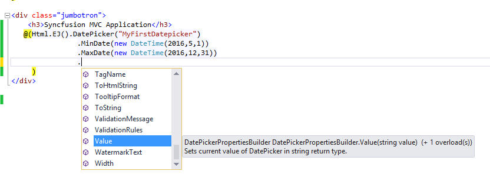

# Core Concepts

## Basics

### API Configuration

Set the values to Syncfusion Widget properties during or after the creation by using fluent helper methods.

In the above example, minimum and maximum ranges are defined for DatePicker component.

### Wiring Client Side Events

Client side events can be wired in the same way as properties. But here all the client side events are grouped into **“ClientSideEvents”** Action method.

1. Specify the client side event name in string format.

   For example:
   
   ~~~ cshtml
   
	@(Html.EJ().DatePicker("MyFirstDatepicker")
		.MinDate(new DateTime(2016,5,1))
		.MaxDate(new DateTime(2016,12,31))
		.Value(DateTime.Now.AddDays(1) )
		.ClientSideEvents( events =>
		events.Change("datepicker_change") // To handle datepicker change event
	    .Select("datepicker_select") // To handle datepicker select event
	    )								
     )
   ~~~

2. Declare the client side events in Script sections.

   ~~~ cshtml
			
	@section scripts{

		

	}

   ~~~
   
### Invoking methods

Syncfusion JavaScript widget client side methods can be accessed via their client side object. You can access the client side object via jQuery.data() utility method.

1. Create server side component in CSHTML.

   ~~~ cshtml
   
	@(Html.EJ().DatePicker(“MyFirstDatepicker")
		.MinDate(new DateTime(2016,5,1))
		.MaxDate(new DateTime(2016,12,31))
	    .Value(DateTime.Now.AddDays(1) )
	)

   ~~~
   
2. Access the client side object using jQuery.data() as shown in the following:

   ~~~ cshtml
   
	

   
   ~~~

3. Access the method from client side object like properties access, as shown in the following.

   ~~~ cshtml
		
	
			
   ~~~
