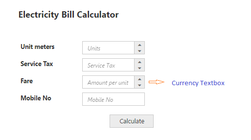
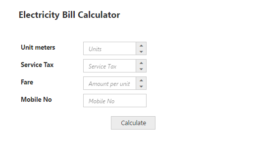

# Getting Started

This section explains briefly about how to create a EJMVC CurrencyTextBox in ASP.NET MVC platform.

## Create your first CurrencyTextBox in MVC

From the following steps you can learn how to create and use CurrencyTextBox in your application. Here we have showcased, a small Electric bill calculator application using EJMVC Editors widgets.The Essential ASP.NET MVC Editors control includes numeric, percentage, currency and maskedit textbox controls. This will guide you to use the wide range of Editors functionalities to complete this application. 

Electricity Bill Calculator
{:.caption}

### Create Editors 

ASP.NET MVC Editors renders built-in features like keyboard navigation, min and max range and flexible API’s. 

1. Create a MVC Project and add necessary Dll’s and Scripts. Refer [MVC-Getting Started](http://help.syncfusion.com/aspnetmvc/currencytextbox/getting-started). 
2. Add necessary helper elements to render the Editor components.

   ~~~ html

		

		

		
Electricity Bill Calculator

		 

		<table class="editors">

			 <tbody>

				 <tr>

				   <td>

					  <label>Unit meters</label>

				   </td>

				   <td>    @* NumericTextBox creation with watermark text *@

					  @Html.EJ().NumericTextbox("numeric").WatermarkText("Units")

				   </td>

				</tr>

				<tr>

					<td>

					   <label>Service Tax</label>

					</td>

					<td>     @* PercentageTextBox creation with watermark text *@

						 @Html.EJ().PercentageTextbox("percent").WatermarkText("Tax")

					</td>

				</tr>

				<tr>

					 <td>

					   <label>Fare</label>

					</td>

					<td>    @* CurrencyTextBox creation with watermark text *@

						@Html.EJ().CurrencyTextbox("currency").WatermarkText("Amount per unit")

					</td>

				</tr>

				<tr>

					<td>

					   <label>Mobile No</label>

					</td>

					<td>    @* MaskEditTextBox creation with watermark text *@

					   @Html.EJ().MaskEdit("maskedit").WatermarkText("Phone number")

					</td>

			   </tr>

			 </tbody></table>

		  
      @Html.EJ().Button("btn").Size(ButtonSize.Small).Text("Calculate").ContentType(ContentType.TextAndImage).PrefixIcon("e-calender")

		  

		

   ~~~
 

3. The following styles are added to arrange the Editors.  You can add the following location in the URL path for the background image and to apply styling [http://js.syncfusion.com/UG/Web/Content/electricity.png](http://js.syncfusion.com/UG/Web/Content/electricity.png)

   ~~~ css

		
		
   ~~~
 

4. Execute the code to render Editors as follows

CurrencyTextBox with watermark text
{:.caption}

### Set MinValue, MaxValue and value in CurrencyTextBox

You can set the “MinValue”,“MaxValue” and “Value” in Currency, percentage and Currency text boxes for maintaining the range in Editors widgets. In this scenario, you have to enter the values between the default ranges and enter the phone number in the Maskedit widget by using the ”MaskFormat” property. By using DecimalPlaces property for CurrencyTextBox you can get decimal values. The following code example illustrates how to achieve this.



Electricity Bill Calculator

 

<table class="editors">

     <tbody>

         <tr>

           <td>

              <label>Unit meters</label>

           </td>

           <td>    @Html.EJ().NumericTextbox("numeric").WatermarkText("Units").MinValue(1).MaxValue(10000).Value("70")

           </td>

        </tr>

        <tr>

            <td>

               <label>Service Tax</label>

            </td>

            <td>                 @Html.EJ().PercentageTextbox("percent").WatermarkText("Tax").MinValue(5).MaxValue(100).Value("15")

            </td>

        </tr>

        <tr>

             <td>

               <label>Fare</label>

            </td>

            <td>                @Html.EJ().CurrencyTextbox("currency").WatermarkText("Amount per unit").MinValue(0.00).MaxValue(100000.00).Value("350.00").DecimalPlaces(2)

            </td>

        </tr>

        <tr>

            <td>

               <label>Mobile No</label>

            </td>

            <td>

               @Html.EJ().MaskEdit("maskedit").WatermarkText("Phone number").MaskFormat("99-999-99999").Value("9090909090")

            </td>

       </tr>

     </tbody>

</table>

  

    @Html.EJ().Button("btn").Size(ButtonSize.Small).Text("Calculate").ContentType(ContentType.TextAndImage).PrefixIcon("e-calender")

  



The following screenshot illustrates the output of the above code examples. 

CurrencyTextBox with Min/Max Value ranges
{:.caption}

### Setting the Strict Mode Option

You can set the “StrictMode” option to restrict entering values defined outside the range. The following code example illustrates how to set strict mode option. 



ElectricityBill Calculator
 

<table class="editors">

     <tbody>

         <tr>

           <td>

              <label>Unit meters</label>

           </td>

           <td>                  @Html.EJ().NumericTextbox("numeric").WatermarkText("Units").MinValue(1).MaxValue(10000).Value("70").EnableStrictMode(true)

           </td>

        </tr>

        <tr>

            <td>

               <label>Service Tax</label>

            </td>

            <td>     

				@Html.EJ().PercentageTextbox("percent").WatermarkText("Tax").MinValue(5).MaxValue(100).Value("15")

            </td>

        </tr>

        <tr>

             <td>

               <label>Fare</label>

            </td>

            <td>   

				@Html.EJ().CurrencyTextbox("currency").WatermarkText("Amount per unit").MinValue(0.00).MaxValue(100000.00).Value("350.00").DecimalPlaces(2)

            </td>

        </tr>

        <tr>

            <td>

               <label>Mobile No</label>

            </td>

            <td>    

               @Html.EJ().MaskEdit("maskedit").WatermarkText("Phone number").MaskFormat("99-999-99999").Value("9090909090")

            </td>

       </tr>

     </tbody>

</table>

  

		@Html.EJ().Button("btn").Size(ButtonSize.Small).Text("Calculate").ContentType(ContentType.TextAndImage).PrefixIcon("e-calender")

  



Run the above code example and you can see that it restricts entering a value exceeding the MinValue and MaxValue range mentioned in the numeric textbox.

### Set Calculation process with CurrencyTextBox Widgets

You can use events to calculate the total and displays the value. You can achieve this with the help of Click event in the button widget. The calculation steps are written in the call back function of Click event button.

To customize the button, set the ContentType as TextAndImage to include the icon before the text. Add the PrefixIcon value as “e-calender” and add the ClientSideEvents for click event.



@* Please refer the table format for textboxes customization *@

  

   @Html.EJ().Button("btn").Size(ButtonSize.Small).Text("Calculate").ContentType(ContentType.TextAndImage).PrefixIcon("e-calender").ClientSideEvents(c=>c.Click("calculateBill"))

  



Run the above code sample, fill the required Textbox fields and click the Calculate button. The values are displayed and an alert message is shown. The following screen shot illustrates the final output of the Electricity bill calculator. 

Electricity bill calculator with alert
{:.caption}

