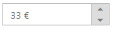
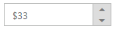

# Localization Support

Localization is language support based on the culture in CurrencyTextBox. You can achieve the Localization using “Locale” property in CurrencyTextBox. 

CurrencyTextBox widget provides multi-language support using globalization. You can customize the CurrencyTextBoxwith your own language style by using this feature. You can change the localization by using the locale property. The default value for Locale property is en-US .

In order to enable [localization](http://help.syncfusion.com/ug/js/default.htm) refer the following scripts: globalize.cultures.js and globalize.js. The “globalize.cultures.js” includes different language support and the “globalize.js” is a simple JavaScript library that allows you to format the value based on the specified culture.

You can refer the following online link reference for globalize.js

[http://cdn.syncfusion.com/js/assets/external/jquery.globalize.min.js](http://cdn.syncfusion.com/js/assets/external/jquery.globalize.min.js)

You can refer the following online link reference for globalize.culture.js

[http://ajax.aspnetcdn.com/ajax/globalize/0.1.1/cultures/globalize.cultures.js](http://ajax.aspnetcdn.com/ajax/globalize/0.1.1/cultures/globalize.cultures.js)

You can get the script file of various cultures from the following path also:

"<Installed Location>\Syncfusion\Essential Studio\<version>\JavaScript\assets\external\cultures"

You can dynamically change the language based on their culture.

## Configure Localization

The following example describes the way to use localization in CurrencyTextBox.



@Html.EJ().CurrencyTextbox("currency").Value("33").Locale("de-DE")



Output of CurrencyTextBox with localization.

