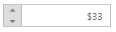

## RTL Support

CurrencyTextBox provides RTL (Right-To-Left) support. The alignment of CurrencyTextBox can be changed from Left-To-Right into Right-To-Left.

Enable RTL

In the View page add CurrencyTextBox helper, and configure the EnableRTL property.

[_cshtml]

@Html.EJ().CurrencyTextbox("currency").Value("33").EnableRTL(true)

Output of CurrencyTextBox when EnableRTL is “True” is as follows. 

{  | markdownify }
{:.image }

_CurrencyTextBox with enableRTL_

