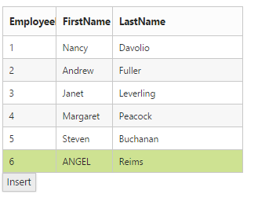

# Data Adaptors

DataManger uses adaptors to process data. There are three types of adaptors in the DataManger. They are

* JSON Adaptor
* URL Adaptor
* OData Adaptor

Here, you can learn when and how each adaptor is used.

## JSON Adaptor

JSONAdaptor is used to process JSON data. It contains methods to process the given JSON data based on the queries. The following code example illustrates on how to use the JSONAdaptor.

**JSONAdaptor** has the following unique in-built methods, 

<table>
    <tr>
        <th> Properties  </th>
        <th> Parameters  </th>
        <th> Description   </th>
    </tr>
     <tr>
        <td> processQuery(dataManagerObj, query) </td>
        <td> 
            <table>
                <tr>  <td> dataManagerObj </td> <td> Object </td> <td> ej.DataManager object </td> </tr>
                <tr>  <td> query </td> <td> ej.Query </td> <td>  Sets the default query for the data source </td> </tr>
            </table>
        </td>
        <td> Used to prepare query string for the request data </td>
    </tr>
    <tr>
        <td> processResponse(data, dataObj, query, xhr) </td>
         <td> 
            <table>
                <tr>  <td> data </td> <td> Object </td> <td>  JSON data or JSON array </td> </tr>
                <tr>  <td> dataObj </td> <td> Object </td> <td> ej.DataManager object </td> </tr>
                <tr>  <td> query </td> <td> ej.Query </td> <td>  Sets the default query for the data source </td> </tr>
                <tr>  <td> xhr </td> <td> Object </td> <td> XMLHTTPRequest object </td> </tr>
            </table>
        </td>
        <td> Used to precess the response which is return from the Data Source </td>
    </tr>
    <tr>
        <td> insert(dataManagerObj, data) </td>
        <td> 
            <table>
                <tr>  <td> data </td> <td> Object </td> <td>  JSON data or JSON array </td> </tr>
                <tr>  <td> dataManagerObj </td> <td> Object </td> <td> ej.DataManager object </td> </tr>
            </table>
        </td>
        <td> Inserts a data item in the data table. </td>
    </tr>
    <tr>
        <td> remove(dataManagerObj, keyField, value, tableName) </td>
        <td> 
            <table>
                <tr>  <td> dataManagerObj </td> <td> Object </td> <td>  ej.DataManager object </td> </tr>
                <tr>  <td> keyField </td> <td> String </td> <td> KeyColumn to find the data </td> </tr>
                <tr>  <td> String </td> <td> Object </td> <td> Specified value for the keyField</td> </tr>
                <tr>  <td> tableName </td> <td> String </td> <td> Name of the source table </td> </tr>
            </table>
        </td>
        <td> It is used to remove the data from the dataSource </td>
    </tr>
    <tr>
        <td> update(dataManagerObj, keyField, value, tableName) </td>
        <td> 
            <table>
                <tr>  <td> dataManagerObj </td> <td> Object </td> <td>  ej.DataManager object </td> </tr>
                <tr>  <td> keyField </td> <td> String </td> <td> KeyColumn to find the data </td> </tr>
                <tr>  <td> String </td> <td> Object </td> <td> Specified value for the keyField</td> </tr>
                <tr>  <td> tableName </td> <td> String </td> <td> Name of the source table </td> </tr>
            </table>
        </td>
        <td> Updates existing record and saves the changes to the table.. </td>
    </tr>
</table>



    public ActionResult GridFeatures()
    {
        var DataSource = new NorthwindDataContext().OrdersViews.ToList();
        ViewBag.dataSource = DataSource;
        return View();
    }





    @(Html.EJ().DataManager("FlatData").Json((IEnumerable<object>)ViewBag.dataSource))

    @(Html.EJ().Grid<MVCdoc.OrdersView>("FlatGrid")
            .DataManagerID("FlatData")
            .Query("new ej.Query().select(['OrderID', 'CustomerID', 'EmployeeID', 'ShipCity', 'Freight']).take(5)")
            .Columns(col =>
            {
                col.Field("OrderID").HeaderText("Order ID").IsPrimaryKey(true).TextAlign(TextAlign.Right).Width(75).Add();
                col.Field("CustomerID").HeaderText("Customer ID").Width(80).Add();
                col.Field("EmployeeID").HeaderText("Employee ID").TextAlign(TextAlign.Right).Width(75).Add();
                col.Field("Freight").HeaderText("Freight").TextAlign(TextAlign.Right).Width(75).Format("{0:C}").Add();
                col.Field("ShipCity").HeaderText("Ship City").Width(110).Add();
            })
    )



The result of above code example is illustrated as follows.

JSON adaptor  
{:.caption}   

## URL Adaptor

URL Adaptor of the DataManager can be used when you are required to use remote service to retrieve data. It interacts with server-side for all DataManager Queries and CRUD operations. Now, in the following code example, the data is retrieved from the MVCController. 

**UrlAdaptor** has the following unique in-built methods, 

<table>
    <tr>
        <th> Properties  </th>
        <th> Parameters  </th>
        <th> Description   </th>
    </tr>
     <tr>
        <td> processQuery(dataManagerObj, query, hierarchyFilters) </td>
        <td> 
            <table>
                <tr>  <td> dataManagerObj </td> <td> Object </td> <td> ej.DataManager object </td> </tr>
                <tr>  <td> query </td> <td> ej.Query </td> <td>  Sets the default query for the data source </td> </tr>
                <tr>  <td> hierarchyFilters </td> <td> ej.Query </td> <td> The hierarchical query can be provided by using the hierarchical function.  </td> </tr>
            </table>
        </td>
        <td> Used to prepare query string for the request data </td>
    </tr>
    <tr>
        <td> processResponse(data, dataObj, query, xhr, request, changes) </td>
         <td> 
            <table>
                <tr>  <td> data </td> <td> Object </td> <td>  JSON data or JSON array of Result</td> </tr>
                <tr>  <td> dataObj </td> <td> Object </td> <td> ej.DataManager object </td> </tr>
                <tr>  <td> query </td> <td> ej.Query </td> <td>  Sets the default query for the data source </td> </tr>
                <tr>  <td> xhr </td> <td> Object </td> <td> XMLHTTPRequest object </td> </tr>
                <tr>  <td> request </td> <td> Object </td> <td>  request object to the Data Source </td> </tr>
                <tr>  <td> changes </td> <td> Object </td> <td> Specified changes to the Data Source </td> </tr>
            </table>
        </td>
        <td> Used to precess the response which is return from the Data Source </td>
    </tr>
    <tr>
        <td> insert(dataManagerObj, data, tableName, query) </td>
        <td> 
            <table>
                <tr>  <td> data </td> <td> Object </td> <td>  JSON data or JSON array </td> </tr>
                <tr>  <td> dataManagerObj </td> <td> Object </td> <td> ej.DataManager object </td> </tr>
                <tr>  <td> tableName </td> <td> String </td> <td> Name of the source table </td> </tr>
                <tr>  <td> query </td> <td> ej.Query </td> <td>  Sets the default query for the data source </td> </tr>
            </table>
        </td>
        <td> Inserts a data item in the data table. </td>
    </tr>
    <tr>
        <td> remove(dataManagerObj, keyField, value, tableName, query) </td>
        <td> 
            <table>
                <tr>  <td> dataManagerObj </td> <td> Object </td> <td>  ej.DataManager object </td> </tr>
                <tr>  <td> keyField </td> <td> String </td> <td> KeyColumn to find the data </td> </tr>
                <tr>  <td> String </td> <td> Object </td> <td> Specified value for the keyField</td> </tr>
                <tr>  <td> tableName </td> <td> String </td> <td> Name of the source table </td> </tr>
                <tr>  <td> query </td> <td> ej.Query </td> <td>  Sets the default query for the data source </td> </tr>
            </table>
        </td>
        <td> It is used to remove the data from the dataSource </td>
    </tr>
    <tr>
        <td> update(dataManagerObj, keyField, value, tableName, query) </td>
        <td> 
            <table>
                <tr>  <td> dataManagerObj </td> <td> Object </td> <td>  ej.DataManager object </td> </tr>
                <tr>  <td> keyField </td> <td> String </td> <td> KeyColumn to find the data </td> </tr>
                <tr>  <td> String </td> <td> Object </td> <td> Specified value for the keyField</td> </tr>
                <tr>  <td> tableName </td> <td> String </td> <td> Name of the source table </td> </tr>
                <tr>  <td> query </td> <td> ej.Query </td> <td>  Sets the default query for the data source </td> </tr>
            </table>
        </td>
        <td> Updates existing record and saves the changes to the table.. </td>
    </tr>
</table>





    @(Html.EJ().DataManager("FlatData").URL("Home/DataSource").Adaptor(AdaptorType.UrlAdaptor))

    @(Html.EJ().Grid<MVCdoc.OrdersView>("FlatGrid")
            .DataManagerID("FlatData")
            .Query("new ej.Query().select(['OrderID', 'CustomerID', 'EmployeeID', 'ShipCity', 'Freight']).take(5)")
            .Columns(col =>
            {
                col.Field("OrderID").HeaderText("Order ID").IsPrimaryKey(true).TextAlign(TextAlign.Right).Width(75).Add();
                col.Field("CustomerID").HeaderText("Customer ID").Width(80).Add();
                col.Field("EmployeeID").HeaderText("Employee ID").TextAlign(TextAlign.Right).Width(75).Add();
                col.Field("Freight").HeaderText("Freight").TextAlign(TextAlign.Right).Width(75).Format("{0:C}").Add();
                col.Field("ShipCity").HeaderText("Ship City").Width(110).Add();
            })

    )





    public class HomeController : Controller
    {
        public ActionResult Index()
        {
            return View();
        }
        public ActionResult DataSource(Syncfusion.JavaScript.DataManager dataManagerObj)
        {
            var DataSource = OrderRepository.GetAllRecords();
            DataResult result = new DataResult();
            result.result = DataSource.Skip(dataManagerObj.Skip).Take(dataManagerObj.Take).ToList();
            result.count = DataSource.Count();
            return Json(result, JsonRequestBehavior.AllowGet);
        }
        public class DataResult
        {
            public IEnumerable<EditableOrder> result { get; set; }
            public int count { get; set; }
        }

    }





The result of the above code example is illustrated as follows.

URL Adaptor
{:.caption}

## OData Adaptor

OData Adaptor that is extended from URL Adaptor is used for consuming data through OData Service. You can use the following code example to use OData adaptor.

**ODataAdaptor** has the following unique in-built methods, 

<table>
    <tr>
        <th> Properties  </th>
        <th> Parameters  </th>
        <th> Description   </th>
    </tr>
    <tr>
        <td> processResponse(data, dataObj, query, xhr, request, changes) </td>
         <td> 
            <table>
                <tr>  <td> data </td> <td> Object </td> <td>  JSON data or JSON array </td> </tr>
                <tr>  <td> dataObj </td> <td> Object </td> <td> ej.DataManager object </td> </tr>
                <tr>  <td> query </td> <td> ej.Query </td> <td>  Sets the default query for the data source </td> </tr>
                <tr>  <td> xhr </td> <td> Object </td> <td> XMLHTTPRequest object </td> </tr>
                <tr>  <td> request </td> <td> Object </td> <td>  request object to the Data Source </td> </tr>
                <tr>  <td> changes </td> <td> Object </td> <td> Specified changes to the Data Source </td> </tr>
            </table>
        </td>
        <td> Used to precess the response which is return from the Data Source </td>
    </tr>
     <tr>
        <td> insert(dataManagerObj, data, tableName) </td>
        <td> 
            <table>
                <tr>  <td> data </td> <td> Object </td> <td>  JSON data or JSON array </td> </tr>
                <tr>  <td> dataManagerObj </td> <td> Object </td> <td> ej.DataManager object </td> </tr>
                <tr>  <td> tableName </td> <td> String </td> <td> Name of the source table </td> </tr>
            </table>
        </td>
        <td> Inserts a data item in the data table. </td>
    </tr>
    <tr>
        <td> remove(dataManagerObj, keyField, value, tableName) </td>
        <td> 
            <table>
                <tr>  <td> dataManagerObj </td> <td> Object </td> <td>  ej.DataManager object </td> </tr>
                <tr>  <td> keyField </td> <td> String </td> <td> KeyColumn to find the data </td> </tr>
                <tr>  <td> String </td> <td> Object </td> <td> Specified value for the keyField</td> </tr>
                <tr>  <td> tableName </td> <td> String </td> <td> Name of the source table </td> </tr>
            </table>
        </td>
        <td> It is used to remove the data from the dataSource </td>
    </tr>
    <tr>
        <td> update(dataManagerObj, keyField, value, tableName) </td>
        <td> 
            <table>
                <tr>  <td> dataManagerObj </td> <td> Object </td> <td>  ej.DataManager object </td> </tr>
                <tr>  <td> keyField </td> <td> String </td> <td> KeyColumn to find the data </td> </tr>
                <tr>  <td> String </td> <td> Object </td> <td> Specified value for the keyField</td> </tr>
                <tr>  <td> tableName </td> <td> String </td> <td> Name of the source table </td> </tr>
            </table>
        </td>
        <td> Updates existing record and saves the changes to the table.. </td>
    </tr>
</table>



    @(Html.EJ().DataManager("FlatData").URL("http://mvc.syncfusion.com/Services/Northwnd.svc/Orders/").Offline(true).CrossDomain(true))

    @(Html.EJ().Grid<MVCdoc.OrdersView>("FlatGrid")
        .DataManagerID("FlatData")
        .Query("new ej.Query().select(['OrderID', 'CustomerID', 'EmployeeID', 'ShipCity', 'Freight']).take(5)")
        .Columns(col =>
        {
            col.Field("OrderID").HeaderText("Order ID").IsPrimaryKey(true).TextAlign(TextAlign.Right).Width(75).Add();
            col.Field("CustomerID").HeaderText("Customer ID").Width(80).Add();  
            col.Field("EmployeeID").HeaderText("Employee ID").TextAlign(TextAlign.Right).Width(75).Add();
            col.Field("Freight").HeaderText("Freight").TextAlign(TextAlign.Right).Width(75).Format("{0:C}").Add();
            col.Field("ShipCity").HeaderText("Ship City").Width(110).Add();
        })
    )



The result of the above code example is illustrated as follows.

OData adaptor 
{:.caption} 

## WebAPI Adaptor

WebAPIAdaptor extended from the UrlAdaptor of the DataManager is used for retrieving data from WebAPI service. Refer to the following code example.

**WebApiAdaptor** has the following unique in-built methods, 

<table>
    <tr>
        <th> Properties  </th>
        <th> Parameters  </th>
        <th> Description   </th>
    </tr>
    <tr>
        <td> processResponse(data, dataObj, query, xhr, request, changes) </td>
         <td> 
            <table>
                <tr>  <td> data </td> <td> Object </td> <td>  JSON data or JSON array </td> </tr>
                <tr>  <td> dataObj </td> <td> Object </td> <td> ej.DataManager object </td> </tr>
                <tr>  <td> query </td> <td> ej.Query </td> <td>  Sets the default query for the data source </td> </tr>
                <tr>  <td> xhr </td> <td> Object </td> <td> XMLHTTPRequest object </td> </tr>
                <tr>  <td> request </td> <td> Object </td> <td>  request object to the Data Source </td> </tr>
                <tr>  <td> changes </td> <td> Object </td> <td> Specified changes to the Data Source </td> </tr>
            </table>
        </td>
        <td> Used to precess the response which is return from the Data Source </td>
    </tr>
     <tr>
        <td> insert(dataManagerObj, data, tableName) </td>
        <td> 
            <table>
                <tr>  <td> data </td> <td> Object </td> <td>  JSON data or JSON array </td> </tr>
                <tr>  <td> dataManagerObj </td> <td> Object </td> <td> ej.DataManager object </td> </tr>
                <tr>  <td> tableName </td> <td> String </td> <td> Name of the source table </td> </tr>
            </table>
        </td>
        <td> Inserts a data item in the data table. </td>
    </tr>
    <tr>
        <td> remove(dataManagerObj, keyField, value, tableName) </td>
        <td> 
            <table>
                <tr>  <td> dataManagerObj </td> <td> Object </td> <td>  ej.DataManager object </td> </tr>
                <tr>  <td> keyField </td> <td> String </td> <td> KeyColumn to find the data </td> </tr>
                <tr>  <td> String </td> <td> Object </td> <td> Specified value for the keyField</td> </tr>
                <tr>  <td> tableName </td> <td> String </td> <td> Name of the source table </td> </tr>
            </table>
        </td>
        <td> It is used to remove the data from the dataSource </td>
    </tr>
    <tr>
        <td> update(dataManagerObj, keyField, value, tableName) </td>
        <td> 
            <table>
                <tr>  <td> dataManagerObj </td> <td> Object </td> <td>  ej.DataManager object </td> </tr>
                <tr>  <td> keyField </td> <td> String </td> <td> KeyColumn to find the data </td> </tr>
                <tr>  <td> String </td> <td> Object </td> <td> Specified value for the keyField</td> </tr>
                <tr>  <td> tableName </td> <td> String </td> <td> Name of the source table </td> </tr>
            </table>
        </td>
        <td> Updates existing record and saves the changes to the table.. </td>
    </tr>
</table>



    public class EmployeeController : ApiController
    {
        static readonly IEmployeeRepository repository = new EmployeeRepository();
        // GET API/<controller>
        [HttpGet]
        public object Get()
        {
            var data = repository.GetAll().ToList();
            return new { Items = data, Count = data.Count() };
        }
    }





    @(Html.EJ().DataManager("FlatData").URL("/api/Employee").Adaptor(AdaptorType.WebApiAdaptor))

    @(Html.EJ().Grid<Sample.Models.Employee>("FlatGrid")
            .DataManagerID("FlatData")
            .Query("new ej.Query().select(['EmployeeID', 'FirstName', 'LastName'])")
            .Columns(col =>
            {
                col.Field("EmployeeID").HeaderText("EmployeeID").IsPrimaryKey(true).Width(75).Add();
                col.Field("FirstName").HeaderText("FirstName").Width(80).Add();
                col.Field("LastName").HeaderText("LastName").Add();
            })
    )



Result of the above code example is illustrated as follows.

 

Web API Adaptor
{:.caption}

## RemoteSave Adaptor

RemoteSaveAdaptor extended from the JsonAdaptor of theDataManager is used for binding local data and performs all DataManager queries in client-side. It interacts with server-side only for CRUD operations to pass the modified records. Refer to the following code example.

**RemoteSaveAdaptor** has the following unique in-built methods, 

<table>
    <tr>
        <th> Properties  </th>
        <th> Parameters  </th>
        <th> Description   </th>
    </tr>
    <tr>
        <td> insert(dataManagerObj, data, tableName, query) </td>
        <td> 
            <table>
                <tr>  <td> data </td> <td> Object </td> <td>  JSON data or JSON array </td> </tr>
                <tr>  <td> dataManagerObj </td> <td> Object </td> <td> ej.DataManager object </td> </tr>
                <tr>  <td> tableName </td> <td> String </td> <td> Name of the source table </td> </tr>
                <tr>  <td> query </td> <td> ej.Query </td> <td>  Sets the default query for the data source </td> </tr>
            </table>
        </td>
        <td> Inserts a data item in the data table. </td>
    </tr>
    <tr>
        <td> remove(dataManagerObj, keyField, value, tableName, query) </td>
        <td> 
            <table>
                <tr>  <td> dataManagerObj </td> <td> Object </td> <td>  ej.DataManager object </td> </tr>
                <tr>  <td> keyField </td> <td> String </td> <td> KeyColumn to find the data </td> </tr>
                <tr>  <td> String </td> <td> Object </td> <td> Specified value for the keyField</td> </tr>
                <tr>  <td> tableName </td> <td> String </td> <td> Name of the source table </td> </tr>
                <tr>  <td> query </td> <td> ej.Query </td> <td>  Sets the default query for the data source </td> </tr>
            </table>
        </td>
        <td> It is used to remove the data from the dataSource </td>
    </tr>
    <tr>
        <td> update(dataManagerObj, keyField, value, tableName, query) </td>
        <td> 
            <table>
                <tr>  <td> dataManagerObj </td> <td> Object </td> <td>  ej.DataManager object </td> </tr>
                <tr>  <td> keyField </td> <td> String </td> <td> KeyColumn to find the data </td> </tr>
                <tr>  <td> String </td> <td> Object </td> <td> Specified value for the keyField</td> </tr>
                <tr>  <td> tableName </td> <td> String </td> <td> Name of the source table </td> </tr>
                <tr>  <td> query </td> <td> ej.Query </td> <td>  Sets the default query for the data source </td> </tr>
            </table>
        </td>
        <td> Updates existing record and saves the changes to the table.. </td>
    </tr>
</table>

  


    @(Html.EJ().Grid<object>("FlatGrid")
                .Datasource(dataSource => dataSource.Json((IEnumerable<object>)ViewBag.datasource).UpdateURL("/Home/Update")
                .InsertURL("/Home/Insert").RemoveURL("/Home/Remove").Adaptor(AdaptorType.RemoteSaveAdaptor))
                .AllowPaging()
                .EditSettings(edit => { edit.AllowAdding().AllowDeleting().AllowEditing(); })
                .ToolbarSettings(toolbar =>
                {
                toolbar.ShowToolbar().ToolbarItems(items =>
                    {
                        items.AddTool(ToolBarItems.Add);
                        items.AddTool(ToolBarItems.Edit);
                        items.AddTool(ToolBarItems.Delete);
                        items.AddTool(ToolBarItems.Update);
                        items.AddTool(ToolBarItems.Cancel);
                    });
                })
            .Columns(col =>
                {
                col.Field("OrderID").IsPrimaryKey(true).Add();
                col.Field("EmployeeID").Add();
                col.Field("CustomerID").Add();
                col.Field("ShipCountry").Add();
                col.Field("Freight").Add();
            })
        )




        namespace EJGrid.Controllers
          {
             public class HomeController : Controller
              {
             public ActionResult Index()
              {
                var data = OrderRepository.GetAllRecords();
                ViewBag.dataSource = data;
                return View();
              }
             public ActionResult Update(EditableOrder value)
              {
                OrderRepository.Update(value);
                var data = OrderRepository.GetAllRecords();
                return Json(data, JsonRequestBehavior.AllowGet);
              }
             public ActionResult Insert(EditableOrder value)
              {
                OrderRepository.Add(value);
                var data = OrderRepository.GetAllRecords();
                return Json(data, JsonRequestBehavior.AllowGet);
             }
            public ActionResult Remove(int key)
            {
               OrderRepository.Delete(key);
               var data = OrderRepository.GetAllRecords();
               return Json(data, JsonRequestBehavior.AllowGet);
            }
         }
      }


 

Result of the above code example is illustrated as follows.

RemoteSave Adaptor
{:.caption}

## Custom Adaptor

Custom Adaptor is a key technique to customize adaptors in the DataManager. It is useful to write own adaptor. Normally ej.Adaptor is base class for all adaptors. Therefore, first inherit the ej.Adaptor to develop the customized one and then override functionality in Custom Adaptor with base class. The following code example illustrates you how to create the Custom Adaptor.



    @(Html.EJ().DataManager("FlatData”))

    @(Html.EJ().Grid<MVCdoc.OrdersView>("FlatGrid")
        .DataManagerID("FlatData")
        .Query("new ej.Query().select(['OrderID', 'CustomerID', 'EmployeeID', 'ShipCity', 'Freight']).take(5)")
        .Columns(col =>
        {
            col.Field("OrderID").HeaderText("Order ID").IsPrimaryKey(true).TextAlign(TextAlign.Right).Width(75).Add();
            col.Field("CustomerID").HeaderText("Customer ID").Width(80).Add();
            col.Field("EmployeeID").HeaderText("Employee ID").TextAlign(TextAlign.Right).Width(75).Add();
            col.Field("Freight").HeaderText("Freight").TextAlign(TextAlign.Right).Width(75).Format("{0:C}").Add();
            col.Field("ShipCity").HeaderText("Ship City").Width(110).Add();
        })

)



Result of above code example is as follows.

Custom adaptor   
{:.caption}

Using Custom Adaptor, you can override the existing method of Extended Adaptor, 

<table>
    <tr>
        <th> Properties  </th>
        <th> Description   </th>
    </tr>
    <tr>
        <td> beforeSend </td>
        <td> Custom headers can be set using pre-request callback beforeSend, by using the setRequestHeader method can be used to modify the XMLHTTPRequest </td>
    </tr>
     <tr>
        <td> processQuery </td>
        <td> Used to prepare query string for the request data </td>
    </tr>
    <tr>
        <td> processResponse </td>
        <td> Used to precess the response which is return from the Data Source </td>
    </tr>
    <tr>
        <td> insert </td>
        <td> The insert method of the data manager is used to add a new record to the table </td>
    </tr>
    <tr>
        <td> remove </td>
        <td> The remove action submits the data items that should be deleted </td>
    </tr>
    <tr>
        <td> update </td>
        <td> The update method is used to update the modified changes made to a record in the data source of the DataManager. </td>
    </tr>
</table>

## Cache Adaptor

Cache Adaptor is used to cache the data of the visited pages. It prevents new requests for the previously visited pages. It can be enabled by using the `EnableCaching` property. You can configure cache page size and duration of caching by using CachingPageSize and TimeTillExpiration properties of the "DataManager". 

**CacheAdaptor** has the following unique in-built methods, 

<table>
    <tr>
        <th> Properties  </th>
        <th> Parameters  </th>
        <th> Description   </th>
    </tr>
     <tr>
        <td> processQuery(dataManagerObj, query, hierarchyFilters) </td>
        <td> 
            <table>
                <tr>  <td> dataManagerObj </td> <td> Object </td> <td> ej.DataManager object </td> </tr>
                <tr>  <td> query </td> <td> ej.Query </td> <td>  Sets the default query for the data source </td> </tr>
                <tr>  <td> hierarchyFilters </td> <td> ej.Query </td> <td> The hierarchical query can be provided by using the hierarchical function.  </td> </tr>
            </table>
        </td>
        <td> Used to prepare query string for the request data </td>
    </tr>
    <tr>
        <td> processResponse(data, dataObj, query, xhr, request, changes) </td>
         <td> 
            <table>
                <tr>  <td> data </td> <td> Object </td> <td>  JSON data or JSON array </td> </tr>
                <tr>  <td> dataObj </td> <td> Object </td> <td> ej.DataManager object </td> </tr>
                <tr>  <td> query </td> <td> ej.Query </td> <td>  Sets the default query for the data source </td> </tr>
                <tr>  <td> xhr </td> <td> Object </td> <td> XMLHTTPRequest object </td> </tr>
                <tr>  <td> request </td> <td> Object </td> <td>  Sets the default query for the data source </td> </tr>
                <tr>  <td> changes </td> <td> Object </td> <td> XMLHTTPRequest object </td> </tr>
            </table>
        </td>
        <td> Used to precess the response which is return from the Data Source </td>
    </tr>
    <tr>
        <td> insert(dataManagerObj, data, tableName) </td>
        <td> 
            <table>
                <tr>  <td> data </td> <td> Object </td> <td>  JSON data or JSON array </td> </tr>
                <tr>  <td> dataManagerObj </td> <td> Object </td> <td> ej.DataManager object </td> </tr>
                <tr>  <td> tableName </td> <td> String </td> <td> Name of the source table </td> </tr>
            </table>
        </td>
        <td> Inserts a data item in the data table. </td>
    </tr>
    <tr>
        <td> remove(dataManagerObj, keyField, value, tableName) </td>
        <td> 
            <table>
                <tr>  <td> dataManagerObj </td> <td> Object </td> <td>  ej.DataManager object </td> </tr>
                <tr>  <td> keyField </td> <td> String </td> <td> KeyColumn to find the data </td> </tr>
                <tr>  <td> String </td> <td> Object </td> <td> Specified value for the keyField</td> </tr>
                <tr>  <td> tableName </td> <td> String </td> <td> Name of the source table </td> </tr>
            </table>
        </td>
        <td> It is used to remove the data from the dataSource </td>
    </tr>
    <tr>
        <td> update(dataManagerObj, keyField, value, tableName) </td>
        <td> 
            <table>
                <tr>  <td> dataManagerObj </td> <td> Object </td> <td>  ej.DataManager object </td> </tr>
                <tr>  <td> keyField </td> <td> String </td> <td> KeyColumn to find the data </td> </tr>
                <tr>  <td> String </td> <td> Object </td> <td> Specified value for the keyField</td> </tr>
                <tr>  <td> tableName </td> <td> String </td> <td> Name of the source table </td> </tr>
            </table>
        </td>
        <td> Updates existing record and saves the changes to the table.. </td>
    </tr>
</table>



    @(Html.EJ().Grid<OrdersView>("Grid")
        .Datasource(dataSource => dataSource.URL(@Url.Action("DataSource"))
        .EnableCaching()
        .CachingPageSize(4)
        .TimeTillExpiration(120000)
        .Adaptor(AdaptorType.UrlAdaptor))
        .AllowPaging()
        .Columns(col =>
            {
                col.Field(p => p.OrderID).HeaderText("Order ID").Add();
                col.Field(p => p.CustomerID).HeaderText("Customer ID").TextAlign(TextAlign.Left).Add();
                col.Field(p => p.EmployeeID).HeaderText("Employee ID").Add();
                col.Field(p => p.Freight).HeaderText("Freight").Format("{0:C2}").Add();
            })
    )




    //Refer the Syncfusion DataSource assembly 
    using Syncfusion.JavaScript;
    using Syncfusion.JavaScript.DataSources;

    public IEnumerable OrderData = new NorthwindDataContext().OrdersViews.ToList();
    public ActionResult GridFeatures()
    {
        return View();
    }
    public ActionResult DataSource(DataManager dataManagerObj) 
    {
        IEnumerable data = OrderData;
        DataOperations operation = new DataOperations();
        if (dataManagerObj.Sorted != null && dataManagerObj.Sorted.Count > 0) //Sorting
        {
            data= operation.PerformSorting(data, dataManagerObj.Sorted);
        }            
        if (dataManagerObj.Where != null && dataManagerObj.Where.Count > 0) //Filtering
        {
            data= operation.PerformWhereFilter(data, dataManagerObj.Where, dataManagerObj.Where[0].Operator);
        }            
        int count = data.Cast<OrdersView>().Count();
        if (dataManagerObj.Skip != 0)
        {
            data= operation.PerformSkip(data, dataManagerObj.Skip);
        }            
        if (dataManagerObj.Take != 0)
        {
            data= operation.PerformTake(data, dataManagerObj.Take);
        }
        return Json(new { result = data, count = count });
        }
    }



Cache Adaptor
{:.caption}

Cache Adaptor has the following unique properties, 

<table>
    <tr>
        <th>
            Properties
             
        </th>
        <th>
            Description
             
        </th>
    </tr>
    <tr>
        <td> TimeTillExpiration </td>
        <td> Specifies the duration of cached pages in milliseconds </td>
    </tr>
    <tr>
        <td> CachingPageSize </td>
        <td> A number of pages to be cached </td>
    </tr>
</table>

