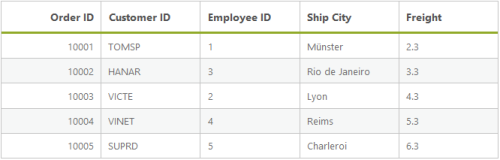
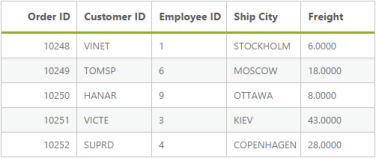
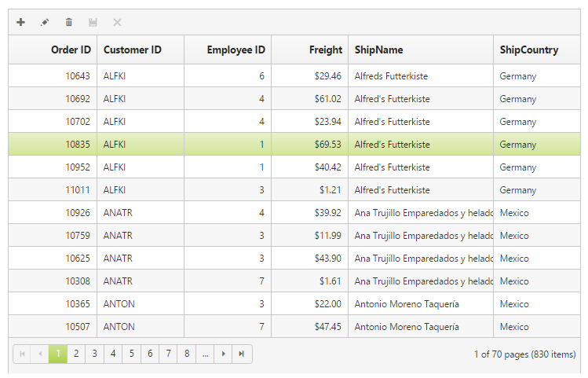
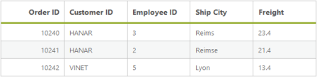
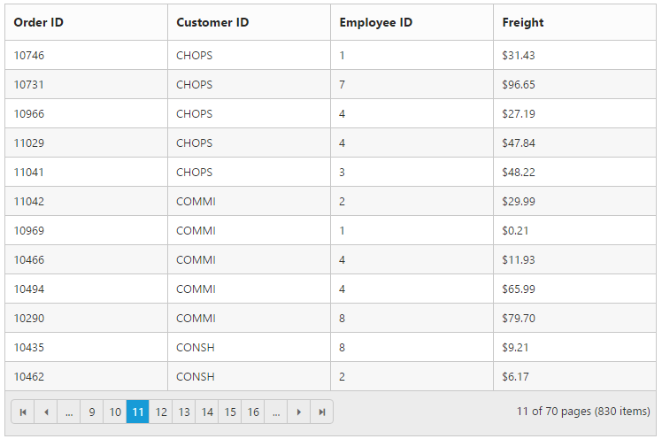

# Data Adaptors

DataManger uses adaptors to process data. There are three types of adaptors in the DataManger. They are

* JSON Adaptor
* URL Adaptor
* OData Adaptor

Here, you can learn when and how each adaptor is used.

## JSON Adaptor

JSONAdaptor is used to process JSON data. It contains methods to process the given JSON data based on the queries. The following code example illustrates on how to use the JSONAdaptor.



@(Html.EJ().DataManager("FlatData").Json((IEnumerable<object>)ViewBag.dataSource))

@(Html.EJ().Grid<MVCdoc.OrdersView>("FlatGrid")

        .DataManagerID("FlatData")

        .Query("new ej.Query().select(['OrderID', 'CustomerID', 'EmployeeID', 'ShipCity', 'Freight']).take(5)")

        .Columns(col =>

        {

            col.Field("OrderID").HeaderText("Order ID").IsPrimaryKey(true).TextAlign(TextAlign.Right).Width(75).Add();

            col.Field("CustomerID").HeaderText("Customer ID").Width(80).Add();

            col.Field("EmployeeID").HeaderText("Employee ID").TextAlign(TextAlign.Right).Width(75).Add();

            col.Field("Freight").HeaderText("Freight").TextAlign(TextAlign.Right).Width(75).Format("{0:C}").Add();

            col.Field("ShipCity").HeaderText("Ship City").Width(110).Add();

        })

)


The result of above code example is illustrated as follows.

JSON adaptor  
{:.caption}   

## URL Adaptor

URL Adaptor of the DataManager can be used when you are required to use remote service to retrieve data. It interacts with server-side for all DataManager Queries and CRUD operations. Now, in the following code example, the data is retrieved from the MVCController. 





@(Html.EJ().DataManager("FlatData").URL("Home/DataSource").Adaptor(AdaptorType.UrlAdaptor))

@(Html.EJ().Grid<MVCdoc.OrdersView>("FlatGrid")

        .DataManagerID("FlatData")

        .Query("new ej.Query().select(['OrderID', 'CustomerID', 'EmployeeID', 'ShipCity', 'Freight']).take(5)")

        .Columns(col =>

        {

            col.Field("OrderID").HeaderText("Order ID").IsPrimaryKey(true).TextAlign(TextAlign.Right).Width(75).Add();

            col.Field("CustomerID").HeaderText("Customer ID").Width(80).Add();

            col.Field("EmployeeID").HeaderText("Employee ID").TextAlign(TextAlign.Right).Width(75).Add();

            col.Field("Freight").HeaderText("Freight").TextAlign(TextAlign.Right).Width(75).Format("{0:C}").Add();

            col.Field("ShipCity").HeaderText("Ship City").Width(110).Add();

        })

)





		public class HomeController : Controller

        {

            public ActionResult Index()

            {

                return View();

            }

            public ActionResult DataSource(Syncfusion.JavaScript.DataManager dm)

            {

                var DataSource = OrderRepository.GetAllRecords();

                DataResult result = new DataResult();

                result.result = DataSource.Skip(dm.Skip).Take(dm.Take).ToList();

                result.count = DataSource.Count();

                return Json(result, JsonRequestBehavior.AllowGet);

            }

            public class DataResult

            {

                public IEnumerable<EditableOrder> result { get; set; }

                public int count { get; set; }

            }

        }





The result of the above code example is illustrated as follows.

URL Adaptor
{:.caption}

## OData Adaptor

OData Adaptor that is extended from URL Adaptor is used for consuming data through OData Service. You can use the following code example to use OData adaptor.



@(Html.EJ().DataManager("FlatData").URL("http://mvc.syncfusion.com/Services/Northwnd.svc/Orders/").Offline(true).CrossDomain(true))

@(Html.EJ().Grid<MVCdoc.OrdersView>("FlatGrid")

        .DataManagerID("FlatData")

        .Query("new ej.Query().select(['OrderID', 'CustomerID', 'EmployeeID', 'ShipCity', 'Freight']).take(5)")

        .Columns(col =>

        {

            col.Field("OrderID").HeaderText("Order ID").IsPrimaryKey(true).TextAlign(TextAlign.Right).Width(75).Add();

            col.Field("CustomerID").HeaderText("Customer ID").Width(80).Add();

            col.Field("EmployeeID").HeaderText("Employee ID").TextAlign(TextAlign.Right).Width(75).Add();

            col.Field("Freight").HeaderText("Freight").TextAlign(TextAlign.Right).Width(75).Format("{0:C}").Add();

            col.Field("ShipCity").HeaderText("Ship City").Width(110).Add();

        })

)



The result of the above code example is illustrated as follows.

OData adaptor 
{:.caption} 

## WebAPI Adaptor

WebAPIAdaptor extended from the UrlAdaptor of the DataManager is used for retrieving data from WebAPI service. Refer to the following code example.

@(Html.EJ().DataManager("FlatData").URL("http://mvc.syncfusion.com/UGService/api/Orders").Adaptor(AdaptorType.WebApiAdaptor))

@(Html.EJ().Grid<MVCdoc.OrdersView>("FlatGrid")

        .DataManagerID("FlatData")

        .Query("new ej.Query().select(['OrderID', 'CustomerID', 'EmployeeID', 'ShipCity', 'Freight']).take(5)")

        .Columns(col =>

        {

            col.Field("OrderID").HeaderText("Order ID").IsPrimaryKey(true).TextAlign(TextAlign.Right).Width(75).Add();

            col.Field("CustomerID").HeaderText("Customer ID").Width(80).Add();

            col.Field("EmployeeID").HeaderText("Employee ID").TextAlign(TextAlign.Right).Width(75).Add();

            col.Field("Freight").HeaderText("Freight").TextAlign(TextAlign.Right).Width(75).Format("{0:C}").Add();

            col.Field("ShipCity").HeaderText("Ship City").Width(110).Add();

        })

)



Result of the above code example is illustrated as follows.

Web API Adaptor
{:.caption}

## RemoteSave Adaptor

RemoteSaveAdaptor extended from the JsonAdaptor of theDataManager is used for binding local data and performs all DataManager queries in client-side. It interacts with server-side only for CRUD operations to pass the modified records. Refer to the following code example.





@(Html.EJ().DataManager("FlatData").Json((IEnumerable<object>)ViewBag.dataSource).Adaptor(AdaptorType.RemoteSaveAdaptor))

@(Html.EJ().Grid<MVCdoc.OrdersView>("FlatGrid")

        .DataManagerID("FlatData")

        .Query("new ej.Query().select(['OrderID', 'CustomerID', 'EmployeeID', 'ShipCity', 'Freight']).take(5)")

        .Columns(col =>

        {

            col.Field("OrderID").HeaderText("Order ID").IsPrimaryKey(true).TextAlign(TextAlign.Right).Width(75).Add();

            col.Field("CustomerID").HeaderText("Customer ID").Width(80).Add();

            col.Field("EmployeeID").HeaderText("Employee ID").TextAlign(TextAlign.Right).Width(75).Add();

            col.Field("Freight").HeaderText("Freight").TextAlign(TextAlign.Right).Width(75).Format("{0:C}").Add();

            col.Field("ShipCity").HeaderText("Ship City").Width(110).Add();

        })

)





		public class HomeController : Controller

        {

            public ActionResult Index()

            {

                return View();

            }

            public ActionResult DataSource(Syncfusion.JavaScript.DataManager dm)

            {

                var DataSource = OrderRepository.GetAllRecords();

                DataResult result = new DataResult();

                result.result = DataSource.Skip(dm.Skip).Take(dm.Take).ToList();

                result.count = DataSource.Count();

                return Json(result, JsonRequestBehavior.AllowGet);

            }

            public class DataResult

            {

                public IEnumerable<EditableOrder> result { get; set; }

                public int count { get; set; }

            }

        }


 

Result of the above code example is illustrated as follows.

RemoteSave Adaptor
{:.caption}

## Custom Adaptor

Custom Adaptor is a key technique to customize adaptors in the DataManager. It is useful to write own adaptor. Normally ej.Adaptor is base class for all adaptors. Therefore, first inherit the ej.Adaptor to develop the customized one and then override functionality in Custom Adaptor with base class. The following code example illustrates you how to create the Custom Adaptor.



@(Html.EJ().DataManager("FlatData”))

@(Html.EJ().Grid<MVCdoc.OrdersView>("FlatGrid")

        .DataManagerID("FlatData")

        .Query("new ej.Query().select(['OrderID', 'CustomerID', 'EmployeeID', 'ShipCity', 'Freight']).take(5)")

        .Columns(col =>

        {

            col.Field("OrderID").HeaderText("Order ID").IsPrimaryKey(true).TextAlign(TextAlign.Right).Width(75).Add();

            col.Field("CustomerID").HeaderText("Customer ID").Width(80).Add();

            col.Field("EmployeeID").HeaderText("Employee ID").TextAlign(TextAlign.Right).Width(75).Add();

            col.Field("Freight").HeaderText("Freight").TextAlign(TextAlign.Right).Width(75).Format("{0:C}").Add();

            col.Field("ShipCity").HeaderText("Ship City").Width(110).Add();

        })

)



Result of above code example is as follows.

Custom adaptor   
{:.caption}

## Cache Adaptor

Cache Adaptor is used to cache the data of the visited pages. It prevents new requests for the previously visited pages. It can be enabled by using the `enableCaching` property. You can configure cache page size and duration of caching by using `cachingPageSize` and `timeTillExpiration` properties of the [`ej.DataManager`](http://help.syncfusion.com/api/js/ejdatamanager# "DataManager"). 



    @(Html.EJ().Grid<OrdersView>("Grid")
        .Datasource(ds => ds.URL(@Url.Action("DataSource"))
        .EnableCaching()
        .CachingPageSize(4)
        .TimeTillExpiration(120000)
        .Adaptor(AdaptorType.UrlAdaptor))
        .AllowPaging()
        .Columns(col =>
            {
                col.Field(p => p.OrderID).HeaderText("Order ID").Add();
                col.Field(p => p.CustomerID).HeaderText("Customer ID").TextAlign(TextAlign.Left).Add();
                col.Field(p => p.EmployeeID).HeaderText("Employee ID").Add();
                col.Field(p => p.Freight).HeaderText("Freight").Format("{0:C2}").Add();
            })
    )




    //Refer the Syncfusion DataSource dll 
    using Syncfusion.JavaScript;
    using Syncfusion.JavaScript.DataSources;

    public IEnumerable OrderData = new NorthwindDataContext().OrdersViews.ToList();
    public ActionResult GridFeatures()
    {
        return View();
    }
    public ActionResult DataSource(DataManager dm) 
    {
        IEnumerable data = OrderData;
        DataOperations operation = new DataOperations();
        if (dm.Sorted != null && dm.Sorted.Count > 0) //Sorting
        {
            data= operation.PerformSorting(data, dm.Sorted);
        }            
        if (dm.Where != null && dm.Where.Count > 0) //Filtering
        {
            data= operation.PerformWhereFilter(data, dm.Where, dm.Where[0].Operator);
        }            
        int count = data.Cast<OrdersView>().Count();
        if (dm.Skip != 0)
        {
            data= operation.PerformSkip(data, dm.Skip);
        }            
        if (dm.Take != 0)
        {
            data= operation.PerformTake(data, dm.Take);
        }
        return Json(new { result = data, count = count });
        }
    }



Cache Adaptor
{:.caption}

N> The unit for TimeTillExpiration is in milliseconds  
1000 ms = 1 second.

