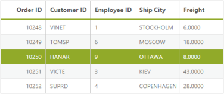
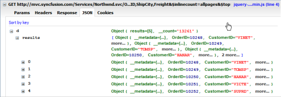

# Data Binding

## Local 

A data source can be bound to a Grid through the DataManager. The DataManager supports JSON array binding. It is useful to bind records in a client-side by using JSON data that is very helpful in Single Page Application (SPA) and in feature rich web application. To achieve this, you can refer to the following code example.





//connection local reference

@(Html.EJ().DataManager("FlatData").URL("Home/DataSource").Adaptor(AdaptorType.UrlAdaptor))

@(Html.EJ().Grid<MVCdoc.OrdersView>("FlatGrid")
        .DataManagerID("FlatData")
        .Query("new ej.Query().select(['OrderID', 'CustomerID', 'EmployeeID', 'ShipCity', 'Freight']).where('CustomerID', 'equal', 'VINET').take(5)")
        //where(fieldName, operator, value, [ignoreCase])
        .Columns(col =>
        {
            col.Field("OrderID").HeaderText("Order ID").IsPrimaryKey(true).TextAlign(TextAlign.Right).Width(75).Add();
            col.Field("CustomerID").HeaderText("Customer ID").Width(80).Add();
            col.Field("EmployeeID").HeaderText("Employee ID").TextAlign(TextAlign.Right).Width(75).Add();
            col.Field("Freight").HeaderText("Freight").TextAlign(TextAlign.Right).Width(75).Format("{0:C}").Add();
            col.Field("ShipCity").HeaderText("Ship City").Width(110).Add();

        })
)





public class HomeController : Controller
{
    public ActionResult Index()
    {
        return View();
    }
    public ActionResult DataSource(Syncfusion.JavaScript.DataManager dm)
    {
        var DataSource = OrderRepository.GetAllRecords();
        DataResult result = new DataResult();
        result.result = DataSource.Skip(dm.Skip).Take(dm.Take).ToList();
        result.count = DataSource.Count();
        return Json(result, JsonRequestBehavior.AllowGet);
    }
    public class DataResult
    {
        public IEnumerable<EditableOrder> result { get; set; }
        public int count { get; set; }
    }

}



 

The result of the above code example is illustrated as follows.

Binding local data to grid
{:.caption}

## REST Services

## OData binding

OData is a standardized protocol for creating and consuming data. You can retrieve data from OData service by using DataManager. You can refer to the following code example of remote Data binding by using the OData service.



    @Html.EJ().DataManager("FlatData").URL("http://mvc.syncfusion.com/Services/Northwnd.svc/Orders/").Adaptor(AdaptorType.ODataAdaptor).CrossDomain(true)

    @(Html.EJ().Grid<MVCdoc.OrdersView>("FlatGrid")

            .DataManagerID("FlatData")
            .Query("new ej.Query().select(['OrderID', 'CustomerID', 'EmployeeID', 'ShipCity', 'Freight']).take(5)")
            .Columns(col =>
            {
                col.Field("OrderID").HeaderText("Order ID").IsPrimaryKey(true).TextAlign(TextAlign.Right).Width(75).Add();
                col.Field("CustomerID").HeaderText("Customer ID").Width(80).Add();
                col.Field("EmployeeID").HeaderText("Employee ID").TextAlign(TextAlign.Right).Width(75).Add();
                col.Field("Freight").HeaderText("Freight").TextAlign(TextAlign.Right).Width(75).Format("{0:C}").Add();
                col.Field("ShipCity").HeaderText("Ship City").Width(110).Add();
            })
    )



The result of the above code example is illustrated as follows.

OData binding
{:.caption}

## OData V4

The OData v4 is an improved version of OData protocols and the DataManager can also retrieve and consume OData v4 services.  For more details on OData v4 Services, refer to the [odata documentation](http://www.odata.org/documentation/).

You can refer to the following code example for consuming OData v4 services and bind the result to the Grid. In the the following code, crossDomain is enabled to make cross domain request.



    @Html.EJ().DataManager("FlatData").URL("http://services.odata.org/V4/Northwind/Northwind.svc/Orders").Adaptor(AdaptorType.ODataV4Adaptor).CrossDomain(true)

    @(Html.EJ().Grid<object>("FlatGrid")
            .DataManagerID("FlatData")
            .Query("new ej.Query().select(['OrderID', 'CustomerID', 'EmployeeID', 'ShipCity', 'Freight']).take(5)")
            .Columns(col =>
            {
                col.Field("OrderID").HeaderText("Order ID").IsPrimaryKey(true).TextAlign(TextAlign.Right).Width(75).Add();
                col.Field("CustomerID").HeaderText("Customer ID").Width(80).Add();
                col.Field("EmployeeID").HeaderText("Employee ID").TextAlign(TextAlign.Right).Width(75).Add();
                col.Field("Freight").HeaderText("Freight").TextAlign(TextAlign.Right).Width(75).Format("{0:C}").Add();
                col.Field("ShipCity").HeaderText("Ship City").Width(110).Add();
            })
    )



The request and response to the service from the DataManager are illustrated as follows.

The result of the above code example is illustrated as follows.

OData v4 request and response
{:.caption}

OData v4 binding
{:.caption}

## WebAPI binding

The Web API is a programmatic interface to define the request and response messages system that is mostly exposed in JSON or XML. The DataManager contains default adaptor to handle the Web API request and responses. The WebApiAdaptor is discussed briefly in the Adaptor section.

Refer to the following code example for consuming the Web API data by using the DataManager.



    @Html.EJ().DataManager("FlatData").URL("http://mvc.syncfusion.com/UGService/api/Orders").Adaptor(AdaptorType.WebApiAdaptor).CrossDomain(true)

    @(Html.EJ().Grid<MVCdoc.OrdersView>("FlatGrid")
            .DataManagerID("FlatData")
            .Query("new ej.Query().select(['OrderID', 'CustomerID', 'EmployeeID', 'ShipCity', 'Freight']).where('CustomerID', 'equal', 'VINET').take(5)")
            .Columns(col =>
            {
                col.Field("OrderID").HeaderText("Order ID").IsPrimaryKey(true).TextAlign(TextAlign.Right).Width(75).Add();
                col.Field("CustomerID").HeaderText("Customer ID").Width(80).Add();
                col.Field("EmployeeID").HeaderText("Employee ID").TextAlign(TextAlign.Right).Width(75).Add();
                col.Field("Freight").HeaderText("Freight").TextAlign(TextAlign.Right).Width(75).Format("{0:C}").Add();
                col.Field("ShipCity").HeaderText("Ship City").Width(110).Add();
            })
    )



The request to the Web API and response is illustrated as follows.

Web API adaptor request and response
{:.caption}

The result for the above code example is illustrated as follows.

Web API data binding
{:.caption}

## Other Web Services binding

The DataManager can also retrieve data from the ASP.NET Web methods and ASP.NET MVC Controller`s action. You can achieve this by using the UrlAdaptor of the DataManager. The UrlAdaptor is discussed briefly in the adaptor section.  By default, the URL Adaptor is used when accessing remote data. 

Refer to the following code example to know how the DataManager can be used to consume data from the web method.

Create a sample using ASP.NET Web Services



    public class WebService1 : System.Web.Services.WebService
    {
        static string cons = ConfigurationManager.ConnectionStrings["SQLConnectionString"].ConnectionString;
        static SqlConnection con = new SqlConnection(cons);

        [WebMethod]
        public DataTable Get()
        {
            SqlCommand getData = new SqlCommand();
            getData.CommandText = "usp_DEV_ChangeLog_Select"; // Stored procedure for retrieve data from suppliers table
            getData.CommandType = CommandType.StoredProcedure;
            getData.Connection = con;
            if (con.State != ConnectionState.Open)
                con.Open();
            DataTable sqldata = new DataTable();
            SqlDataAdapter sqladapter = new SqlDataAdapter(getData);
            sqldata.TableName = "Suppliers";
            sqladapter.Fill(sqldata);
            return sqldata;
        }
    }



In the above code snippet, we have created webservices by using the ASP.NET web service and bound dataSource to Grid, in code behind GetDataSource method.



    [WebMethod]
    [ScriptMethod(ResponseFormat = ResponseFormat.Json)] // Return the JSON formatted result
    public static object GetDataSource()
    {
        CRUD_Service.WebService1 service = new CRUD_Service.WebService1();
        var sqldata = service.Get();   // Get data from webservices
        DataResult result = new DataResult();
        List<EditableCustomer> data = (from ord in sqldata.AsEnumerable() // Perform skip take for on demand load paging
                                        select new EditableCustomer
                                        {
                                            OrderID = ord.ItemArray[0].ToString(),
                                            CustomerID = ord.ItemArray[1].ToString(),
                                            EmployeeID = ord.ItemArray[5].ToString(),
                                            Freight = ord.ItemArray[7].ToString(),
                                            ShipCity = ord.ItemArray[8].ToString()
                                        }).ToList();

        con.Close();
        return data;
    }





    @Html.EJ().DataManager("FlatData").URL("WebService1.asmx/GetDataSource"))

    @(Html.EJ().Grid<MVCdoc.OrdersView>("FlatGrid")
            .DataManagerID("FlatData")
            .Query("new ej.Query().select(['OrderID', 'CustomerID', 'EmployeeID', 'ShipCity', 'Freight']).take(5)")
            .Columns(col =>
            {
                col.Field("OrderID").HeaderText("Order ID").IsPrimaryKey(true).TextAlign(TextAlign.Right).Width(75).Add();
                col.Field("CustomerID").HeaderText("Customer ID").Width(80).Add();
                col.Field("EmployeeID").HeaderText("Employee ID").TextAlign(TextAlign.Right).Width(75).Add();
                col.Field("Freight").HeaderText("Freight").TextAlign(TextAlign.Right).Width(75).Format("{0:C}").Add();
                col.Field("ShipCity").HeaderText("Ship City").Width(110).Add();

            })
    )



ASP.NET Web service binding
{:.caption}
