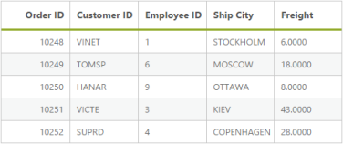

## Data Binding

Local 

A data source can be bound to a Grid through the DataManager. The DataManager supports JSON array binding. It is useful to bind records in a client-side by using JSON data that is very helpful in Single Page Application (SPA) and in feature rich web application. To achieve this, you can refer to the following code example.

[View]

//connection local reference

@(Html.EJ().DataManager("FlatData").URL("Home/DataSource").Adaptor(AdaptorType.UrlAdaptor))

@(Html.EJ().Grid<MVCdoc.OrdersView>("FlatGrid")

        .DataManagerID("FlatData")

        .Query("new ej.Query().select(['OrderID', 'CustomerID', 'EmployeeID', 'ShipCity', 'Freight']).where('CustomerID', 'equal', 'VINET').take(5)")

        //where(fieldName, operator, value, [ignoreCase])

        .Columns(col =>

        {

            col.Field("OrderID").HeaderText("Order ID").IsPrimaryKey(true).TextAlign(TextAlign.Right).Width(75).Add();

            col.Field("CustomerID").HeaderText("Customer ID").Width(80).Add();

            col.Field("EmployeeID").HeaderText("Employee ID").TextAlign(TextAlign.Right).Width(75).Add();

            col.Field("Freight").HeaderText("Freight").TextAlign(TextAlign.Right).Width(75).Format("{0:C}").Add();

            col.Field("ShipCity").HeaderText("Ship City").Width(110).Add();

        }))

[Controller]

public class HomeController : Controller

        {

            public ActionResult Index()

            {

                return View();

            }

            public ActionResult DataSource(Syncfusion.JavaScript.DataManager dm)

            {

                var DataSource = OrderRepository.GetAllRecords();

                DataResult result = new DataResult();

                result.result = DataSource.Skip(dm.Skip).Take(dm.Take).ToList();

                result.count = DataSource.Count();

                return Json(result, JsonRequestBehavior.AllowGet);

            }

            public class DataResult

            {

                public IEnumerable<EditableOrder> result { get; set; }

                public int count { get; set; }

            }

        }

The result of the above code example is illustrated as follows.

__{{ '' | markdownify }}
{:.image }

REST Services

OData binding

OData is a standardized protocol for creating and consuming data. You can retrieve data from oData service by using DataManager. You can refer to the following code example of remote Data binding by using the oData service.

@Html.EJ().DataManager("FlatData").URL("http://mvc.syncfusion.com/Services/Northwnd.svc/Orders/").CrossDomain(true)

@(Html.EJ().Grid<MVCdoc.OrdersView>("FlatGrid")

        .DataManagerID("FlatData")

        .Query("new ej.Query().select(['OrderID', 'CustomerID', 'EmployeeID', 'ShipCity', 'Freight']).take(5)")

        .Columns(col =>

        {

            col.Field("OrderID").HeaderText("Order ID").IsPrimaryKey(true).TextAlign(TextAlign.Right).Width(75).Add();

            col.Field("CustomerID").HeaderText("Customer ID").Width(80).Add();

            col.Field("EmployeeID").HeaderText("Employee ID").TextAlign(TextAlign.Right).Width(75).Add();

            col.Field("Freight").HeaderText("Freight").TextAlign(TextAlign.Right).Width(75).Format("{0:C}").Add();

            col.Field("ShipCity").HeaderText("Ship City").Width(110).Add();

        }))

The result of the above code example is illustrated as follows.__

{{ '' | markdownify }}
{:.image }

OData V4

The OData v4 is an improved version of OData protocols and the DataManager can also retrieve and consume OData v4 services.  For more details on OData v4 Services, refer to the [odata documentation](http://www.odata.org/documentation/odata-version-4-0/).

You can refer to the following code example for consuming OData v4 services and bind the result to the Grid. In the the following code, crossDomain is enabled to make cross domain request.

<ej:DataManager ID="FlatData" runat="server" URL="http://mvc.syncfusion.com/Services/Northwnd.svc/Orders/" CrossDomain="true" />

<ej:Grid ID="OrdersGrid" runat="server"  DataManagerID="FlatData" 

            Query ="new ej.Query().select(['OrderID', 'CustomerID', 'EmployeeID', 'ShipCity', 'Freight']).take(5)">

            <Columns>

                <ej:Column Field="OrderID" HeaderText="Order ID" IsPrimaryKey="True" TextAlign="Right" Width="75" />

                <ej:Column Field="CustomerID" HeaderText="Customer ID" Width="75" />

                <ej:Column Field="EmployeeID" HeaderText="Employee ID" Width="75" />

                <ej:Column Field="ShipCity" HeaderText="Ship City" Width="75" />

                <ej:Column Field="Freight" HeaderText="Freight" Width="75" />

            </Columns>

</ej:Grid>

The request and response to the service from the DataManager are illustrated as follows.

The result of the above code example is illustrated as follows.

{{ '' | markdownify }}
{:.image }

{{ '' | markdownify }}
{:.image }

WebAPI binding

The Web API is a programmatic interface to define the request and response messages system that is mostly exposed in JSON or XML. The DataManager contains default adaptor to handle the Web API request and responses. The WebApiAdaptor is discussed briefly in the Adaptor section.

Refer to the following code example for consuming the Web API data by using the DataManager.

@Html.EJ().DataManager("FlatData").URL("http://mvc.syncfusion.com/Services/Northwnd.svc/Orders/").Adaptor(AdaptorType.WebApiAdaptor)

@(Html.EJ().Grid<MVCdoc.OrdersView>("FlatGrid")

        .DataManagerID("FlatData")

        .Query("new ej.Query().select(['OrderID', 'CustomerID', 'EmployeeID', 'ShipCity', 'Freight']).where('CustomerID', 'equal', 'VINET').take(5)")

        .Columns(col =>

        {

            col.Field("OrderID").HeaderText("Order ID").IsPrimaryKey(true).TextAlign(TextAlign.Right).Width(75).Add();

            col.Field("CustomerID").HeaderText("Customer ID").Width(80).Add();

            col.Field("EmployeeID").HeaderText("Employee ID").TextAlign(TextAlign.Right).Width(75).Add();

            col.Field("Freight").HeaderText("Freight").TextAlign(TextAlign.Right).Width(75).Format("{0:C}").Add();

            col.Field("ShipCity").HeaderText("Ship City").Width(110).Add();

        }))

The request to the Web API and response is illustrated as follows.

{{ '' | markdownify }}
{:.image }

The result for the above code example is illustrated as follows.

{{ '' | markdownify }}
{:.image }

Other Web Services binding

The DataManager can also retrieve data from the ASP.NET Web methods and ASP.NET MVC Controller`s action. You can achieve this by using the UrlAdaptor of the DataManager. The UrlAdaptor is discussed briefly in the adaptor section.  By default, the Url Adaptor is used when accessing remote data. 

Refer to the following code example to know how the DataManager can be used to consume data from the web method.

@Html.EJ().DataManager("FlatData").URL("WebService1.asmx/getData"))

@(Html.EJ().Grid<MVCdoc.OrdersView>("FlatGrid")

        .DataManagerID("FlatData")

        .Query("new ej.Query().select(['OrderID', 'CustomerID', 'EmployeeID', 'ShipCity', 'Freight']).take(5)")

        .Columns(col =>

        {

            col.Field("OrderID").HeaderText("Order ID").IsPrimaryKey(true).TextAlign(TextAlign.Right).Width(75).Add();

            col.Field("CustomerID").HeaderText("Customer ID").Width(80).Add();

            col.Field("EmployeeID").HeaderText("Employee ID").TextAlign(TextAlign.Right).Width(75).Add();

            col.Field("Freight").HeaderText("Freight").TextAlign(TextAlign.Right).Width(75).Format("{0:C}").Add();

            col.Field("ShipCity").HeaderText("Ship City").Width(110).Add();

        }))

{{ '' | markdownify }}
{:.image }

Offline Mode

The offline mode is one of the useful features of the DataManager that can be enabled by setting the offline property of the DataManager as true. With offline as true, the DataManager requests the server only once and further data manipulation operation can be done at client-side itself.

In the following code example, the offline property of the DataManager is set as true.

@Html.EJ().DataManager("FlatData").URL("http://mvc.syncfusion.com/Services/Northwnd.svc/Orders/").Offline(true))

@(Html.EJ().Grid<MVCdoc.OrdersView>("FlatGrid")

        .DataManagerID("FlatData")

        .Query("new ej.Query().select(['OrderID', 'CustomerID', 'EmployeeID', 'ShipCity', 'Freight']).take(5)")

        .Columns(col =>

        {

            col.Field("OrderID").HeaderText("Order ID").IsPrimaryKey(true).TextAlign(TextAlign.Right).Width(75).Add();

            col.Field("CustomerID").HeaderText("Customer ID").Width(80).Add();

            col.Field("EmployeeID").HeaderText("Employee ID").TextAlign(TextAlign.Right).Width(75).Add();

            col.Field("Freight").HeaderText("Freight").TextAlign(TextAlign.Right).Width(75).Format("{0:C}").Add();

            col.Field("ShipCity").HeaderText("Ship City").Width(110).Add();

        }))

The result of the above code example is illustrated as follows.

{{ '' | markdownify }}
{:.image }

Load on demand

Load on demand is a powerful technique to reduce the band width size of consuming the data. It allows you to retrieve the required range of data alone from the server and this feature helps you when the server contains large amount of data.

You can use the following code example for implementing load on demand by using the DataManager.

@Html.EJ().DataManager("FlatData").URL("http://mvc.syncfusion.com/Services/Northwnd.svc/Orders/").CrossDomain(true))

@(Html.EJ().Grid<MVCdoc.OrdersView>("FlatGrid")

        .DataManagerID("FlatData")

        .Query("new ej.Query().select(['OrderID', 'CustomerID', 'EmployeeID', 'ShipCity', 'Freight']).page(1,3)")

        .Columns(col =>

        {

            col.Field("OrderID").HeaderText("Order ID").IsPrimaryKey(true).TextAlign(TextAlign.Right).Width(75).Add();

            col.Field("CustomerID").HeaderText("Customer ID").Width(80).Add();

            col.Field("EmployeeID").HeaderText("Employee ID").TextAlign(TextAlign.Right).Width(75).Add();

            col.Field("Freight").HeaderText("Freight").TextAlign(TextAlign.Right).Width(75).Format("{0:C}").Add();

            col.Field("ShipCity").HeaderText("Ship City").Width(110).Add();

        }))

pageIndex: <input id="pageindx" type="text" placeholder="pageindex" />

pageSize:  <input id="pagesize" type="text" placeholder="pagesize" />

@Html.EJ().Button("submit").Text("Loadondemand").ClientSideEvents(e => { e.Click("onClick"); })

The result of the above code example is illustrated as follows.

{{ '' | markdownify }}
{:.image }

The request and the response for the above code are sent as follows.

{{ '' | markdownify }}
{:.image }

Custom Request Headers

You can add custom request headers by using the DataManager and the headers can be added to the request headers in two ways illustrated in the following code example.

You can add custom request headers to every request made by the DataManager by using the headers property. Refer to the following code example.

@(Html.EJ().DataManager("FlatData").URL("http://mvc.syncfusion.com/Services/Northwnd.svc/Orders/").CrossDomain(true).Headers(new List<string>() { "DataServiceVersion: 1.0","MaxDataServiceVersion: 1.0"}))

@(Html.EJ().Grid<MVCdoc.OrdersView>("FlatGrid")

        .DataManagerID("FlatData")

        .Query("new ej.Query().select(['OrderID', 'CustomerID', 'EmployeeID', 'ShipCity', 'Freight']).take(5)")

        .Columns(col =>

        {

            col.Field("OrderID").HeaderText("Order ID").IsPrimaryKey(true).TextAlign(TextAlign.Right).Width(75).Add();

            col.Field("CustomerID").HeaderText("Customer ID").Width(80).Add();

            col.Field("EmployeeID").HeaderText("Employee ID").TextAlign(TextAlign.Right).Width(75).Add();

            col.Field("Freight").HeaderText("Freight").TextAlign(TextAlign.Right).Width(75).Format("{0:C}").Add();

            col.Field("ShipCity").HeaderText("Ship City").Width(110).Add();

        }))

The above method generates the request header with custom header as follows.

{{ '' | markdownify }}
{:.image }

Cross domain & JSONP

The DataManager contains support for creating cross domain request, you can achieve this by using the crossDomain and jsonp properties of the DataManager. The following code example illustrates on how to create cross domain request. 

@(Html.EJ().DataManager("FlatData").URL("http://mvc.syncfusion.com/Services/Northwnd.svc/Orders/").CrossDomain(true))

@(Html.EJ().Grid<MVCdoc.OrdersView>("FlatGrid")

        .DataManagerID("FlatData")

        .Query("new ej.Query().select(['OrderID', 'CustomerID', 'EmployeeID', 'ShipCity', 'Freight']).take(5)")

        .Columns(col =>

        {

            col.Field("OrderID").HeaderText("Order ID").IsPrimaryKey(true).TextAlign(TextAlign.Right).Width(75).Add();

            col.Field("CustomerID").HeaderText("Customer ID").Width(80).Add();

            col.Field("EmployeeID").HeaderText("Employee ID").TextAlign(TextAlign.Right).Width(75).Add();

            col.Field("Freight").HeaderText("Freight").TextAlign(TextAlign.Right).Width(75).Format("{0:C}").Add();

            col.Field("ShipCity").HeaderText("Ship City").Width(110).Add();

        }))

Result of above code example is illustrated as follows.

{{ '' | markdownify }}
{:.image }

Html Table

Other than JSON and Remote datasource, the DataManager can also fetch and use data from HTML element. You can achieve this by using the table property of the DataManager. The DataManager can fetch data from the HTML table element.

Refer to the following code example for the HTML element binding by using the DataManager.

@(Html.EJ().DataManager("FlatData").Table("#_table1"))

@(Html.EJ().Grid<MVCdoc.OrdersView>("FlatGrid")

        .DataManagerID("FlatData")

        .Columns(col =>

        {

            col.Field("OrderID").HeaderText("Order ID").IsPrimaryKey(true).TextAlign(TextAlign.Right).Width(75).Add();

            col.Field("CustomerID").HeaderText("Customer ID").Width(80).Add();

            col.Field("EmployeeID").HeaderText("Employee ID").TextAlign(TextAlign.Right).Width(75).Add();

        })

)

The result of the above code example is illustrated as follows.

{{ '' | markdownify }}
{:.image }

