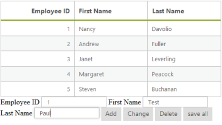
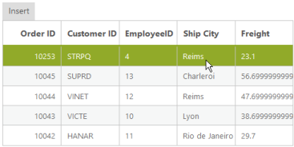
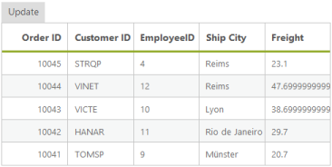

# Editing

Editing is a key feature in the DataManager and it provides support to add a new record, edit an existing record and remove a record from the table. Here, you can learn in detail how these operations are performed by using the DataManager.

## Batch Edit

Batch Editing is a unique feature, where requests to add, remove and change are handled altogether at a time rather than passing the request separately for each operation.

@(Html.EJ().DataManager("FlatData").Adaptor(AdaptorType.JsonAdaptor))

@(Html.EJ().Grid<MVCdoc.OrdersView>("FlatGrid")

        .DataManagerID("FlatData")

        .Query("ej.Query().take(5)")

        .Columns(col =>

        {

            col.Field("EmployeeID").HeaderText("EmployeeID").IsPrimaryKey(true).TextAlign(TextAlign.Right).Width(75).Add();

            col.Field("FirstName").HeaderText("FirstName").Width(80).Add();

            col.Field("LastName").HeaderText("LastName").TextAlign(TextAlign.Right).Width(75).Add();

        })

)


## Employee ID

<input id="EmployeeID" class="e-ejinputtext" type="text" value="" />

First Name

<input id="FirstName" class="e-ejinputtext" type="text" value="" />

Last Name 

<input id="LastName" class="e-ejinputtext" type="text" value="" />

@Html.EJ().Button("submit").Text("Add").ClientSideEvents(e => { e.Click("onClick"); })

@Html.EJ().Button("submit").Text("Change").ClientSideEvents(e => { e.Click("onClick"); })

@Html.EJ().Button("submit").Text("Delete").ClientSideEvents(e => { e.Click("onClick"); })

@Html.EJ().Button("submit").Text("Save All").ClientSideEvents(e => { e.Click("onClick"); })

    

</asp:Content>



Result of the above code example is illustrated as follows.

## Insert

The insert method of the DataManager is used to add a new record to the table. The JSON data is passed as a parameter to the insert method that is inserted to the data source of the DataManager.


@(Html.EJ().DataManager("FlatData").Adaptor(AdaptorType.JsonAdaptor))

@Html.EJ().Button("submit").Text("Insert").ClientSideEvents(e => { e.Click("onClick"); })

@(Html.EJ().Grid<MVCdoc.OrdersView>("FlatGrid")

        .DataManagerID("FlatData")

        .Query("ej.Query().take(5)")

        .Columns(col =>

        {

            col.Field("EmployeeID").HeaderText("EmployeeID").IsPrimaryKey(true).TextAlign(TextAlign.Right).Width(75).Add();

            col.Field("FirstName").HeaderText("FirstName").Width(80).Add();

            col.Field("LastName").HeaderText("LastName").TextAlign(TextAlign.Right).Width(75).Add();

        })

)


    



Result of the above code example is illustrated as follows.

## Update

The update method is used to update the modified changes made to a record in the data source of the DataManager.

@(Html.EJ().DataManager("FlatData").Adaptor(AdaptorType.JsonAdaptor))

@Html.EJ().Button("submit").Text("Update").ClientSideEvents(e => { e.Click("onClick"); })

@(Html.EJ().Grid<MVCdoc.OrdersView>("FlatGrid")

        .DataManagerID("FlatData")

        .Query("ej.Query().take(5)")

        .Columns(col =>

        {

            col.Field("EmployeeID").HeaderText("EmployeeID").IsPrimaryKey(true).TextAlign(TextAlign.Right).Width(75).Add();

            col.Field("FirstName").HeaderText("FirstName").Width(80).Add();

            col.Field("LastName").HeaderText("LastName").TextAlign(TextAlign.Right).Width(75).Add();

        })

)



    


Result of the above code example is illustrated as follows.

## Remove

The remove method is used to delete a record from the data source of the DataManager.

@(Html.EJ().DataManager("FlatData").Adaptor(AdaptorType.JsonAdaptor))

@Html.EJ().Button("submit").Text("Update").ClientSideEvents(e => { e.Click("onClick"); })

@(Html.EJ().Grid<MVCdoc.OrdersView>("FlatGrid")

        .DataManagerID("FlatData")

        .Query("ej.Query().take(5)")

        .Columns(col =>

        {

            col.Field("EmployeeID").HeaderText("EmployeeID").IsPrimaryKey(true).TextAlign(TextAlign.Right).Width(75).Add();

            col.Field("FirstName").HeaderText("FirstName").Width(80).Add();

            col.Field("LastName").HeaderText("LastName").TextAlign(TextAlign.Right).Width(75).Add();

        })

)






Result of the above code example is illustrated as follows.

