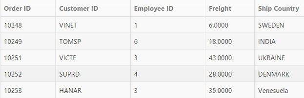
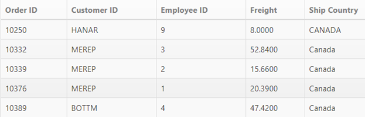
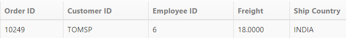
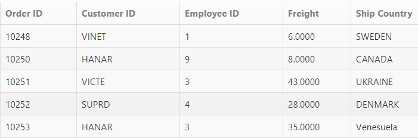
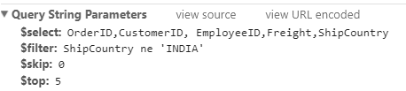
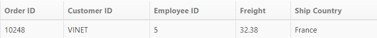
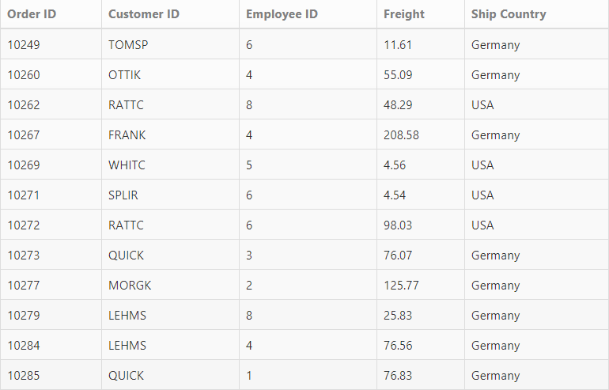

# Filtering

Filtering is a basic technique in the DataManager query. The where query is used to filter some particular or related records from the data source to review details of records. 

## Filter Operators

Filter operators are generally used to specify the filter type. The various filter operators corresponding to the type of the column are listed in the following table.

_Filter Operators_

<table>
<tr>
<th>
Column type</th><th>
Filter operators</th></tr>
<tr>
<td>
Number</td><td>
ej.FilterOperators.greaterThan ej.FilterOperators.greaterThanOrEqual ej.FilterOperators.lessThan ej.FilterOperators.lessThanOrEqual ej.FilterOperators.equal</td></tr>
<tr>
<td>
String</td><td>
ej.FilterOperators.startsWith ej.FilterOperators.endsWith ej.FilterOperators.contains ej.FilterOperators.equal ej.FilterOperators.notEqual</td></tr>
<tr>
<td>
Boolean</td><td>
ej.FilterOperators.equal ej.FilterOperators.notEqual</td></tr>
<tr>
<td>
Date</td><td>
ej.FilterOperators.greaterThan ej.FilterOperators.greaterThanOrEqual ej.FilterOperators.lessThan ej.FilterOperators.lessThanOrEqual ej.FilterOperators.equal</td></tr>
</table>

## lessThan

This operator is used to get the records with values lesser than the filter value.



	@Html.EJ().DataManager("FlatData").URL("http://mvc.syncfusion.com/Services/Northwnd.svc/Orders/").Adaptor(AdaptorType.ODataAdaptor).CrossDomain(true)

	@(Html.EJ().Grid<MVCdoc.OrdersView>("FlatGrid")
		.DataManagerID("FlatData")
		.Query("new ej.Query().where('OrderID', 'lessThan', 10252, false)")
		.Columns(col => 
		{ 
			col.Field("OrderID").HeaderText("Order ID").IsPrimaryKey(true).TextAlign(TextAlign.Right).Width(75).Add();
			col.Field("CustomerID").HeaderText("Customer ID").Width(80).Add();  
			col.Field("EmployeeID").HeaderText("Employee ID").TextAlign(TextAlign.Right).Width(75).Add(); 
			col.Field("Freight").HeaderText("Freight").TextAlign(TextAlign.Right).Width(75).Format("{0:C}").Add();
			col.Field("ShipCity").HeaderText("Ship City").Width(110).Add();
		})	
	)



Result of the above code example is illustrated as follows.

Filter using “lessThan” operator
{:.caption}

## greaterThan

This operator is used to get the records with values greater than that of the filter value.



	@Html.EJ().DataManager("FlatData").URL("http://mvc.syncfusion.com/Services/Northwnd.svc/Orders/").Adaptor(AdaptorType.ODataAdaptor).CrossDomain(true)

	@(Html.EJ().Grid<MVCdoc.OrdersView>("FlatGrid")
		.DataManagerID("FlatData")
		.Query("new ej.Query().where('OrderID', 'greaterThan', 10252, false).take(5)")
		.Columns(col =>        { 
			col.Field("OrderID").HeaderText("Order ID").IsPrimaryKey(true).TextAlign(TextAlign.Right).Width(75).Add();
			col.Field("CustomerID").HeaderText("Customer ID").Width(80).Add();
			col.Field("EmployeeID").HeaderText("Employee ID").TextAlign(TextAlign.Right).Width(75).Add(); 
			col.Field("Freight").HeaderText("Freight").TextAlign(TextAlign.Right).Width(75).Format("{0:C}").Add();  
			col.Field("ShipCity").HeaderText("Ship City").Width(110).Add(); 
			})	
	)



Result of the above code example is illustrated as follows.

Filter using “greaterThan” operator
{:.caption}

## lessThanOrEqual

This operator is used to get the records with values lesser than or equal to the filter value.


	@Html.EJ().DataManager("FlatData").URL("http://mvc.syncfusion.com/Services/Northwnd.svc/Orders/").Adaptor(AdaptorType.ODataAdaptor).CrossDomain(true)

	@(Html.EJ().Grid<MVCdoc.OrdersView>("FlatGrid")
			.DataManagerID("FlatData")
			.Query("new ej.Query().where('OrderID', 'lessThanOrEqual', 10252, false)")
			.Columns(col =>        {
				col.Field("OrderID").HeaderText("Order ID").IsPrimaryKey(true).TextAlign(TextAlign.Right).Width(75).Add(); 
				col.Field("CustomerID").HeaderText("Customer ID").Width(80).Add();  
				col.Field("EmployeeID").HeaderText("Employee ID").TextAlign(TextAlign.Right).Width(75).Add(); 
				col.Field("Freight").HeaderText("Freight").TextAlign(TextAlign.Right).Width(75).Format("{0:C}").Add();  
				col.Field("ShipCity").HeaderText("Ship City").Width(110).Add(); 
			})
	)



Result of the above code example is illustrated as follows.

Filter using “lessThanOrEqual” operator
{:.caption}

## greaterThanOrEqual

This operator is used to get the records with values greater than or equal to the filter value.



	@Html.EJ().DataManager("FlatData").URL("http://mvc.syncfusion.com/Services/Northwnd.svc/Orders/").Adaptor(AdaptorType.ODataAdaptor).CrossDomain(true)

	@(Html.EJ().Grid<MVCdoc.OrdersView>("FlatGrid")
		.DataManagerID("FlatData")
		.Query("new ej.Query().where('OrderID', 'greaterThanOrEqual', 10252, false).take(5)")
		.Columns(col =>
		{
			col.Field("OrderID").HeaderText("Order ID").IsPrimaryKey(true).TextAlign(TextAlign.Right).Width(75).Add();
			col.Field("CustomerID").HeaderText("Customer ID").Width(80).Add();
			col.Field("EmployeeID").HeaderText("Employee ID").TextAlign(TextAlign.Right).Width(75).Add();
			col.Field("Freight").HeaderText("Freight").TextAlign(TextAlign.Right).Width(75).Format("{0:C}").Add();
			col.Field("ShipCity").HeaderText("Ship City").Width(110).Add();
		})	
	)



Result of the above code example is illustrated as follows.

Filter using “greaterThanOrEqual” operator
{:.caption}

## equal

This operator is used to get the records with values equal to that of the filter value.



	@Html.EJ().DataManager("FlatData").URL("http://mvc.syncfusion.com/Services/Northwnd.svc/Orders/").Adaptor(AdaptorType.ODataAdaptor).CrossDomain(true)

	@(Html.EJ().Grid<MVCdoc.OrdersView>("FlatGrid")
		.DataManagerID("FlatData")
		.Query("new ej.Query().where('EmployeeID', 'equal', 4).take(5)")
		.Columns(col =>
		{
			col.Field("OrderID").HeaderText("Order ID").IsPrimaryKey(true).TextAlign(TextAlign.Right).Width(75).Add();
			col.Field("CustomerID").HeaderText("Customer ID").Width(80).Add();
			col.Field("EmployeeID").HeaderText("Employee ID").TextAlign(TextAlign.Right).Width(75).Add();
			col.Field("Freight").HeaderText("Freight").TextAlign(TextAlign.Right).Width(75).Format("{0:C}").Add();
			col.Field("ShipCity").HeaderText("Ship City").Width(110).Add();
		})	
	)



Result of the above code example is illustrated as follows.

Filter using “equal” operator
{:.caption}

## notEqual

This operator is used to get the records with values not equal to that of the filter value specified.



	@Html.EJ().DataManager("FlatData").URL("http://mvc.syncfusion.com/Services/Northwnd.svc/Orders/").Adaptor(AdaptorType.ODataAdaptor).CrossDomain(true)

	@(Html.EJ().Grid<MVCdoc.OrdersView>("FlatGrid")
		.DataManagerID("FlatData")
		.Query("new ej.Query().where('EmployeeID', 'notEqual', 4).take(5)")
		.Columns(col =>
		{
			col.Field("OrderID").HeaderText("Order ID").IsPrimaryKey(true).TextAlign(TextAlign.Right).Width(75).Add();
			col.Field("CustomerID").HeaderText("Customer ID").Width(80).Add();
			col.Field("EmployeeID").HeaderText("Employee ID").TextAlign(TextAlign.Right).Width(75).Add();
			col.Field("Freight").HeaderText("Freight").TextAlign(TextAlign.Right).Width(75).Format("{0:C}").Add();
			col.Field("ShipCity").HeaderText("Ship City").Width(110).Add();
		})	

	)



Result of the above code example is illustrated as follows.

Filter using “notEqual” operator
{:.caption}

## contains

This operator is used to get the records that contains the filter value.



	@Html.EJ().DataManager("FlatData").URL("http://mvc.syncfusion.com/Services/Northwnd.svc/Orders/").Adaptor(AdaptorType.ODataAdaptor).CrossDomain(true)

	@(Html.EJ().Grid<MVCdoc.OrdersView>("FlatGrid")
		.DataManagerID("FlatData")
		.Query("new ej.Query().where('CustomerID', 'contains', 'A', false ).take(5)")
		.Columns(col =>
		{
			col.Field("OrderID").HeaderText("Order ID").IsPrimaryKey(true).TextAlign(TextAlign.Right).Width(75).Add();
			col.Field("CustomerID").HeaderText("Customer ID").Width(80).Add();
			col.Field("EmployeeID").HeaderText("Employee ID").TextAlign(TextAlign.Right).Width(75).Add();
			col.Field("Freight").HeaderText("Freight").TextAlign(TextAlign.Right).Width(75).Format("{0:C}").Add();
			col.Field("ShipCity").HeaderText("Ship City").Width(110).Add();
		})	
	)



Result of the above code example is illustrated as follows.

Filter using “contains” operator
{:.caption}

## startswith

This operator is used to get the records that starts with the filter value specified.



	@Html.EJ().DataManager("FlatData").URL("http://mvc.syncfusion.com/Services/Northwnd.svc/Orders/").Adaptor(AdaptorType.ODataAdaptor).CrossDomain(true)

	@(Html.EJ().Grid<MVCdoc.OrdersView>("FlatGrid")
		.DataManagerID("FlatData")
		.Query("new ej.Query().where('CustomerID', 'startswith', 'A', false ).take(5)")
		.Columns(col =>
		{
			col.Field("OrderID").HeaderText("Order ID").IsPrimaryKey(true).TextAlign(TextAlign.Right).Width(75).Add();
			col.Field("CustomerID").HeaderText("Customer ID").Width(80).Add();
			col.Field("EmployeeID").HeaderText("Employee ID").TextAlign(TextAlign.Right).Width(75).Add();
			col.Field("Freight").HeaderText("Freight").TextAlign(TextAlign.Right).Width(75).Format("{0:C}").Add();
			col.Field("ShipCity").HeaderText("Ship City").Width(110).Add();
		})	
	)



Result of the above code example is illustrated as follows.

Filter using “startswith” operator
{:.caption}

## endswith

This operator is used to get the records that ends with the filter value specified.



	@Html.EJ().DataManager("FlatData").URL("http://mvc.syncfusion.com/Services/Northwnd.svc/Orders/").Adaptor(AdaptorType.ODataAdaptor).CrossDomain(true)

	@(Html.EJ().Grid<MVCdoc.OrdersView>("FlatGrid")

		.DataManagerID("FlatData")
		.Query("new ej.Query().where('CustomerID', 'endswith', 'A', false ).take(5)")
		.Columns(col =>
		{
			col.Field("OrderID").HeaderText("Order ID").IsPrimaryKey(true).TextAlign(TextAlign.Right).Width(75).Add();
			col.Field("CustomerID").HeaderText("Customer ID").Width(80).Add();
			col.Field("EmployeeID").HeaderText("Employee ID").TextAlign(TextAlign.Right).Width(75).Add();
			col.Field("Freight").HeaderText("Freight").TextAlign(TextAlign.Right).Width(75).Format("{0:C}").Add();
			col.Field("ShipCity").HeaderText("Ship City").Width(110).Add();
		})	

	)



Result of the above code example is illustrated as follows.

Filter using “endswith” operator
{:.caption}

## and predicate

The and predicate is used to add n-number of predicates with and condition and filter the data.



	@Html.EJ().DataManager("FlatData").URL("http://mvc.syncfusion.com/Services/Northwnd.svc/Orders/").Adaptor(AdaptorType.ODataAdaptor).CrossDomain(true)
	@(Html.EJ().Grid<MVCdoc.OrdersView>("FlatGrid")
		.DataManagerID("FlatData")
		.Query("new ej.Query().where(ej.Predicate('OrderID', ej.FilterOperators.greaterThan, 10399, true)
								.and('CustomerID', ej.FilterOperators.startsWith, 'V', true)).take(5)")
		.Columns(col =>
		{
			col.Field("OrderID").HeaderText("Order ID").IsPrimaryKey(true).TextAlign(TextAlign.Right).Width(75).Add();
			col.Field("CustomerID").HeaderText("Customer ID").Width(80).Add();
			col.Field("EmployeeID").HeaderText("Employee ID").TextAlign(TextAlign.Right).Width(75).Add();
			col.Field("Freight").HeaderText("Freight").TextAlign(TextAlign.Right).Width(75).Format("{0:C}").Add();
			col.Field("ShipCity").HeaderText("Ship City").Width(110).Add();
		})	
	)



Result of the above code example is illustrated as follows.

Result of using “and” condition
{:.caption}

## or predicate

By using this method, you can add n-number of predicates with or condition and filter the data.



	@Html.EJ().DataManager("FlatData").URL("http://mvc.syncfusion.com/Services/Northwnd.svc/Orders/").Adaptor(AdaptorType.ODataAdaptor).CrossDomain(true)
	@(Html.EJ().Grid<MVCdoc.OrdersView>("FlatGrid")
		.DataManagerID("FlatData")
		.Query("new ej.Query().where(ej.Predicate('OrderID', ej.FilterOperators.greaterThan, 10399, true)
							.or('CustomerID', ej.FilterOperators.startsWith, 'V', true)).take(5)")
		.Columns(col =>
		{
			col.Field("OrderID").HeaderText("Order ID").IsPrimaryKey(true).TextAlign(TextAlign.Right).Width(75).Add();
			col.Field("CustomerID").HeaderText("Customer ID").Width(80).Add();
			col.Field("EmployeeID").HeaderText("Employee ID").TextAlign(TextAlign.Right).Width(75).Add();
			col.Field("Freight").HeaderText("Freight").TextAlign(TextAlign.Right).Width(75).Format("{0:C}").Add();
			col.Field("ShipCity").HeaderText("Ship City").Width(110).Add();
		})	
	)



Result of the above code example is illustrated as follows.

Result of using “or” condition
{:.caption}

## Containment Operators

### notcontains

This operator is used to get the records that not contains the filter value.



	@Html.EJ().DataManager("FlatData").URL("http://mvc.syncfusion.com/Services/Northwnd.svc/Orders/").Adaptor(AdaptorType.ODataAdaptor).CrossDomain(true)

	@(Html.EJ().Grid<MVCdoc.OrdersView>("FlatGrid")
		.DataManagerID("FlatData")
		.Query("ej.Query()
                .from('Orders').select('OrderID', 'CustomerID', 'EmployeeID', 'Freight', 'ShipCountry')
                .page(1,5).where('ShipCountry', 'notcontains', 'CAN', false)")
		.Columns(col =>
		{
			col.Field("OrderID").HeaderText("Order ID").IsPrimaryKey(true).TextAlign(TextAlign.Right).Width(75).Add();
			col.Field("CustomerID").HeaderText("Customer ID").Width(80).Add();
			col.Field("EmployeeID").HeaderText("Employee ID").TextAlign(TextAlign.Right).Width(75).Add();
			col.Field("Freight").HeaderText("Freight").TextAlign(TextAlign.Right).Width(75).Format("{0:C}").Add();
			col.Field("ShipCountry").HeaderText("Ship City").Width(110).Add();
		})	
	)

   


 

### contains

This operator is used to get the records that contains the filter value.



    @Html.EJ().DataManager("FlatData").URL("http://mvc.syncfusion.com/Services/Northwnd.svc/Orders/").Adaptor(AdaptorType.ODataAdaptor).CrossDomain(true)

	@(Html.EJ().Grid<MVCdoc.OrdersView>("FlatGrid")
		.DataManagerID("FlatData")
		.Query("ej.Query()
                .from('Orders').select('OrderID', 'CustomerID', 'EmployeeID', 'Freight', 'ShipCountry')
                .page(1,5).where('ShipCountry', 'contains', 'CAN', false)")
		.Columns(col =>
		{
			col.Field("OrderID").HeaderText("Order ID").IsPrimaryKey(true).TextAlign(TextAlign.Right).Width(75).Add();
			col.Field("CustomerID").HeaderText("Customer ID").Width(80).Add();
			col.Field("EmployeeID").HeaderText("Employee ID").TextAlign(TextAlign.Right).Width(75).Add();
			col.Field("Freight").HeaderText("Freight").TextAlign(TextAlign.Right).Width(75).Format("{0:C}").Add();
			col.Field("ShipCountry").HeaderText("Ship City").Width(110).Add();
		})	
	)



 

### in

This operator used to fetch the records with value match with the given filter value. 



    @Html.EJ().DataManager("FlatData").URL("http://mvc.syncfusion.com/Services/Northwnd.svc/Orders/").Adaptor(AdaptorType.ODataAdaptor).CrossDomain(true)

	@(Html.EJ().Grid<MVCdoc.OrdersView>("FlatGrid")
		.DataManagerID("FlatData")
		.Query("ej.Query()
                .from('Orders').select('OrderID', 'CustomerID', 'EmployeeID', 'Freight', 'ShipCountry')
                .page(1,5).where('ShipCountry', 'IN', ['INDIA'], false)")
		.Columns(col =>
		{
			col.Field("OrderID").HeaderText("Order ID").IsPrimaryKey(true).TextAlign(TextAlign.Right).Width(75).Add();
			col.Field("CustomerID").HeaderText("Customer ID").Width(80).Add();
			col.Field("EmployeeID").HeaderText("Employee ID").TextAlign(TextAlign.Right).Width(75).Add();
			col.Field("Freight").HeaderText("Freight").TextAlign(TextAlign.Right).Width(75).Format("{0:C}").Add();
			col.Field("ShipCountry").HeaderText("Ship Country").Width(110).Add();
		})	
	)



 

### notin

This operator used to fetch the records with value not match with the given filter value. 



    @Html.EJ().DataManager("FlatData").URL("http://mvc.syncfusion.com/Services/Northwnd.svc/Orders/").Adaptor(AdaptorType.ODataAdaptor).CrossDomain(true)

	@(Html.EJ().Grid<MVCdoc.OrdersView>("FlatGrid")
		.DataManagerID("FlatData")
		.Query("ej.Query()
                .from('Orders').select('OrderID', 'CustomerID', 'EmployeeID', 'Freight', 'ShipCountry')
                .page(1,5).where('ShipCountry', 'notin', ['INDIA'], false)")
		.Columns(col =>
		{
			col.Field("OrderID").HeaderText("Order ID").IsPrimaryKey(true).TextAlign(TextAlign.Right).Width(75).Add();
			col.Field("CustomerID").HeaderText("Customer ID").Width(80).Add();
			col.Field("EmployeeID").HeaderText("Employee ID").TextAlign(TextAlign.Right).Width(75).Add();
			col.Field("Freight").HeaderText("Freight").TextAlign(TextAlign.Right).Width(75).Format("{0:C}").Add();
			col.Field("ShipCountry").HeaderText("Ship Country").Width(110).Add();
		})	
	)



 

 

## Lambda Operators

### all

The ALL operator returns true if all the sub query values meet the condition. This operator used to fetch the records of the fields match with the given value’s fields.



    	@(Html.EJ().Grid<MVCdoc.OrdersView>("FlatGrid")
		.Columns(col =>
		{
			col.Field("OrderID").HeaderText("Order ID").IsPrimaryKey(true).TextAlign(TextAlign.Right).Width(75).Add();
			col.Field("CustomerID").HeaderText("Customer ID").Width(80).Add();
			col.Field("EmployeeID").HeaderText("Employee ID").TextAlign(TextAlign.Right).Width(75).Add();
			col.Field("Freight").HeaderText("Freight").TextAlign(TextAlign.Right).Width(75).Format("{0:C}").Add();
			col.Field("ShipCountry").HeaderText("Ship Country").Width(110).Add();
		})	
	)





    setTimeout(function () {
        var gridData = [{ OrderID: 10248, CustomerID: "VINET", EmployeeID: 5, OrderDate: new Date(8364186e5), ShipName: "Vins et alcools Chevalier", ShipCity: "Reims", ShipAddress: "59 rue de l'Abbaye", ShipRegion: null, ShipPostalCode: "51100", ShipCountry: "France", Freight: 32.38, Verified: !0 }];
        var data = [{ OrderID: 10248, CustomerID: "VINET", EmployeeID: 5, OrderDate: new Date(8364186e5), ShipName: "Vins et alcools Chevalier", ShipCity: "Reims", ShipAddress: "59 rue de l'Abbaye", ShipRegion: null, ShipPostalCode: "51100", ShipCountry: "France", Freight: 32.38, Verified: !0 }];
        var dataManager = ej.DataManager(gridData);
        var dataSource = ej.DataManager(data);
        var result = ej.Query().select("ShipCountry")
        var ShipCountry = dataSource.executeLocal(result);
        var query = ej.Query()
            .where("ShipCountry", "equal all", ShipCountry, false).select("OrderID", "CustomerID", "EmployeeID", "Freight", "ShipCountry");

        var execute = dataManager.executeLocal(query); // executing query
        var obj = $("#FlatGrid").ejGrid("instance");
        obj.dataSource(execute);
    }, 1000);



 

### any

The ANY operator returns true if any of the sub query values meet the condition. The returned data match with any one of the field in existing table.



    	@(Html.EJ().Grid<MVCdoc.OrdersView>("FlatGrid")
		.Columns(col =>
		{
			col.Field("OrderID").HeaderText("Order ID").IsPrimaryKey(true).TextAlign(TextAlign.Right).Width(75).Add();
			col.Field("CustomerID").HeaderText("Customer ID").Width(80).Add();
			col.Field("EmployeeID").HeaderText("Employee ID").TextAlign(TextAlign.Right).Width(75).Add();
			col.Field("Freight").HeaderText("Freight").TextAlign(TextAlign.Right).Width(75).Format("{0:C}").Add();
			col.Field("ShipCountry").HeaderText("Ship Country").Width(110).Add();
		})	
	)





    setTimeout(function () {
        var gridData = window.gridData;
        var data = [{ OrderID: 10343, CustomerID: "LEHMS", EmployeeID: 4, OrderDate: new Date(8467002e5), ShipName: "Lehmanns Marktstand", ShipCity: "Frankfurt a.M.", ShipAddress: "Magazinweg 7", ShipRegion: null, ShipPostalCode: "60528", ShipCountry: "Germany", Freight: 110.37, Verified: !0 }, { OrderID: 10344, CustomerID: "WHITC", EmployeeID: 4, OrderDate: new Date(8467866e5), ShipName: "White Clover Markets", ShipCity: "Seattle", ShipAddress: "1029 - 12th Ave. S.", ShipRegion: "WA", ShipPostalCode: "98124", ShipCountry: "USA", Freight: 23.29, Verified: !1 }];
        var dataManager = ej.DataManager(gridData);
        var dataSource = ej.DataManager(data);
        var result = ej.Query().select("ShipCountry")
        var ShipCountry = dataSource.executeLocal(result);
        var query = ej.Query()
            .where("ShipCountry", "equal any", ShipCountry, false).select("OrderID", "CustomerID", "EmployeeID", "Freight", "ShipCountry");
        var execute = dataManager.executeLocal(query); // executing query
		var obj = $("#FlatGrid").ejGrid("instance");
        obj.dataSource(execute);
    }, 1000);



 