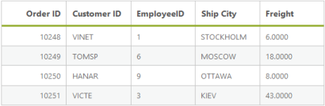
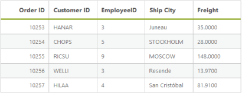
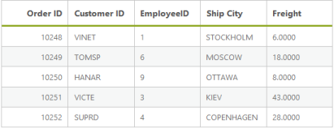
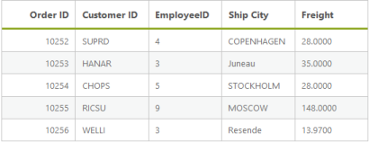
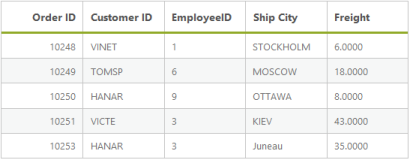
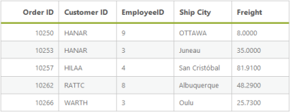
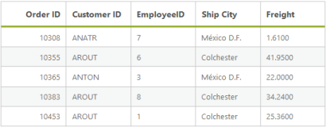
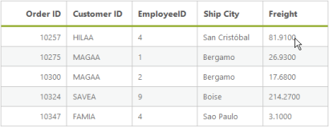
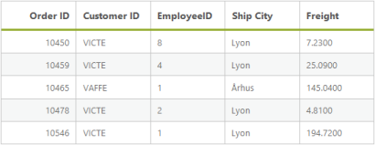
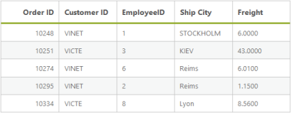

# Filtering

Filtering is a basic technique in the DataManager query. The where query is used to filter some particular or related records from the data source to review details of records. 

## Filter Operators

Filter operators are generally used to specify the filter type. The various filter operators corresponding to the type of the column are listed in the following table.

_Filter Operators_

<table>
<tr>
<th>
Column type</th><th>
Filter operators</th></tr>
<tr>
<td>
Number</td><td>
ej.FilterOperators.greaterThan,ej.FilterOperators.greaterThanOrEqual,ej.FilterOperators.lessThan,ej.FilterOperators.lessThanOrEqual,ej.FilterOperators.equal</td></tr>
<tr>
<td>
String</td><td>
ej.FilterOperators.startsWith,ej.FilterOperators.endsWith,ej.FilterOperators.contains,ej.FilterOperators.equal,ej.FilterOperators.notEqual</td></tr>
<tr>
<td>
Boolean</td><td>
ej.FilterOperators.equal,ej.FilterOperators.notEqual</td></tr>
<tr>
<td>
Date</td><td>
ej.FilterOperators.greaterThan,ej.FilterOperators.greaterThanOrEqual,ej.FilterOperators.lessThan,ej.FilterOperators.lessThanOrEqual,ej.FilterOperators.equal</td></tr>
</table>

## lessThan

This operator is used to get the records with values lesser than the filter value.



@(Html.EJ().DataManager("FlatData").URL("http://mvc.syncfusion.com/UGService/api/Orders"))
@(Html.EJ().Grid<MVCdoc.OrdersView>("FlatGrid")
	.DataManagerID("FlatData")
	.Query("new ej.Query().where('OrderID', 'lessThan', 10252, false)")
	.Columns(col => 
	{ 
		col.Field("OrderID").HeaderText("Order ID").IsPrimaryKey(true).TextAlign(TextAlign.Right).Width(75).Add();
		col.Field("CustomerID").HeaderText("Customer ID").Width(80).Add();  
		col.Field("EmployeeID").HeaderText("Employee ID").TextAlign(TextAlign.Right).Width(75).Add(); 
		col.Field("Freight").HeaderText("Freight").TextAlign(TextAlign.Right).Width(75).Format("{0:C}").Add();
		col.Field("ShipCity").HeaderText("Ship City").Width(110).Add();
	})	
)



Result of the above code example is illustrated as follows.

Filter using “lessThan” operator
{:.caption}

## greaterThan

This operator is used to get the records with values greater than that of the filter value.


@(Html.EJ().DataManager("FlatData").URL("http://mvc.syncfusion.com/UGService/api/Orders"))
@(Html.EJ().Grid<MVCdoc.OrdersView>("FlatGrid")
	.DataManagerID("FlatData")
	.Query("new ej.Query().where('OrderID', 'greaterThan', 10252, false).take(5)")
	.Columns(col =>        { 
		col.Field("OrderID").HeaderText("Order ID").IsPrimaryKey(true).TextAlign(TextAlign.Right).Width(75).Add();
		col.Field("CustomerID").HeaderText("Customer ID").Width(80).Add();
		col.Field("EmployeeID").HeaderText("Employee ID").TextAlign(TextAlign.Right).Width(75).Add(); 
		col.Field("Freight").HeaderText("Freight").TextAlign(TextAlign.Right).Width(75).Format("{0:C}").Add();  
		col.Field("ShipCity").HeaderText("Ship City").Width(110).Add(); 
		})	
 )



Result of the above code example is illustrated as follows.

Filter using “greaterThan” operator
{:.caption}

## lessThanOrEqual

This operator is used to get the records with values lesser than or equal to the filter value.


@(Html.EJ().DataManager("FlatData").URL("http://mvc.syncfusion.com/UGService/api/Orders"))
@(Html.EJ().Grid<MVCdoc.OrdersView>("FlatGrid")
        .DataManagerID("FlatData")
        .Query("new ej.Query().where('OrderID', 'lessThanOrEqual', 10252, false)")
        .Columns(col =>        {
			col.Field("OrderID").HeaderText("Order ID").IsPrimaryKey(true).TextAlign(TextAlign.Right).Width(75).Add(); 
			col.Field("CustomerID").HeaderText("Customer ID").Width(80).Add();  
			col.Field("EmployeeID").HeaderText("Employee ID").TextAlign(TextAlign.Right).Width(75).Add(); 
			col.Field("Freight").HeaderText("Freight").TextAlign(TextAlign.Right).Width(75).Format("{0:C}").Add();  
			col.Field("ShipCity").HeaderText("Ship City").Width(110).Add(); 
		})
 )


Result of the above code example is illustrated as follows.

Filter using “lessThanOrEqual” operator
{:.caption}

## greaterThanOrEqual

This operator is used to get the records with values greater than or equal to the filter value.


@(Html.EJ().DataManager("FlatData").URL("http://mvc.syncfusion.com/UGService/api/Orders"))

@(Html.EJ().Grid<MVCdoc.OrdersView>("FlatGrid")

	.DataManagerID("FlatData")

	.Query("new ej.Query().where('OrderID', 'greaterThanOrEqual', 10252, false).take(5)")

	.Columns(col =>

	{

		col.Field("OrderID").HeaderText("Order ID").IsPrimaryKey(true).TextAlign(TextAlign.Right).Width(75).Add();

		col.Field("CustomerID").HeaderText("Customer ID").Width(80).Add();

		col.Field("EmployeeID").HeaderText("Employee ID").TextAlign(TextAlign.Right).Width(75).Add();

		col.Field("Freight").HeaderText("Freight").TextAlign(TextAlign.Right).Width(75).Format("{0:C}").Add();

		col.Field("ShipCity").HeaderText("Ship City").Width(110).Add();

	})	

)



Result of the above code example is illustrated as follows.

Filter using “greaterThanOrEqual” operator
{:.caption}

## equal

This operator is used to get the records with values equal to that of the filter value.


@(Html.EJ().DataManager("FlatData").URL("http://mvc.syncfusion.com/UGService/api/Orders"))

@(Html.EJ().Grid<MVCdoc.OrdersView>("FlatGrid")

	.DataManagerID("FlatData")

	.Query("new ej.Query().where('EmployeeID', 'equal', 4).take(5)")

	.Columns(col =>

	{

		col.Field("OrderID").HeaderText("Order ID").IsPrimaryKey(true).TextAlign(TextAlign.Right).Width(75).Add();

		col.Field("CustomerID").HeaderText("Customer ID").Width(80).Add();

		col.Field("EmployeeID").HeaderText("Employee ID").TextAlign(TextAlign.Right).Width(75).Add();

		col.Field("Freight").HeaderText("Freight").TextAlign(TextAlign.Right).Width(75).Format("{0:C}").Add();

		col.Field("ShipCity").HeaderText("Ship City").Width(110).Add();

	})	

)



Result of the above code example is illustrated as follows.

Filter using “equal” operator
{:.caption}

## notEqual

This operator is used to get the records with values not equal to that of the filter value specified.



@(Html.EJ().DataManager("FlatData").URL("http://mvc.syncfusion.com/UGService/api/Orders"))

@(Html.EJ().Grid<MVCdoc.OrdersView>("FlatGrid")

	.DataManagerID("FlatData")

	.Query("new ej.Query().where('EmployeeID', 'notEqual', 4).take(5)")

	.Columns(col =>

	{

		col.Field("OrderID").HeaderText("Order ID").IsPrimaryKey(true).TextAlign(TextAlign.Right).Width(75).Add();

		col.Field("CustomerID").HeaderText("Customer ID").Width(80).Add();

		col.Field("EmployeeID").HeaderText("Employee ID").TextAlign(TextAlign.Right).Width(75).Add();

		col.Field("Freight").HeaderText("Freight").TextAlign(TextAlign.Right).Width(75).Format("{0:C}").Add();

		col.Field("ShipCity").HeaderText("Ship City").Width(110).Add();

	})	

)


Result of the above code example is illustrated as follows.

Filter using “notEqual” operator
{:.caption}

## contains

This operator is used to get the records that contains the filter value.



@(Html.EJ().DataManager("FlatData").URL("http://mvc.syncfusion.com/UGService/api/Orders"))

@(Html.EJ().Grid<MVCdoc.OrdersView>("FlatGrid")

	.DataManagerID("FlatData")

	.Query("new ej.Query().where('CustomerID', 'contains', 'A', false ).take(5)")

	.Columns(col =>

	{

		col.Field("OrderID").HeaderText("Order ID").IsPrimaryKey(true).TextAlign(TextAlign.Right).Width(75).Add();

		col.Field("CustomerID").HeaderText("Customer ID").Width(80).Add();

		col.Field("EmployeeID").HeaderText("Employee ID").TextAlign(TextAlign.Right).Width(75).Add();

		col.Field("Freight").HeaderText("Freight").TextAlign(TextAlign.Right).Width(75).Format("{0:C}").Add();

		col.Field("ShipCity").HeaderText("Ship City").Width(110).Add();

	})	

)



Result of the above code example is illustrated as follows.

Filter using “contains” operator
{:.caption}

## startswith

This operator is used to get the records that starts with the filter value specified.

@(Html.EJ().DataManager("FlatData").URL("http://mvc.syncfusion.com/UGService/api/Orders"))

@(Html.EJ().Grid<MVCdoc.OrdersView>("FlatGrid")

	.DataManagerID("FlatData")

	.Query("new ej.Query().where('CustomerID', 'startswith', 'A', false ).take(5)")

	.Columns(col =>

	{

		col.Field("OrderID").HeaderText("Order ID").IsPrimaryKey(true).TextAlign(TextAlign.Right).Width(75).Add();

		col.Field("CustomerID").HeaderText("Customer ID").Width(80).Add();

		col.Field("EmployeeID").HeaderText("Employee ID").TextAlign(TextAlign.Right).Width(75).Add();

		col.Field("Freight").HeaderText("Freight").TextAlign(TextAlign.Right).Width(75).Format("{0:C}").Add();

		col.Field("ShipCity").HeaderText("Ship City").Width(110).Add();

	})	

)



Result of the above code example is illustrated as follows.

Filter using “startswith” operator
{:.caption}

## endswith

This operator is used to get the records that ends with the filter value specified.


@(Html.EJ().DataManager("FlatData").URL("http://mvc.syncfusion.com/UGService/api/Orders"))

@(Html.EJ().Grid<MVCdoc.OrdersView>("FlatGrid")

	.DataManagerID("FlatData")

	.Query("new ej.Query().where('CustomerID', 'endswith', 'A', false ).take(5)")

	.Columns(col =>

	{

		col.Field("OrderID").HeaderText("Order ID").IsPrimaryKey(true).TextAlign(TextAlign.Right).Width(75).Add();

		col.Field("CustomerID").HeaderText("Customer ID").Width(80).Add();

		col.Field("EmployeeID").HeaderText("Employee ID").TextAlign(TextAlign.Right).Width(75).Add();

		col.Field("Freight").HeaderText("Freight").TextAlign(TextAlign.Right).Width(75).Format("{0:C}").Add();

		col.Field("ShipCity").HeaderText("Ship City").Width(110).Add();

	})	

)


Result of the above code example is illustrated as follows.

Filter using “endswith” operator
{:.caption}

## Predicate

### and predicate

The and predicate is used to add n-number of predicates with and condition and filter the data.



@(Html.EJ().DataManager("FlatData").URL("http://mvc.syncfusion.com/UGService/api/Orders"))

@(Html.EJ().Grid<MVCdoc.OrdersView>("FlatGrid")

	.DataManagerID("FlatData")

	.Query("new ej.Query().where(ej.Predicate('OrderID', ej.FilterOperators.greaterThan, 10399, true)
							.and('CustomerID', ej.FilterOperators.startsWith, 'V', true)).take(5)")

	.Columns(col =>

	{

		col.Field("OrderID").HeaderText("Order ID").IsPrimaryKey(true).TextAlign(TextAlign.Right).Width(75).Add();

		col.Field("CustomerID").HeaderText("Customer ID").Width(80).Add();

		col.Field("EmployeeID").HeaderText("Employee ID").TextAlign(TextAlign.Right).Width(75).Add();

		col.Field("Freight").HeaderText("Freight").TextAlign(TextAlign.Right).Width(75).Format("{0:C}").Add();

		col.Field("ShipCity").HeaderText("Ship City").Width(110).Add();

	})	

)



Result of the above code example is illustrated as follows.

Result of using “and” condition
{:.caption}

### or predicate

By using this method, you can add n-number of predicates with or condition and filter the data.



@(Html.EJ().DataManager("FlatData").URL("http://mvc.syncfusion.com/UGService/api/Orders"))

@(Html.EJ().Grid<MVCdoc.OrdersView>("FlatGrid")

	.DataManagerID("FlatData")

	.Query("new ej.Query().where(ej.Predicate('OrderID', ej.FilterOperators.greaterThan, 10399, true)
						  .or('CustomerID', ej.FilterOperators.startsWith, 'V', true)).take(5)")

	.Columns(col =>

	{

		col.Field("OrderID").HeaderText("Order ID").IsPrimaryKey(true).TextAlign(TextAlign.Right).Width(75).Add();

		col.Field("CustomerID").HeaderText("Customer ID").Width(80).Add();

		col.Field("EmployeeID").HeaderText("Employee ID").TextAlign(TextAlign.Right).Width(75).Add();

		col.Field("Freight").HeaderText("Freight").TextAlign(TextAlign.Right).Width(75).Format("{0:C}").Add();

		col.Field("ShipCity").HeaderText("Ship City").Width(110).Add();

	})	

)


Result of the above code example is illustrated as follows.

Result of using “or” condition
{:.caption}