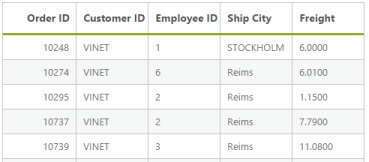
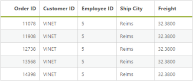
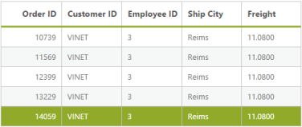

# Getting Started 

## Create your DataManager in the ASP.NET MVC

DataManager is used to manage relational data. It supports CRUD (Create, Read, Update, and Destroy) in individual requests and Batch. DataManager uses DataManager control for processing and ej.Query for serving the data. DataManager control communicates with data source and ej.Query generates data queries that are read by DataManager. 

Configure Demo Application

This section briefly describes how to make a connection to WCF “Northwind” OData service and generate a report with top five orders from customer HANAR with higher Freight charges.  In this application scenario, you can learn how to bind the DataManager to the Grid control to do paging, filtering and sorting with Grid contol in the DataManager by using ej.Query.

Create Connection

To define connection to data source, you can use the DataManager control. The data source can be local or remote. Local data source is the local data and remote data source is any web service. 

The local data is set as data source by using the following code example.

&lt;%--connection local reference--%&gt;

@(Html.EJ().DataManager("FlatData").URL("Home/DataSource").Adaptor(AdaptorType.UrlAdaptor))

[Controller]

public class HomeController : Controller

        {

            public ActionResult Index()

            {

                return View();

            }

            public ActionResult DataSource(Syncfusion.JavaScript.DataManager dm)

            {

                var DataSource = OrderRepository.GetAllRecords();

                DataResult result = new DataResult();

                result.result = DataSource.Skip(dm.Skip).Take(dm.Take).ToList();

                result.count = DataSource.Count();

                return Json(result, JsonRequestBehavior.AllowGet);

            }

            public class DataResult

            {

                public IEnumerable<EditableOrder> result { get; set; }

                public int count { get; set; }

            }

        }

In this application, as you have web service for NorthWind database, you can assign the web service URL link to the URL property of DataManager, and you can enable crossDomain to retrieve data from another domain.

@Html.EJ().DataManager("FlatData").URL("http://mvc.syncfusion.com/Services/Northwnd.svc/Orders/").CrossDomain(true)

You can use the ej.Query to generate the report from web service.

Binding with Grid Control

You can bind the DataManager with Grid by defining the ID of DataManager in the DataManagerID property of the Grid control.

@Html.EJ().DataManager("FlatData").URL("http://mvc.syncfusion.com/Services/Northwnd.svc/Orders/").CrossDomain(true)

@(Html.EJ().Grid<MVCdoc.OrdersView>("FlatGrid")

        .DataManagerID("FlatData") //DataManagerID(DataManager ID)

        .Query("new ej.Query().take(5)")

        .Columns(col =>

        {

            col.Field("OrderID").HeaderText("Order ID").IsPrimaryKey(true).TextAlign(TextAlign.Right).Width(75).Add();

            col.Field("CustomerID").HeaderText("Customer ID").Width(80).Add();

            col.Field("EmployeeID").HeaderText("Employee ID").TextAlign(TextAlign.Right).Width(75).Add();

            col.Field("Freight").HeaderText("Freight").TextAlign(TextAlign.Right).Width(75).Format("{0:C}").Add();

            col.Field("ShipCity").HeaderText("Ship City").Width(110).Add();

        }))

When you run, the following table is displayed.

{  | markdownify }
{:.image }

Filter

You can generate the Filter query to filter the CustomerID column based on VINET value and it is ran by using the DataManager.

The where function is used to filter the records based on the specified filter condition.

The select property of ejQuery is used to retrieve the specified columns from the data source.

@Html.EJ().DataManager("FlatData").URL("http://mvc.syncfusion.com/Services/Northwnd.svc/Orders/").CrossDomain(true)

@(Html.EJ().Grid<MVCdoc.OrdersView>("FlatGrid")

        .DataManagerID("FlatData")

        .Query("new ej.Query().select(['OrderID', 'CustomerID', 'EmployeeID', 'ShipCity', 'Freight']).where('CustomerID', 'equal', 'VINET').take(5)")

        //where(fieldName, operator, value, [ignoreCase])

        .Columns(col =>

        {

            col.Field("OrderID").HeaderText("Order ID").IsPrimaryKey(true).TextAlign(TextAlign.Right).Width(75).Add();

            col.Field("CustomerID").HeaderText("Customer ID").Width(80).Add();

            col.Field("EmployeeID").HeaderText("Employee ID").TextAlign(TextAlign.Right).Width(75).Add();

            col.Field("Freight").HeaderText("Freight").TextAlign(TextAlign.Right).Width(75).Format("{0:C}").Add();

            col.Field("ShipCity").HeaderText("Ship City").Width(110).Add();

        }))

When you run the filter query and bind the result to the Grid, the following table is displayed.

__

{  | markdownify }
{:.image }

Sort

You can generate the Sort query to sort the Freight column in descending order and that is executed by using the DataManager. 

The sortBy property of ejQuery is used to sort the records based on the field and direction specified.

@Html.EJ().DataManager("FlatData").URL("http://mvc.syncfusion.com/Services/Northwnd.svc/Orders/").CrossDomain(true)

@(Html.EJ().Grid<MVCdoc.OrdersView>("FlatGrid")

        .DataManagerID("FlatData")

        .Query("new ej.Query().select(['OrderID', 'CustomerID', 'EmployeeID', 'ShipCity', 'Freight']).where('CustomerID', 'equal', 'VINET').sortBy('Freight desc').take(5)")

        //sortBy(field direction)

        .Columns(col =>

        {

            col.Field("OrderID").HeaderText("Order ID").IsPrimaryKey(true).TextAlign(TextAlign.Right).Width(75).Add();

            col.Field("CustomerID").HeaderText("Customer ID").Width(80).Add();

            col.Field("EmployeeID").HeaderText("Employee ID").TextAlign(TextAlign.Right).Width(75).Add();

            col.Field("Freight").HeaderText("Freight").TextAlign(TextAlign.Right).Width(75).Format("{0:C}").Add();

            col.Field("ShipCity").HeaderText("Ship City").Width(110).Add();

        }))

When you run the sort query and bind the result to the table, the following table is displayed.

{  | markdownify }
{:.image }

_Data with Sorting_

Page

You can generate the Paging query to get the top four orders and it is ran by using the DataManager.  

The Page property of ejQuery is used to retrieve the records based on the given pageIndex and pageSize.

@Html.EJ().DataManager("FlatData").URL("http://mvc.syncfusion.com/Services/Northwnd.svc/Orders/").CrossDomain(true)

@(Html.EJ().Grid<MVCdoc.OrdersView>("FlatGrid")

        .DataManagerID("FlatData")

        .Query("new ej.Query().select(['OrderID', 'CustomerID', 'EmployeeID', 'ShipCity', 'Freight']).where('CustomerID', 'equal', 'VINET').sortBy('Freight desc').page(3,5)")

        //page(pageIndex,pageSize)

        .Columns(col =>

        {

            col.Field("OrderID").HeaderText("Order ID").IsPrimaryKey(true).TextAlign(TextAlign.Right).Width(75).Add();

            col.Field("CustomerID").HeaderText("Customer ID").Width(80).Add();

            col.Field("EmployeeID").HeaderText("Employee ID").TextAlign(TextAlign.Right).Width(75).Add();

            col.Field("Freight").HeaderText("Freight").TextAlign(TextAlign.Right).Width(75).Format("{0:C}").Add();

            col.Field("ShipCity").HeaderText("Ship City").Width(110).Add();

        }))

__{  | markdownify }
{:.image }

In this section, you can learn how to enable basic properties available in the DataManager and the usage of the various queries in the DataManager.  

