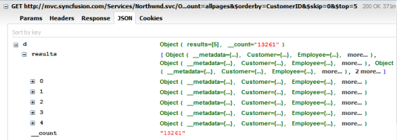

# Grouping

Grouping technique is also supported in the DataManager. When you want to analyse any particular record based on its category, simply you can group that column and analyze the records based on category. The following code example illustrates the grouping behavior in table.

@(Html.EJ().DataManager("FlatData").URL("http://mvc.syncfusion.com/Services/Northwnd.svc/Orders"))

@(Html.EJ().Grid<MVCdoc.OrdersView>("FlatGrid")

        .DataManagerID("FlatData")

        .Query("new ej.Query().page(1,5).group('CustomerID')")

        .Columns(col =>

        {

            col.Field("OrderID").HeaderText("Order ID").IsPrimaryKey(true).TextAlign(TextAlign.Right).Width(75).Add();

            col.Field("CustomerID").HeaderText("Customer ID").Width(80).Add();

            col.Field("EmployeeID").HeaderText("Employee ID").TextAlign(TextAlign.Right).Width(75).Add();

            col.Field("Freight").HeaderText("Freight").TextAlign(TextAlign.Right).Width(75).Format("{0:C}").Add();

            col.Field("ShipCity").HeaderText("Ship City").Width(110).Add();

        })

)


Result of the above code example is illustrated as follows.

