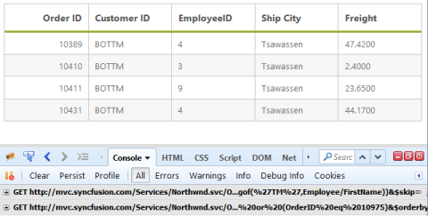

# Hierarchical Query

The DataManager contains support to manage the hierarchicalquery. The hierarchical queries are commonly required when you use foreign key binding. The hierarchical query can be provided by using the hierarchical function. This method accepts two parameters such as the query and the selector function. 

## foreignKey

The foreignkey method of ej.Query can be used to refer to another table fields. The foreignkey method accepts one parameter, the foreign key value. 

The following code example illustrates the hierarchical query and foreignkey method. 


@(Html.EJ().DataManager("FlatData").URL("http://mvc.syncfusion.com/Services/Northwnd.svc"))

@(Html.EJ().Grid<MVCdoc.OrdersView>("FlatGrid")

	.DataManagerID("FlatData")

	.Query("ej.Query().from('Orders').search('TM', ['CustomerID', 'Employee.FirstName']).page(1, 4).hierarchy(ej.Query().foreignKey('OrderID').from('Order_Details').sortBy('Quantity'),function () {return [10410, 10492, 10949, 10742, 10975]})")

	.Columns(col =>

	{

		col.Field("OrderID").HeaderText("Order ID").IsPrimaryKey(true).TextAlign(TextAlign.Right).Width(75).Add();

		col.Field("CustomerID").HeaderText("Customer ID").Width(80).Add();

		col.Field("EmployeeID").HeaderText("Employee ID").TextAlign(TextAlign.Right).Width(75).Add();

		col.Field("Freight").HeaderText("Freight").TextAlign(TextAlign.Right).Width(75).Format("{0:C}").Add();

		col.Field("ShipCity").HeaderText("Ship City").Width(110).Add();

	})

)



The result for the above code example is illustrated as follows.

Hierarchical Query and foreignkey method
{:.caption}

