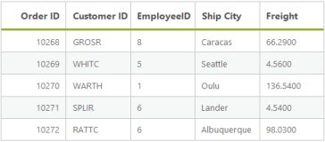
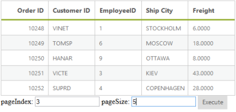
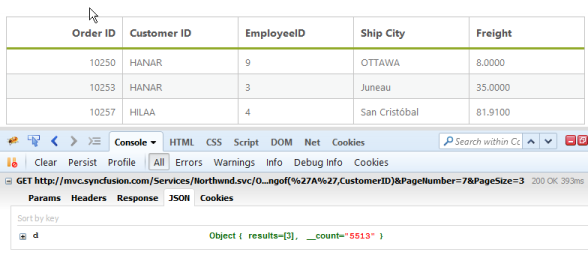
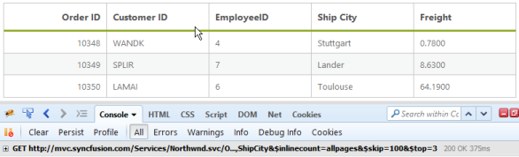
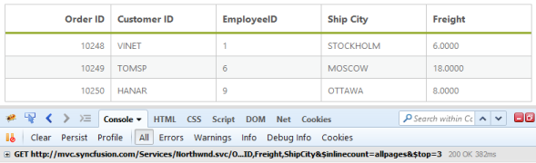
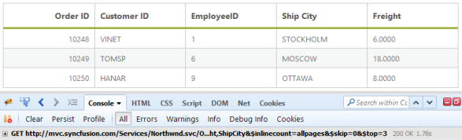
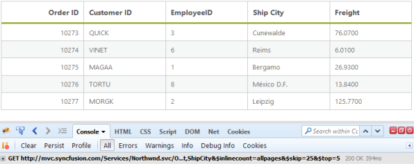

# Paging

Paging is a very important query in the DataManager used to display only some records from the large data source. Here, you can learn the paging query in detail.

## Default

The paging index and the paging size parameters of the paging query determine the number of records to be retrieved from the data source of the DataManager.

Refer to the following code example for the paging options.

@(Html.EJ().DataManager("FlatData").URL("http://mvc.syncfusion.com/Services/Northwnd.svc/Orders"))

@(Html.EJ().Grid<MVCdoc.OrdersView>("FlatGrid")

        .DataManagerID("FlatData")

        .Query("new ej.Query().page(5,5)")

        .Columns(col =>

        {

            col.Field("OrderID").HeaderText("Order ID").IsPrimaryKey(true).TextAlign(TextAlign.Right).Width(75).Add();

            col.Field("CustomerID").HeaderText("Customer ID").Width(80).Add();

            col.Field("EmployeeID").HeaderText("Employee ID").TextAlign(TextAlign.Right).Width(75).Add();

            col.Field("Freight").HeaderText("Freight").TextAlign(TextAlign.Right).Width(75).Format("{0:C}").Add();

            col.Field("ShipCity").HeaderText("Ship City").Width(110).Add();

        })

)


Result for the above code example is illustrated as follows.

## Dynamic Paging

The paging operation can be dynamically performed by using the DataManager. With the help of an external button click event, the required page records can be obtained and processed accordingly. The following code example illustrates the dynamic paging.

@Html.EJ().DataManager("FlatData").URL("http://mvc.syncfusion.com/Services/Northwnd.svc/Orders/").CrossDomain(true))

@(Html.EJ().Grid<MVCdoc.OrdersView>("FlatGrid")

        .DataManagerID("FlatData")

        .Query("new ej.Query().select(['OrderID', 'CustomerID', 'EmployeeID', 'ShipCity', 'Freight']).page(1,3)")

        .Columns(col =>

        {

            col.Field("OrderID").HeaderText("Order ID").IsPrimaryKey(true).TextAlign(TextAlign.Right).Width(75).Add();

            col.Field("CustomerID").HeaderText("Customer ID").Width(80).Add();

            col.Field("EmployeeID").HeaderText("Employee ID").TextAlign(TextAlign.Right).Width(75).Add();

            col.Field("Freight").HeaderText("Freight").TextAlign(TextAlign.Right).Width(75).Format("{0:C}").Add();

            col.Field("ShipCity").HeaderText("Ship City").Width(110).Add();

        }))

pageIndex: <input id="pageindx" type="text" placeholder="pageindex" />

pageSize:  <input id="pagesize" type="text" placeholder="pagesize" />

@Html.EJ().Button("submit").Text("Execute").ClientSideEvents(e => { e.Click("onClick"); })






Result of above code example is illustrated as follows.

## Custom paging

In this section, you can learn how to use the customized paging. The following code example illustrates the custom paging.

@(Html.EJ().DataManager("FlatData").URL("http://mvc.syncfusion.com/Services/Northwnd.svc/Orders"))

@(Html.EJ().Grid<MVCdoc.OrdersView>("FlatGrid")

        .DataManagerID("FlatData")

        .Query("new ej.Query().select('OrderID', 'CustomerID', 'EmployeeID', 'Freight', 'ShipCity').addParams('PageNumber',7).addParams('PageSize',3).where('CustomerID', 'contains', 'A', false)")

        .Columns(col =>

        {

            col.Field("OrderID").HeaderText("Order ID").IsPrimaryKey(true).TextAlign(TextAlign.Right).Width(75).Add();

            col.Field("CustomerID").HeaderText("Customer ID").Width(80).Add();

            col.Field("EmployeeID").HeaderText("Employee ID").TextAlign(TextAlign.Right).Width(75).Add();

            col.Field("Freight").HeaderText("Freight").TextAlign(TextAlign.Right).Width(75).Format("{0:C}").Add();

            col.Field("ShipCity").HeaderText("Ship City").Width(110).Add();

        })

)



Result of above code example is illustrated as follows.

## Skip

The skip query is used to skip some number of records.

@(Html.EJ().DataManager("FlatData").URL("http://mvc.syncfusion.com/Services/Northwnd.svc/Orders"))

@(Html.EJ().Grid<MVCdoc.OrdersView>("FlatGrid")

        .DataManagerID("FlatData")

        .Query("new ej.Query().select('OrderID', 'CustomerID', 'EmployeeID', 'Freight', 'ShipCity').skip(100).take(5)")

        .Columns(col =>

        {

            col.Field("OrderID").HeaderText("Order ID").IsPrimaryKey(true).TextAlign(TextAlign.Right).Width(75).Add();

            col.Field("CustomerID").HeaderText("Customer ID").Width(80).Add();

            col.Field("EmployeeID").HeaderText("Employee ID").TextAlign(TextAlign.Right).Width(75).Add();

            col.Field("Freight").HeaderText("Freight").TextAlign(TextAlign.Right).Width(75).Format("{0:C}").Add();

            col.Field("ShipCity").HeaderText("Ship City").Width(110).Add();

        })

)


Result of the above code example is illustrated as follows.

## Take

The take query is used to get some number of records from the data source of the DataManager.

@(Html.EJ().DataManager("FlatData").URL("http://mvc.syncfusion.com/Services/Northwnd.svc/Orders"))

@(Html.EJ().Grid<MVCdoc.OrdersView>("FlatGrid")

        .DataManagerID("FlatData")

        .Query("new ej.Query().select('OrderID', 'CustomerID', 'EmployeeID', 'Freight', 'ShipCity').take(3)")

        .Columns(col =>

        {

            col.Field("OrderID").HeaderText("Order ID").IsPrimaryKey(true).TextAlign(TextAlign.Right).Width(75).Add();

            col.Field("CustomerID").HeaderText("Customer ID").Width(80).Add();

            col.Field("EmployeeID").HeaderText("Employee ID").TextAlign(TextAlign.Right).Width(75).Add();

            col.Field("Freight").HeaderText("Freight").TextAlign(TextAlign.Right).Width(75).Format("{0:C}").Add();

            col.Field("ShipCity").HeaderText("Ship City").Width(110).Add();

        })

)



Result of the above code example is illustrated as follows.

## RequiresCount

The requiresCount query is used to get the count of the total number of records in the data source of the DataManager.


@(Html.EJ().DataManager("FlatData").URL("http://mvc.syncfusion.com/Services/Northwnd.svc/Orders"))

@(Html.EJ().Grid<MVCdoc.OrdersView>("FlatGrid")

        .DataManagerID("FlatData")

        .Query("new ej.Query().select('OrderID', 'CustomerID', 'EmployeeID', 'Freight', 'ShipCity').page(1,3).requiresCount()")

        .Columns(col =>

        {

            col.Field("OrderID").HeaderText("Order ID").IsPrimaryKey(true).TextAlign(TextAlign.Right).Width(75).Add();

            col.Field("CustomerID").HeaderText("Customer ID").Width(80).Add();

            col.Field("EmployeeID").HeaderText("Employee ID").TextAlign(TextAlign.Right).Width(75).Add();

            col.Field("Freight").HeaderText("Freight").TextAlign(TextAlign.Right).Width(75).Format("{0:C}").Add();

            col.Field("ShipCity").HeaderText("Ship City").Width(110).Add();

        })

)



Result of the above code example is illustrated as follows.

## Range

The range query is used to get some particular range of records from the data source of the DataManager.

@(Html.EJ().DataManager("FlatData").URL("http://mvc.syncfusion.com/Services/Northwnd.svc/Orders"))

@(Html.EJ().Grid<MVCdoc.OrdersView>("FlatGrid")

        .DataManagerID("FlatData")

        .Query("new ej.Query().select('OrderID', 'CustomerID', 'EmployeeID', 'Freight', 'ShipCity').range(25,30)")

        .Columns(col =>

        {

            col.Field("OrderID").HeaderText("Order ID").IsPrimaryKey(true).TextAlign(TextAlign.Right).Width(75).Add();

            col.Field("CustomerID").HeaderText("Customer ID").Width(80).Add();

            col.Field("EmployeeID").HeaderText("Employee ID").TextAlign(TextAlign.Right).Width(75).Add();

            col.Field("Freight").HeaderText("Freight").TextAlign(TextAlign.Right).Width(75).Format("{0:C}").Add();

            col.Field("ShipCity").HeaderText("Ship City").Width(110).Add();

        })

)

Result of the above code example is illustrated as follows.

