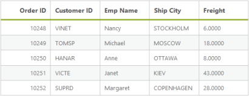

# Query

DataManager provides support for multiple queries in order to perform various operations like filtering, sorting, cloning, expanding, searching, grouping etc., in the data source. Here, you can learn the query options in detail.

## Select

The select query of the DataManager is used to select only some particular fields or columns from the data source. The following code example illustrates on how to select only particular fields by using the select query.



    @Html.EJ().DataManager("FlatData").URL("http://mvc.syncfusion.com/Services/Northwnd.svc/Orders/").Adaptor(AdaptorType.ODataAdaptor).CrossDomain(true)

    @(Html.EJ().Grid<MVCdoc.OrdersView>("FlatGrid")

        .DataManagerID("FlatData")

        .Query("new ej.Query().select(['OrderID', 'CustomerID', 'EmployeeID', 'ShipCity', 'Freight']).take(5)")
        .Columns(col =>
        {
            col.Field("OrderID").HeaderText("Order ID").IsPrimaryKey(true).TextAlign(TextAlign.Right).Width(75).Add();
            col.Field("CustomerID").HeaderText("Customer ID").Width(80).Add();
            col.Field("EmployeeID").HeaderText("Employee ID").TextAlign(TextAlign.Right).Width(75).Add();
            col.Field("Freight").HeaderText("Freight").TextAlign(TextAlign.Right).Width(75).Format("{0:C}").Add();
            col.Field("ShipCity").HeaderText("Ship City").Width(110).Add();
        })

    )



Result of the above code example is illustrated as follows.

Result of using “select”
{:.caption}

## From

The from query of the DataManager is used to select the table from where the data is retrieved and bound to the table. The following code example illustrates how to use the from query.



    @Html.EJ().DataManager("FlatData").URL("http://mvc.syncfusion.com/Services/Northwnd.svc/").Adaptor(AdaptorType.ODataAdaptor).CrossDomain(true)

    @(Html.EJ().Grid<MVCdoc.OrdersView>("FlatGrid")

        .DataManagerID("FlatData")
        .Query("new ej.Query().from('Orders').select(['OrderID', 'CustomerID', 'EmployeeID', 'ShipCity', 'Freight']).take(5)")
        .Columns(col =>
        {
            col.Field("OrderID").HeaderText("Order ID").IsPrimaryKey(true).TextAlign(TextAlign.Right).Width(75).Add();
            col.Field("CustomerID").HeaderText("Customer ID").Width(80).Add();
            col.Field("EmployeeID").HeaderText("Employee ID").TextAlign(TextAlign.Right).Width(75).Add();
            col.Field("Freight").HeaderText("Freight").TextAlign(TextAlign.Right).Width(75).Format("{0:C}").Add();
            col.Field("ShipCity").HeaderText("Ship City").Width(110).Add();
        })
    )



Result of the above code example is illustrated as follows.

Result of using “from”
{:.caption}

## Clone

The clone query of the DataManager is used to duplicate the query. The following code example illustrates how to clone a query.



    @Html.EJ().DataManager("FlatData").URL("http://mvc.syncfusion.com/Services/Northwnd.svc/").Adaptor(AdaptorType.ODataAdaptor).CrossDomain(true)

    @(Html.EJ().Grid<MVCdoc.OrdersView>("FlatGrid")

        .DataManagerID("FlatData")
        .Query("new ej.Query().from('Orders').select(['OrderID', 'CustomerID', 'EmployeeID', 'ShipCity', 'Freight']).take(15)")
        .ClientSideEvents(e => e.ActionComplete("onComplete"))
        .Columns(col =>
        {
            col.Field("OrderID").HeaderText("Order ID").IsPrimaryKey(true).TextAlign(TextAlign.Right).Width(75).Add();
            col.Field("CustomerID").HeaderText("Customer ID").Width(80).Add();
            col.Field("EmployeeID").HeaderText("Employee ID").TextAlign(TextAlign.Right).Width(75).Add();
            col.Field("Freight").HeaderText("Freight").TextAlign(TextAlign.Right).Width(75).Format("{0:C}").Add();
            col.Field("ShipCity").HeaderText("Ship City").Width(110).Add();
        })
    )

    



Result of the above code example is illustrated as follows.

Result of using “clone”
{:.caption}

## Expand

The expand query of the DataManager is used to perform complex data binding.



    @Html.EJ().DataManager("FlatData").URL("http://mvc.syncfusion.com/Services/Northwnd.svc/").Adaptor(AdaptorType.ODataAdaptor).CrossDomain(true)

    @(Html.EJ().Grid<MVCdoc.OrdersView>("FlatGrid")
            .DataManagerID("FlatData")
            .Query("new ej.Query().from('Orders').select(['OrderID', 'CustomerID', 'EmployeeID', 'ShipCity', 'Freight']).take(5).expand('Employee')")
            .Columns(col =>
            {
                col.Field("OrderID").HeaderText("Order ID").IsPrimaryKey(true).TextAlign(TextAlign.Right).Width(75).Add();
                col.Field("CustomerID").HeaderText("Customer ID").Width(80).Add();
                col.Field("Employee.FirstName").HeaderText("Employee Name").TextAlign(TextAlign.Right).Width(75).Add();
                col.Field("Freight").HeaderText("Freight").TextAlign(TextAlign.Right).Width(75).Format("{0:C}").Add();
                col.Field("ShipCity").HeaderText("Ship City").Width(110).Add();
            })

    )



Result of the above code example is illustrated as follows.

Result of using “expand”
{:.caption}
