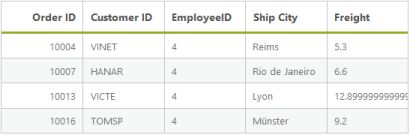

# Searching

Searching is a basic query technique in the Data Manager. It is used to filter the records from the entire data source based on the search key parameter.

@(Html.EJ().DataManager("FlatData").URL("http://mvc.syncfusion.com/UGService/api/Orders"))

@(Html.EJ().Grid<MVCdoc.OrdersView>("FlatGrid")

        .DataManagerID("FlatData")

        .Query("new ej.Query().search(4, 'EmployeeID').take(5)")

        .Columns(col =>

        {

            col.Field("OrderID").HeaderText("Order ID").IsPrimaryKey(true).TextAlign(TextAlign.Right).Width(75).Add();

            col.Field("CustomerID").HeaderText("Customer ID").Width(80).Add();

            col.Field("EmployeeID").HeaderText("Employee ID").TextAlign(TextAlign.Right).Width(75).Add();

            col.Field("Freight").HeaderText("Freight").TextAlign(TextAlign.Right).Width(75).Format("{0:C}").Add();

            col.Field("ShipCity").HeaderText("Ship City").Width(110).Add();

        })	

)



Result of above code example is illustrated as follows.

