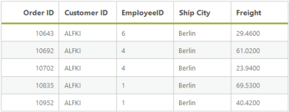
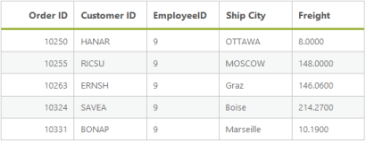
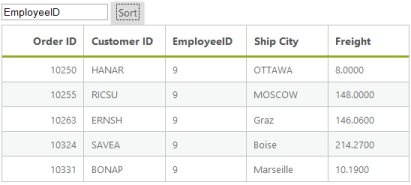
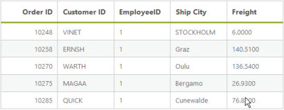

## Sorting

Default 

Sorting is basic query in the DataManager. It enables you to view the items or records in ascending or descending order based on a particular field and sorting direction. The query parameter of the DataManager enables you to retrieve the data in the sorted fashion and thus utilizing the resultant data obtained.

@(Html.EJ().DataManager("FlatData").URL("http://mvc.syncfusion.com/UGService/api/Orders"))

@(Html.EJ().Grid<MVCdoc.OrdersView>("FlatGrid")

        .DataManagerID("FlatData")

        .Query("new ej.Query().sortBy('CustomerID', ej.sortOrder.Ascending, false).take(5)")

        .Columns(col =>

        {

            col.Field("OrderID").HeaderText("Order ID").IsPrimaryKey(true).TextAlign(TextAlign.Right).Width(75).Add();

            col.Field("CustomerID").HeaderText("Customer ID").Width(80).Add();

            col.Field("EmployeeID").HeaderText("Employee ID").TextAlign(TextAlign.Right).Width(75).Add();

            col.Field("Freight").HeaderText("Freight").TextAlign(TextAlign.Right).Width(75).Format("{0:C}").Add();

            col.Field("ShipCity").HeaderText("Ship City").Width(110).Add();

        })

)

Result of the above code example is illustrated as follows.

{{ '' | markdownify }}
{:.image }

SortByDesc

The sortByDesc query of the DataManager is used to sort the specified field in descending order, by default. You can use the following code example for sortByDesc query.

@(Html.EJ().DataManager("FlatData").URL("http://mvc.syncfusion.com/UGService/api/Orders"))

@(Html.EJ().Grid<MVCdoc.OrdersView>("FlatGrid")

        .DataManagerID("FlatData")

        .Query("new ej.Query().sortByDesc('EmployeeID').take(5)")

        .Columns(col =>

        {

            col.Field("OrderID").HeaderText("Order ID").IsPrimaryKey(true).TextAlign(TextAlign.Right).Width(75).Add();

            col.Field("CustomerID").HeaderText("Customer ID").Width(80).Add();

            col.Field("EmployeeID").HeaderText("Employee ID").TextAlign(TextAlign.Right).Width(75).Add();

            col.Field("Freight").HeaderText("Freight").TextAlign(TextAlign.Right).Width(75).Format("{0:C}").Add();

            col.Field("ShipCity").HeaderText("Ship City").Width(110).Add();

        })	

)

Result of the above code example is illustrated as follows.

{{ '' | markdownify }}
{:.image }

Dynamic sorting

The table can be dynamically sorted by using an external button click event. The value of the column to be sorted can be obtained by the sortBy query and thus the sorted data is retrieved and bounded to the table. The following code example illustrates you to dynamically sort the data source.

@(Html.EJ().DataManager("FlatData").URL("http://mvc.syncfusion.com/UGService/api/Orders"))

@(Html.EJ().Grid<MVCdoc.OrdersView>("FlatGrid")

        .DataManagerID("FlatData")

        .Query("new ej.Query().sortByDesc('EmployeeID').take(5)")

        .Columns(col =>

        {

            col.Field("OrderID").HeaderText("Order ID").IsPrimaryKey(true).TextAlign(TextAlign.Right).Width(75).Add();

            col.Field("CustomerID").HeaderText("Customer ID").Width(80).Add();

            col.Field("EmployeeID").HeaderText("Employee ID").TextAlign(TextAlign.Right).Width(75).Add();

            col.Field("Freight").HeaderText("Freight").TextAlign(TextAlign.Right).Width(75).Format("{0:C}").Add();

            col.Field("ShipCity").HeaderText("Ship City").Width(110).Add();

        })	

)

<input id="field" type="text" placeholder="fieldName" />

@Html.EJ().Button("submit").Text("Sort").ClientSideEvents(e => { e.Click("onClick"); })

Result of above code example is illustrated as follows.

{{ '' | markdownify }}
{:.image }

Multi sorting

Multi sorting is a special technique, where you can sort multiple fields by adding multiple sorting queries to the DataManager.

@(Html.EJ().DataManager("FlatData").URL("http://mvc.syncfusion.com/UGService/api/Orders"))

@(Html.EJ().Grid<MVCdoc.OrdersView>("FlatGrid")

        .DataManagerID("FlatData")

        .Query("new ej.Query().sortByDesc('CustomerID').sortBy('EmployeeID', 'ascending').take(5)")

        .Columns(col =>

        {

            col.Field("OrderID").HeaderText("Order ID").IsPrimaryKey(true).TextAlign(TextAlign.Right).Width(75).Add();

            col.Field("CustomerID").HeaderText("Customer ID").Width(80).Add();

            col.Field("EmployeeID").HeaderText("Employee ID").TextAlign(TextAlign.Right).Width(75).Add();

            col.Field("Freight").HeaderText("Freight").TextAlign(TextAlign.Right).Width(75).Format("{0:C}").Add();

            col.Field("ShipCity").HeaderText("Ship City").Width(110).Add();

        })	

)

Result of above code example is illustrated as follows.

{{ '' | markdownify }}
{:.image }

