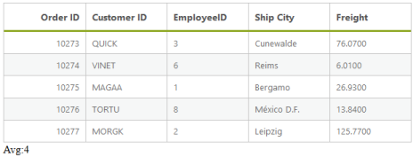
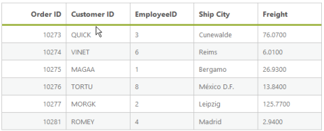

## Summary 

Summary is a key feature in the DataManager that helps to aggregate any data. DataManager provides several summary type by default, they are as follows.

* Sum
* Average 
* Minimum
* Maximum
* Distinct

The ej provides several data utilization methods to achieve summary. 

Sum

The Sum summary type provides the sum of the data. The Sum data utilization method accepts two parameters, they are JSON data and the fieldname where the sum is calculated. The following code example illustrates the Default Summary Types.

@(Html.EJ().DataManager("FlatData").URL("http://mvc.syncfusion.com/Services/Northwnd.svc/Orders"))

@(Html.EJ().Grid<MVCdoc.OrdersView>("FlatGrid")

        .DataManagerID("FlatData")

        .Query("new ej.Query().select('OrderID', 'CustomerID', 'EmployeeID', 'Freight', 'ShipCity').range(25,30)")

        .Columns(col =>

        {

            col.Field("OrderID").HeaderText("Order ID").IsPrimaryKey(true).TextAlign(TextAlign.Right).Width(75).Add();

            col.Field("CustomerID").HeaderText("Customer ID").Width(80).Add();

            col.Field("EmployeeID").HeaderText("Employee ID").TextAlign(TextAlign.Right).Width(75).Add();

            col.Field("Freight").HeaderText("Freight").TextAlign(TextAlign.Right).Width(75).Format("{0:C}").Add();

            col.Field("ShipCity").HeaderText("Ship City").Width(110).Add();

        })

)

    

The result of the above code example is illustrated as follows.

{{ '' | markdownify }}
{:.image }

Min

The Minimum of a particular field can be calculated by using the ej.min data utilization method and this method accepts the arguments such as JSON data/array, field name and the comparer used for the comparison. When the data to the min method is a JSON array, then the whole record is returned.

The minimum of particular field can be calculated as follows.

@(Html.EJ().DataManager("FlatData").URL("http://mvc.syncfusion.com/Services/Northwnd.svc/Orders"))

@(Html.EJ().Grid<MVCdoc.OrdersView>("FlatGrid")

        .DataManagerID("FlatData")

        .Query("new ej.Query().select('OrderID', 'CustomerID', 'EmployeeID', 'Freight', 'ShipCity').range(25,30)")

        .Columns(col =>

        {

            col.Field("OrderID").HeaderText("Order ID").IsPrimaryKey(true).TextAlign(TextAlign.Right).Width(75).Add();

            col.Field("CustomerID").HeaderText("Customer ID").Width(80).Add();

            col.Field("EmployeeID").HeaderText("Employee ID").TextAlign(TextAlign.Right).Width(75).Add();

            col.Field("Freight").HeaderText("Freight").TextAlign(TextAlign.Right).Width(75).Format("{0:C}").Add();

            col.Field("ShipCity").HeaderText("Ship City").Width(110).Add();

        })

)

    

The result of the above code example is illustrated as follows.

{{ '' | markdownify }}
{:.image }

Max

The Maximum of a particular field can be calculated by using the ej.max data utilization method and this method accepts the arguments such as JSON data/array, field name and the comparer used for the comparison. When the data to the max method is a JSON array, then the whole record is returned.

The maximum of particular field can be calculated as follows.

@(Html.EJ().DataManager("FlatData").URL("http://mvc.syncfusion.com/Services/Northwnd.svc/Orders"))

@(Html.EJ().Grid<MVCdoc.OrdersView>("FlatGrid")

        .DataManagerID("FlatData")

        .Query("new ej.Query().select('OrderID', 'CustomerID', 'EmployeeID', 'Freight', 'ShipCity').range(25,30)")

        .Columns(col =>

        {

            col.Field("OrderID").HeaderText("Order ID").IsPrimaryKey(true).TextAlign(TextAlign.Right).Width(75).Add();

            col.Field("CustomerID").HeaderText("Customer ID").Width(80).Add();

            col.Field("EmployeeID").HeaderText("Employee ID").TextAlign(TextAlign.Right).Width(75).Add();

            col.Field("Freight").HeaderText("Freight").TextAlign(TextAlign.Right).Width(75).Format("{0:C}").Add();

            col.Field("ShipCity").HeaderText("Ship City").Width(110).Add();

        })

)

    

The result for the above code example is illustrated as follows.

{{ '' | markdownify }}
{:.image }

Avg

The Average summary type provides the average of the given data. The Average data utilization method accepts two parameters, they are JSON/Array data and the fieldname where the sum is calculated. Use the following code example for calculating the average of the given JSON data.

@(Html.EJ().DataManager("FlatData").URL("http://mvc.syncfusion.com/Services/Northwnd.svc/Orders"))

@(Html.EJ().Grid<MVCdoc.OrdersView>("FlatGrid")

        .DataManagerID("FlatData")

        .Query("new ej.Query().select('OrderID', 'CustomerID', 'EmployeeID', 'Freight', 'ShipCity').range(25,30)")

        .Columns(col =>

        {

            col.Field("OrderID").HeaderText("Order ID").IsPrimaryKey(true).TextAlign(TextAlign.Right).Width(75).Add();

            col.Field("CustomerID").HeaderText("Customer ID").Width(80).Add();

            col.Field("EmployeeID").HeaderText("Employee ID").TextAlign(TextAlign.Right).Width(75).Add();

            col.Field("Freight").HeaderText("Freight").TextAlign(TextAlign.Right).Width(75).Format("{0:C}").Add();

            col.Field("ShipCity").HeaderText("Ship City").Width(110).Add();

        })

)

    

The result of the above code example is illustrated as follows.

{{ '' | markdownify }}
{:.image }
_Summary - Average_

Distinct

In a data, a field may contain many duplicate values; and sometimes you are required only to list the different (distinct) values. This can be achieved by using the ej.distinct method. This method accepts three parameters such as JSON/Array data, fieldname that you want to fetch as distinct and the third Boolean parameter set as true, returns the whole record when the data is a JSON array. 

The following code example illustrates how to use the ej.distinct method. In the following code, the third parameter of distinct method is set as true and hence it fetches the whole record from the provided data.

@(Html.EJ().DataManager("FlatData").URL("http://mvc.syncfusion.com/Services/Northwnd.svc/Orders"))

@(Html.EJ().Grid<MVCdoc.OrdersView>("FlatGrid")

        .DataManagerID("FlatData")

        .Query("new ej.Query().select('OrderID', 'CustomerID', 'EmployeeID', 'Freight', 'ShipCity').range(25,35)")

        .Columns(col =>

        {

            col.Field("OrderID").HeaderText("Order ID").IsPrimaryKey(true).TextAlign(TextAlign.Right).Width(75).Add();

            col.Field("CustomerID").HeaderText("Customer ID").Width(80).Add();

            col.Field("EmployeeID").HeaderText("Employee ID").TextAlign(TextAlign.Right).Width(75).Add();

            col.Field("Freight").HeaderText("Freight").TextAlign(TextAlign.Right).Width(75).Format("{0:C}").Add();

            col.Field("ShipCity").HeaderText("Ship City").Width(110).Add();

        })

)

    

The result for the above code example is illustrated as follows.

{{ '' | markdownify }}
{:.image }

