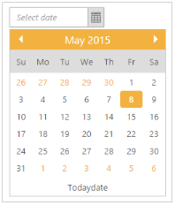
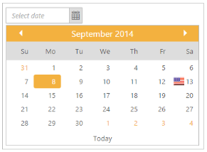
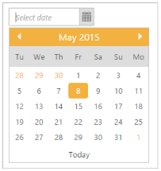
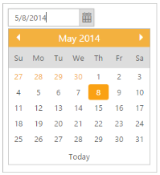
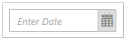

# Behavior Settings

## Button Text

Set the display text for the Button in the DatePicker popup. By default, ButtonText is set Today (String). Change this default value by using ButtonText property to change the ButtonText.

The following steps explains how to set the ButtonText for DatePicker widget.

1. In the CSHTML page, add the following code to render the DatePicker widget.



@*Add the following code example to the corresponding CSHTML page to render DatePicker widget with customized ButtonText*@

@Html.EJ().DatePicker("datepicker").ButtonText("Todaydate")



2. The following screenshot displays the output for the above code.

## Display Default Date

You can allow or not allow to display default date value in input textbox. By default “DisplayDefaultDate” property is set to ‘true’ in DatePicker widget. You can not allow to display default date value in input textbox of DatePicker widget by setting “DisplayDefaultDate” property as ‘false’.

The following steps explain DisplayDefaultDate in DatePicker widget.

1. In the CSHTML page, add the following code to render the DatePicker widget with out default date.



@*Add the following code example to the corresponding CSHTML page to render DatePicker widget without default date*@

@Html.EJ().DatePicker("datepicker").DisplayDefaultDate(false).Value("5/8/2014")



## Enabled

You can Enable or Disable the DatePicker widget. By default “Enabled” property is set to ‘true’ in DatePicker widget. You can disable the DatePicker widget by setting “Enabled” property as ‘false’.

The following steps explain you how to disable the DatePicker widget.

1. In the CSHTML page, add the following code to disable the DatePicker widget.



@*Add the following code example to the corresponding CSHTML page to disable DatePicker widget*@

@Html.EJ().DatePicker("datepicker").Enabled(false)


## Enable strict mode

When EnableStrictMode is set to ‘false’, DatePicker doesn’t allow the value out of the range, it is internally changed to the correct value. By default “EnableStrictMode” property is set as ‘false’ in DatePicker.

The following steps explain you how to enable the “EnableStrictMode” for DatePicker widget.

1. In the CSHTML page, add the following code to render the DatePicker widget with EnableStrictMode.



@*Add the following code example to the corresponding CSHTML page to render DatePicker widget with customized EnableStrictMode*@

@Html.EJ().DatePicker("datepicker").EnableStrictMode(true)



## Fields

You can specify the fieldsmapping in DatePicker. You can also provide the support to add image, image styles, sprite css class, query, and HTML attributes.

The DatePicker widget provides support to customize the particular date. i.e. you can customize the date with image and tooltip options. The following table specifies the special date fields and its configuration.

_Table_ _1_: MVC table_

<table>
<tr>
<th>
Name</th><th>
Description</th><th>
Default value</th><th>
Data type</th></tr>
<tr>
<td>
Date</td><td>
The date that needs to be customized. </td><td>
Null </td><td>
String </td></tr>
<tr>
<td>
Tooltip</td><td>
Shows the tooltip to mention date while mouse hovering </td><td>
Null </td><td>
String </td></tr>
<tr>
<td>
Icon </td><td>

{:.image }
You can set the customized css with this property. {{     '_Note: You need to set the image as background url and its styles within this class_ '| markdownify }}</td><td>
Null </td><td>
String</td></tr>
</table>

The following steps explain you how to specify the fieldsmapping in DatePicker widget.

1. In the CSHTML page, add the following code to render the DatePicker widget with fields mapping.


@*Add the following code example to the corresponding CSHTML page to render DatePicker widget with customized fields mapping*@

@Html.EJ().DatePicker("datePicker").SpecialDates(p =>

       {

           p.Add().Date("9/13/2014").Tooltip("America").Icon("flag");

       })



2. Add the following styles to specify the fields mapping in DatePicker widget.

_Note: Images for this example are available in ‘installed location /Content/images’ and you need to define images in mentioned CSS. Henceforth the images are displayed._





3. The following screenshot displays the output for the above code.

### Define start day of the week

It specifies the StartDay of the week in DatePicker calendar. By default “Value” is set to 0 (Sunday). 

The following steps explain you how to specify the StartDay of the week in DatePicker widget.

1. In the CSHTML page, add the following code to render the DatePicker widget with StartDay (Tuesday)



@*Add the following code example to the corresponding CSHTML page to specify the start day of the week in DatePicker widget*@

@Html.EJ().DatePicker("datePicker").StartDay(2)



2. The following screenshot displays the output for the above code.

## Step months

It specifies the number of months to navigate at one click in next and previous button that is achieved by “StepMonths” property. You can change the StepMonths by changing the default value using “StepMonths” property. 

The following steps explain you how to specify the number of months to navigate at one click.

1. In the CSHTML page, add the following code to render the DatePicker widget with stepMonths.



@*Add the following code example to the corresponding CSHTML page to specify the number of months to navigate at one click in DatePicker widget*@

@Html.EJ().DatePicker("datePicker").StepMonths(2)



## Define value

It specifies the selected date value. You can specify the selected date value by using “Value” property.

The following steps explain you how to specify the selected value.

1. In the CSHTML page, add the following code to render the DatePicker widget with selected value.


@*Add the following code example to the corresponding CSHTML page to specify selected value in DatePicker widget*@

@Html.EJ().DatePicker("datePicker").Value("5/8/2014")



2.  The following screenshot displays the output for the above code.

### Watermark Text

It specifies the WatermarkText to display the input text in DatePicker. By default “WatermarkText” property is set as “select date” in DatePicker. 

The following steps explain you how to specify the WatermarkText in DatePicker widget.

1. In the CSHTML page, add the following code to render the DatePicker widget with watermark text.


@*Add the following code example to the corresponding CSHTML page to specify Watermark Text in DatePicker widget*@

@Html.EJ().DatePicker("datePicker").WatermarkText("Enter Date")



2. The following screenshot displays the output for the above code.

