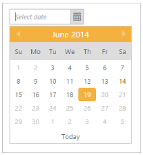

# Date Range

Date Range from minimum to maximum value is set for DatePicker widget using “MinDate” and “MaxDate” properties respectively. This allows you to restrict the date selection between the MinDate and MaxDate. This disables the dates below the MinDate and dates above the MaxDate.

The following steps explain you how to get the Date Range of DatePicker widget.

1. In the CSHTML page, add the following code to render the DatePicker widget with date range.

   ~~~ cshtml

	@*Add the following code example to the corresponding CSHTML page to render DatePicker widget with date range*@

	@Html.EJ().DatePicker("datePicker").MinDate("2014/06/03").MaxDate("2014/06/19")

   ~~~

2.  The following screenshot displays the output for the above code.

Date Range in DatePicker
{:.caption}