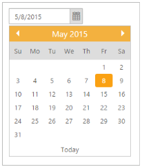

## Dates in Other Month

Dates from the previous and next month are showed in DatePicker calendar. 

You can set the other month date in DatePicker by using “ShowOtherMonths” property. By default ShowOtherMonths (Boolean) is set to ‘true’ that enables the other month date.

The Current month date alone is displayed by setting Boolean as ‘false’.

The following steps explain you how to get the current month date alone.

1. In the CSHTML page, add the following code to render the DatePicker widget.

[CSHTML]

@*Add the following code example to the corresponding CSHTML page to render DatePicker widget with current month date alone*@

@Html.EJ().DatePicker("datePicker").ShowOtherMonths(false)

2.  The following screenshot displays the output for the above code.

{  | markdownify }
{:.image }

