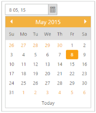
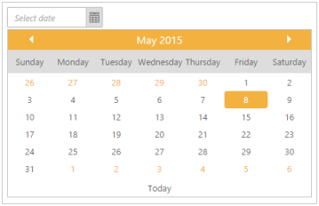
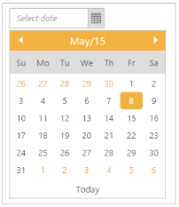

# Display Format

## Date Format

DateFormat defines a format or structure of the displayed date in the textbox. You can change the Date Format by using “DateFormat” property.

The standard formats are listed as follows,

_Date format_

<table>
<tr>
<th>
Format Name</th><th>
   Formats</th></tr>
<tr>
<td>
Default</td><td>
MM/dd/yyyy</td></tr>
<tr>
<td>
Short</td><td>
 d M, y</td></tr>
<tr>
<td>
Medium</td><td>
d MM, y</td></tr>
<tr>
<td>
Full</td><td>
dddd,MMMM,yy</td></tr>
<tr>
<td>
UTC</td><td>
yyyy-MM-dd</td></tr>
</table>

You can display the date value depending on culture using above specified DateFormat.

The following steps explain you how to set the date format as "d MM, y".

1. In the CSHTML page, add the following code to render the DatePicker widget with DateFormat.

   ~~~ cshtml

	@*Add the following code example to the corresponding CSHTML page to get the date format as "d MM, y" in DatePicker widget*@

	@Html.EJ().DatePicker("datePicker").DateFormat("d MM, y")

   ~~~
   

2.  The following screenshot displays the output for the above code.

DateFormat in DatePicker 
{:.caption}

## Day header format

It specifies the header format of days in short, long or min types. You can set the DatePickerdayheader format by using “DayHeaderFormat” property. By default “DayHeaderFormat” property is set as “ShowHeaderMin” in DatePicker widget. 

Enum for DatePicker startLevel and depthLevel

<table>
<tr>
<th>
Day header</th><th>
Description</th></tr>
<tr>
<td>
ShowHeaderShort</td><td>
It shows the day header format in short</td></tr>
<tr>
<td>
ShowHeaderMin</td><td>
It shows the header format in min</td></tr>
<tr>
<td>
ShowHeaderLong</td><td>
It shows the day header format in long</td></tr>
<tr>
<td>
ShowHeaderNone</td><td>
Removes the day header</td></tr>
</table>

The following steps explain you how to get the DayHeaderFormat for DatePicker widget.

1. In the CSHTML page, add the following code to render the DatePicker widget with DayHeaderFormat.

   ~~~ cshtml
   
	@*Add the following code example to the corresponding CSHTML page to render DatePicker widget with customized DayHeaderFormat.*@

	@Html.EJ().DatePicker("datePicker").DayHeaderFormat(Header.ShowHeaderLong)

   ~~~
  

2.  The following screenshot displays the output for the above code.

Header Format in DatePicker
{:.caption}

## Header format

It specifies the Header format to be displayed in the pop up of DatePicker. The header in the DatePicker popup is displayed in the specified format. By default “DayHeaderFormat” property is set as “MMMM yyyy” in DatePicker widget. 

The following steps explain you how to the header format to be displayed in the pop up of DatePicker.

1. In the CSHTML page, add the following code to render the DatePicker widget with header format.

   ~~~ cshtml
   
	@*Add the following code example to the corresponding CSHTML page to render DatePicker widget with customized header format*@

	@Html.EJ().DatePicker("datePicker").HeaderFormat("MMMM/yy")

   ~~~
  

2. The following screenshot displays the output for the above code.

Header Format in DatePicker
{:.caption}