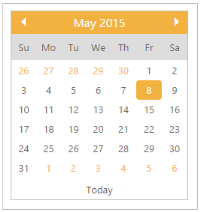

## Display Inline

DisplayInline allows you to make DatePicker widget similar to a Calendar date. Also associate DatePicker with 
 element instead of input. Default value for DisplayInline property is set as ‘false’ 

The following steps explain you how to get the Calendar control using DatePicker.

1. In the CSHTML page, add the following code to render the DatePicker widget with display inline.

[CSHTML]

@*Add the following code example to the corresponding CSHTML page to get the Calendar control using DatePicker*@

@Html.EJ().DatePicker("datePicker").TagName("div").DisplayInline(true)

2. The following screenshot displays the output for the above code.

{{ '' | markdownify }}
{:.image }

