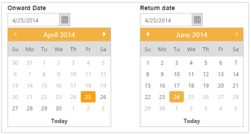
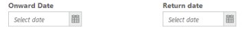
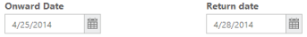

# Getting Started

This section explains briefly about how to create a DatePicker in your application with ASP.NET MVC.

## Create your first DatePicker in MVC

The ASP.NET MVC DatePicker provides support to display the calendar within your web page and allows you to pick date from the calendar. In this example, you will learn how to customize two date pickers for a real time ticket booking application. This example shows how to use the DatePicker control to book a ticket within a limited number of days. 

The following screenshot illustrates the functionality of a date picker with date range of maximum 60 days. You can select a date for Onward and Return journeys ranging for a period of 60 days from the current day. This avoids selecting a journey date prior to the current date.

{  | markdownify }
{:.image }

Create a DatePicker 

ASP.NET MVC DatePicker widget basically renders with built-in features such as keyboard navigation, other months navigation with animations and flexible API’s. You can easily create the DatePicker widget by using simple input textbox element as follows.

1. You can create a MVC Project and add necessary Dlls and scripts. Refer [MVC-Getting Started](http://help.syncfusion.com/ug/js/Documents/gettingstartedwithmv.htm).
2. Add the following code to the corresponding view page for DatePicker rendering.

&lt;table&gt;

    &lt;tr&gt;

        <td class="tdclass">Onward Date</td>

        <td class="tdclass">Return date</td>

    &lt;/tr&gt;

    &lt;tr&gt;

        &lt;td class="tdclass"&gt;

            &lt;span class="innerdp"&gt;

                @Html.EJ().DatePicker("startDate")

            &lt;/span&gt;

        &lt;/td&gt;

        &lt;td class="tdclass"&gt;

            &lt;span class="innerdp"&gt;

                @Html.EJ().DatePicker("endDate")

            &lt;/span&gt;

        &lt;/td&gt;

    &lt;/tr&gt;

&lt;/table&gt;

3. Apply the given styles to show the DatePicker in the Horizontal order.

&lt;style type="text/css" class="cssStyles"&gt;

    .tdclass {

        width: 300px;

        font-weight: bold;

    }

    .innerdp {

        display: inline-block;

    }

&lt;/style&gt;

By executing the above code samples, you can create two DatePicker widgets in a page as shown as follows.

{  | markdownify }
{:.image }

Set the Min and Max Date

In the real time ticket booking scenario, the booking is open for limited number of days. You have to, select a date from the given range. This can be achieved by using the properties “MinDate” and “MaxDate”. In this way, only those dates ranging between the “MinDate” and “MaxDate” are enabled in the DatePicker.

  &lt;table&gt;

      &lt;tr&gt;

         <td class="tdclass">Onward Date</td>

         <td class="tdclass">Return date</td>

      &lt;/tr&gt;

      &lt;tr&gt;

         &lt;td class="tdclass"&gt;

             &lt;span class="innerdp"&gt;

                     @Html.EJ().DatePicker("startDate").Value("04/25/2014").MinDate("04/25/2014").MaxDate("06/24/2014")

             &lt;/span&gt;

         &lt;/td&gt;

         &lt;td class="tdclass"&gt;

             &lt;span class="innerdp"&gt;

                 @Html.EJ().DatePicker("endDate").Value("04/25/2014").MinDate("04/25/2014").MaxDate("06/24/2014")

     &lt;/span&gt;

         &lt;/td&gt;

       &lt;/tr&gt;

  &lt;/table&gt;

The following screenshot shows the output of the above code example.

{  | markdownify }
{:.image }

Set Event to Process the Min and Max Date Validations

You can select the “onward journey date” in the first DatePicker and then the “Return journey date” in the second DatePicker. This validation process is done after the selection of “onward journey date” and the changes are reflected in the Return Date selection DatePicker. You can manipulate this process on the “Select” Event of Onward Date Selection DatePicker.

&lt;table&gt;

    &lt;tr&gt;

        <td class="tdclass">Onward Date</td>

        <td class="tdclass">Return date</td>

    &lt;/tr&gt;

    &lt;tr&gt;

        &lt;td class="tdclass"&gt;

            &lt;span class="innerdp"&gt;                @Html.EJ().DatePicker("startDate").Value("04/25/2014").MinDate("04/25/2014").MaxDate("06/24/2014").ClientSideEvents(sd => sd.Select("selectedStartDate"))

            &lt;/span&gt;

        &lt;/td&gt;

        &lt;td class="tdclass"&gt;

            &lt;span class="innerdp"&gt;                @Html.EJ().DatePicker("endDate").Value("04/25/2014").MinDate("04/25/2014").MaxDate("06/24/2014").ClientSideEvents(ed => ed.Select("selectedEndDate"))

            &lt;/span&gt;

        &lt;/td&gt;

    &lt;/tr&gt;

&lt;/table&gt;

&lt;script type="text/javascript"&gt;

    function selectedStartDate(sender) {

        var selDate = new Date(sender.value); // mentions the selected date.

        minDatepicker = $("#endDate").data("ejDatePicker");// creating DatePicker object

        minDatepicker.setModel({ "minDate": selDate });// setting minDate property through setModel of DatePicker object.

    }

    function selectedEndDate(sender) {

        var selDate = new Date(sender.value);

        maxDatepicker = $("#startDate").data("ejDatePicker");// creating DatePicker object

        maxDatepicker.setModel({ "maxDate": selDate });// setting maxDate property through setModel of DatePicker object.

    }

&lt;/script&gt;

You can execute the above code and achieve the desired result. By selecting the onward journey date in the first DatePicker, you can select the Return Journey date within the given range. This restricts you from selecting the false date.

This scenario is illustrated in the following screenshot.

{  | markdownify }
{:.image }

{  | markdownify }
{:.image }
By using the min/max date range property, you can select a date within a given range as follows. 

You can add additional functionalities like localization and date formats to the DatePicker.

