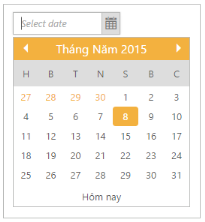

## Localization

Localization is language support based on the culture in DatePicker. You can achieve the Localization using “Locale” property in DatePicker.

In order to enable [localization](http://help.syncfusion.com/ug/js/default.htm) refer the following scripts: globalize.cultures.js and globalize.js. The “globalize.cultures.js” includes different language support for ASP.NET MVC controls and the “globalize.js” is a simple JavaScript library that allows you to format and dates based on the specified culture.

You can refer the following online link reference for globalize.js

[http://ajax.aspnetcdn.com/ajax/globalize/0.1.1/globalize.min.js](http://ajax.aspnetcdn.com/ajax/globalize/0.1.1/globalize.min.js)

You can refer the following online link reference for globalize.culture.js

[http://ajax.aspnetcdn.com/ajax/globalize/0.1.1/cultures/globalize.cultures.js](http://ajax.aspnetcdn.com/ajax/globalize/0.1.1/cultures/globalize.cultures.js)

You can dynamically change the language based on their culture.

The following steps explain you how to get the Localization.

1. In the CSHTML page, add the following code to render the DatePicker widget with localization.

[CSHTML]

@*Add the following code example to the corresponding CSHTML page to render DatePicker widget with customized localization*@

@Html.EJ().DatePicker("datePicker").Locale("vi-VN").ButtonText("Hôm nay")

2.  The following screenshot displays the output for the above code.

{  | markdownify }
{:.image }

