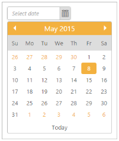
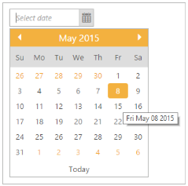

# Miscellaneous

## Define height

It specifies the height of the DatePicker input text. The “Height” property allows you to set the maximum height of the DatePicker. The value set to this property should be string or Numer type.

The following steps explain you how to specify the height of the DatePicker input text.

1. In the CSHTML page, add the following code to render the DatePicker widget.


@*Add the following code example to the corresponding CSHTML page to render DatePicker widget with customized height*@

@Html.EJ().DatePicker("datepicker").Height("22")



## Define width

It specifies the width of the DatePicker input text. The “Width” property allows you to set the maximum width of DatePicker. The value set to this property should be string or Numer type

The following steps explain you how to specify the width of the DatePicker input text.

1. In the CSHTML page, add the following code to render the DatePicker widget.


@*Add the following code example to the corresponding CSHTML page to render DatePicker widget with customized width*@

@Html.EJ().DatePicker("datepicker").Width("200")



## Highlight Section

Highlight section highlights the current month, current week, current workdays. You can highlight a week, month, and work days by using “HighlightSection” property.

_Table_ _6__: Highlight Selection_

<table>
<tr>
<th>
Name </th><th>
Description</th></tr>
<tr>
<td>
Month</td><td>
Highlight the Current Month.</td></tr>
<tr>
<td>
Week</td><td>
Highlight the Current Week.</td></tr>
<tr>
<td>
WorkDays</td><td>
Highlight the Current Workdays</td></tr>
<tr>
<td>
None</td><td>
Don’t Highlight Anything</td></tr>
</table>

The following steps explain you how to highlight the current week section.

1. In the CSHTML page, add the following code to render the DatePicker widget.



@*Add the following code example to the corresponding CSHTML page to render DatePicker widget with customized highlight section*@

@Html.EJ().DatePicker("datepicker").HighlightSection(Section.Week)



2. The following screenshot displays the output for the above code.   

## ReadOnly

Readonly property indicates that the DatePicker value can only be read. You can’t edit the value in DatePicker and also the DatePicker calendar popup is not shown. By default “ReadOnly” Boolean value is set to ‘false’.

The following steps explain you how to set the DatePicker value as readonly.

1. In the CSHTML page, add the following code to render the DatePicker widget.


@*Add the following code example to the corresponding CSHTML page to render DatePicker widget with customized Readonly*@

@Html.EJ().DatePicker("datepicker").ReadOnly(true)


## Show Footer

It allows to Show Footer in DatePicker calendar to select today date. By default “ShowFooter” property is set as ‘true’ in DatePicker widget. You can hide footer in the DatePicker when this property is set to “false”.

The following steps explain you how to hide footer in the DatePicker widget.

1. In the CSHTML page, add the following code to render the DatePicker widget.



@*Add the following code example to the corresponding CSHTML page to hide footer in DatePicker widget*@

@Html.EJ().DatePicker("datepicker").ShowFooter(false)


## Show popup button

It shows the date icon button at right side of textbox and shows DatePicker popup on clicking it that can be achieved by using “ShowPopupButton “property. By default “ShowPopupButton” property is set as “true” in DatePicker widget. 

The following steps explain you how to hide the popupbutton in the DatePicker widget.

1. In the CSHTML page, add the following code to render the DatePicker widget.



@*Add the following code example to the corresponding CSHTML page to hide popupbutton in DatePicker widget*@

@Html.EJ().DatePicker("datepicker").ShowPopupButton(false)



2. The following screenshot displays the output for the above code.

## Show rounded corner

DatePicker input is displayed in rounded corner style, when this property is set to ‘true’. By default “ShowRoundedCorner” property is set as “false” in DatePicker widget.

The following steps explain you how to show Roundedcorner in the DatePicker.

1. In the CSHTML page, add the following code to render the DatePicker widget.



@*Add the following code example to the corresponding CSHTML page to render DatePicker widget with customized rounder corner*@

@Html.EJ().DatePicker("datepicker").ShowRoundedCorner(true)


2.  The following screenshot displays the output for the above code.

## Show ToolTip

DatePickerTooltip is displayed while you hover the date. By default “ShowTooltip” property as “true” in DatePicker widget.

The following steps explain you how to hide the ToolTip in the DatePicker.

1. In the CSHTML page, add the following code to render the DatePicker widget.

{ % highlight html %}

@*Add the following code example to the corresponding CSHTML page to render DatePicker widget with customized tooltip*@

@Html.EJ().DatePicker("datepicker").ShowTooltip(true)



2. The following screenshot displays the output for the above code.

