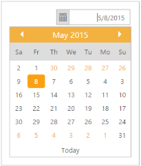

## RTL Support

Right-to-left starts from the right of the page and continues to the left. By default, this option is set to “false” in the DatePicker widget. 

The EnableRTL option allows the DatePicker widget to display it in the right to left direction.

The following steps explain you how to enable the EnableRTL property of the DatePicker widget.

1. In the CSHTML page, add the following code to render the DatePicker widget.

[CSHTML]

@*Add the following code example to the corresponding CSHTML page to render DatePicker widget with right to left direction*@

@Html.EJ().DatePicker("datePicker").EnableRTL(true)

2.  The following screenshot displays the output for the above code.

{  | markdownify }
{:.image }

