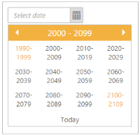
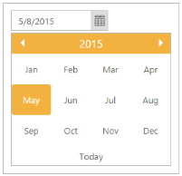

## Start and Depth navigation

Start Level

It specifies the Start Level view in DatePicker calendar. By default “StartLevel” property is set to “Period.Month”. The “StartLevel” property receives “enum” value. The “Period” class contains four types of levels. Refer the following table to know the different types of start level.

Table 3: Start level

<table>
<tr>
<td>
Name </td><td>
Description</td></tr>
<tr>
<td>
Month</td><td>
Starts from month level view.</td></tr>
<tr>
<td>
Year</td><td>
Starts from year level view.</td></tr>
<tr>
<td>
Decade</td><td>
Starts from decade level view.</td></tr>
<tr>
<td>
Century</td><td>
Starts from century level view.</td></tr>
</table>

The following steps explain you how to specify the Start Level view in DatePicker widget.

1. In the CSHTML page, add the following code to render the DatePicker widget.

[CSHTML]

@*Add the following code example to the corresponding CSHTML page to render DatePicker widget with customized start level view*@

@Html.EJ().DatePicker("datePicker").StartLevel(Period.Century)

2. The following screenshot displays the output for the above code.

{{ '' | markdownify }}
{:.image }

Depth Level

It specifies the drill down level of DatePicker. You can restrict the drill down Depth Level using “DepthLevel” property. 

It accepts the following values. 

_Table_ _4_: Depth level_

<table>
<tr>
<td>
Value</td><td>
Description</td></tr>
<tr>
<td>
Month</td><td>
Starts from month level view.</td></tr>
<tr>
<td>
Year</td><td>
Starts from year level view.</td></tr>
<tr>
<td>
Decade</td><td>
Starts from year decade level view.</td></tr>
<tr>
<td>
Century</td><td>
Starts from century level view. </td></tr>
</table>

The following steps explain you how to get the DepthLevel.

1. In the CSHTML page, add the following code to render the DatePicker widget.

[CSHTML]

@*Add the following code example to the corresponding CSHTML page to restrict the drill down depth level DatePicker widget*@

@Html.EJ().DatePicker("datePicker").StartLevel(Period.Century).DepthLevel(Period.Year)

2. The following screenshot displays the output for the above code.

{{ '' | markdownify }}
{:.image }

