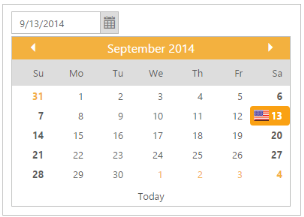

# Week end and Special dates highlight

Week end and special dates are highlighted in DatePicker widget for your identification based on your requirement.

You can highlight the week end by using “HighlightWeekend” property and special dates are highlighted by using “SpecialDates” property.

You can find the sprite images in the following location when you have installed essential studio otherwise you can use your own image.

[Installed Drive]:\Users\[username]\AppData\Local\Syncfusion\EssentialStudio\X.X.X.X\JavaScript\samples\web\images\autocomplete\flags.png

The following steps explain you how to get the highlighted week end and special dates.

1. In the CSHTML page, add the following code to render the DatePicker widget.

   ~~~ cshtml

	@*Add the following code example to the corresponding CSHTML page to render DatePicker widget with customized highlighted week end and special dates highlight*@

	@Html.EJ().DatePicker("datePicker").SpecialDates(p =>

		{

			p.Add().Date("9/13/2014").Tooltip("America").Icon("flag");

		}).HighlightWeekend(true)

   ~~~
  

2. Add the following styles to get the special dates highlighted.

   N> Images for this example are available in ‘installed location /Content/images’ and you need to define images in mentioned CSS. Henceforth the images are displayed.

   ~~~ css

	

   ~~~

3. The following screenshot displays the output for the above code.

Week end and Special dates highlight in DatePicker
{:.caption}