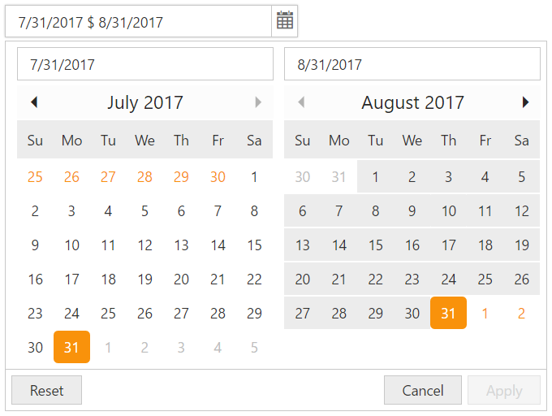

# Behavior-Settings

DateRangePicker has some default behavior settings which helps you to perform more operations by built-in.

## Value

DateRangePicker value can be selected through picking two date values from available two DatePicker calendar or you can set it by using **Value** property.

Add the following code in your CSHTML page to render DateRangePicker with value.

   ~~~ cshtml
     @Html.EJ().DateRangePicker("DateRangePick").Value("5/12/2017 - 12/5/2017").ClientSideEvents(p => p.Change("onChange"))
   ~~~  

   ~~~ cshtml
    function onChange(args) {

            //args contains entire model of DateRangePicker to get the value of all properties.

            //alert DateRangePicker shows the start date and end date.

            alert(" start date is : " + args.startDate + " \n end date is : " + args.endDate);

        }
   ~~~  

## Seperator

Separator will be “- “by default and this can be changed using API called **Separator**. Please check with below code example to setting/changing the separator using **Separator** API. The value of the DateRangePicker popup will be presented with two date strings which is separated by **Separator** 
(e.g “11/1/2016 - 11/2/2017”).

Add the following code in your CSHTML page to render DateRangePicker widget with value seperated by separator.

   ~~~ cshtml
    @Html.EJ().DateRangePicker("DateRangePick").Value("7/31/2017 - 8/31/2017").Width("25%").Separator("$")
   ~~~

Execute the above code to render the following output.
  

    
DateRangePicker
{:.caption}