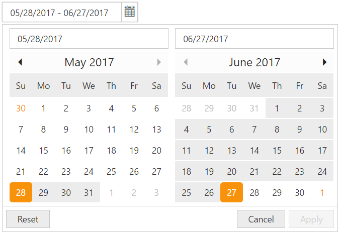

# Getting Started

This section explains briefly about how to render a DateRangePicker in your application with ASP.NET MVC.

## Create your first DateRangePicker in MVC 

The Essential ASP.NET MVC DateRangePicker supports to display two calendars in the webpage and allows you pick date range from the calendars. Refer the following guidelines to customize the DateRangePicker. The following screenshot illustrates the functionality of DateRangePicker.

    
DateRangePicker
{:.caption}

In the above screenshot, you can see the start date and end date selection of a date range in DateRangePicker. This control offers easy way to navigate and select desired date range from one month as start date to other month as end date or we can pick both the start date and end date from the same month.

## Create a DateRangePicker 

ASP.NET MVC DateRangePicker widget basically renders with built-in features like calendar to calendar navigation with animations and flexible APIs. You can easily create the DateRangePicker widget using simple DateRangePicker elements as follows.

1. Create an MVC Project, add necessary assemblies and scripts.

2. Refer [MVC-Getting Started] (https://help.syncfusion.com/aspnetmvc/getting-started).

3. Add the following code to the corresponding view page to render DateRangePicker.

   ~~~ cshtml
       
	@*Add the following code example to the corresponding CSHTML page to render DateRangePicker widget*@

	@Html.EJ().DateRangePicker("DateRangePick").Value("05/28/2017-06/27/2017").DateFormat("dd/MM/yyyy").Width("200px")

   ~~~
   

Execute the above code to render the following output.

DateRangePicker
{:.caption}

## Start Date

Start Date can be selected from any calendar in the popup of DateRangePicker. The date which is selected in the calendar in any following cases will be considered as StartDate of a date range,

1. Click on empty calendar (with no start date, range, end date)

2. Click on date which is lesser than existing start date

3. Click on calendar when already there is start date and end date is updated.

Start Date of range can be set using API called **StartDate**, please refer the below code example:

        
            
        @*Add the following code example to the corresponding CSHTML page to render DateRangePicker widget with start date *@

        @Html.EJ().DateRangePicker("DateRangePick").StartDate("5/1/2017")

        
   
StartDate can be set to popup, by entering the date value into first input box in popup also.

## End Date

End Date of the date range can be selected from popup directly. Else this can be also updated by using the API called EndDate.

The Selection next to the **StartDate** will be considered as end date. This selected date should be higher or equal date than the existing start date.  Else this selection will be considered **StartDate** as we have mentioned in StartDate section above.

Below code will explain to use the **EndDate** API to set the end Date in popup.

        
            
        @*Add the following code example to the corresponding CSHTML page to render DateRangePicker widget with customized Start Date and  End Date*@

        @Html.EJ().DateRangePicker("DateRangePick").Width("25%").StartDate("5/1/2017").EndDate("6/17/2017")

        

Execute the above code to render the following output.

DateRangePicker with StartDate and EndDate 
{:.caption}

End Date can be set to popup by entering the date into the second input box in popup.

